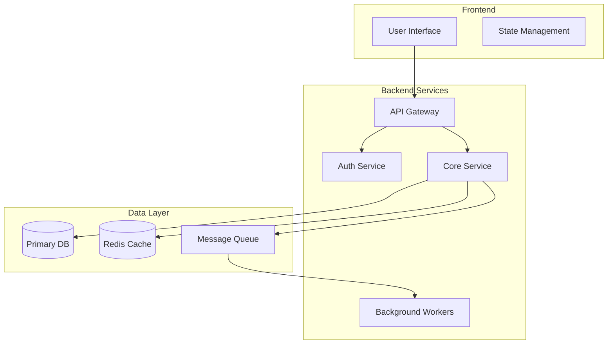

# Design System Architecture Task (Brownfield)

## Purpose
Guide the evolution of existing system architectures, understanding current state before proposing changes, ensuring backward compatibility, migration paths, and incremental improvements.

## System Design Process

### Phase 0: Current State Analysis (MANDATORY)

#### Search Knowledge Base First:
```bash
# Understand what exists
./.vector_db/kb search "architecture" --collection architecture
./.vector_db/kb search "system design" --collection documentation
./.vector_db/kb search "database schema" --collection code
./.vector_db/kb search "API endpoints" --collection api

# Review existing decisions
ls /docs/architecture/adrs/
./.vector_db/kb search "ADR" --collection architecture
```

#### Document Current State:
1. **Existing Architecture**
   - Current components and services
   - Technology stack in use
   - Integration points
   - Data flow patterns

2. **Technical Debt**
   - Known issues and limitations
   - Performance bottlenecks
   - Security concerns
   - Maintenance challenges

3. **What's Working Well**
   - Successful patterns
   - Stable components
   - Good practices to preserve

### Phase 1: Requirements Analysis

#### Gather Context:
1. **Change Requirements**
   - What needs to change and why
   - New features vs improvements
   - Migration requirements
   - Backward compatibility needs

2. **Non-Functional Requirements**
   - Scalability targets
   - Availability requirements (99.9%? 99.99%?)
   - Security requirements
   - Compliance needs
   - Performance SLAs

3. **Constraints**
   - Budget limitations
   - Team expertise
   - Timeline pressures
   - Technology restrictions
   - Legacy system integration

4. **Success Metrics**
   - How will we measure success?
   - What are the KPIs?
   - What are acceptable thresholds?

### Phase 2: High-Level Architecture

#### Present Multiple Options:
Always design 2-3 architectural approaches:

**Option 1: Simple/Conservative**
- Proven patterns
- Minimal complexity
- Quick to market
- Lower risk

**Option 2: Balanced/Recommended**
- Good trade-offs
- Reasonable complexity
- Scalable approach
- Moderate risk

**Option 3: Advanced/Future-Proof**
- Cutting-edge patterns
- Higher complexity
- Maximum flexibility
- Higher risk

#### For Each Option Document:

```markdown
### Architecture Option: [Name]

#### Overview
[1-2 paragraph description of the approach]

#### Key Components
- **Component A**: [Purpose and responsibility]
- **Component B**: [Purpose and responsibility]
- **Component C**: [Purpose and responsibility]

#### Data Flow
1. User initiates request via [entry point]
2. Request processed by [component]
3. Data retrieved from [storage]
4. Response returned via [path]

#### Technology Stack
| Layer | Technology | Rationale |
|-------|------------|-----------|
| Frontend | [Tech] | [Why chosen] |
| Backend | [Tech] | [Why chosen] |
| Database | [Tech] | [Why chosen] |
| Cache | [Tech] | [Why chosen] |
| Queue | [Tech] | [Why chosen] |

#### Trade-offs
- **Pros**: 
  - [Advantage 1]
  - [Advantage 2]
- **Cons**: 
  - [Disadvantage 1]
  - [Disadvantage 2]

#### Estimated Effort
- Development: [X weeks/months]
- Testing: [X weeks]
- Deployment: [X days]

#### Risk Assessment
- [Risk]: [Mitigation strategy]
```

### Phase 3: Detailed Design

Once an approach is selected, create detailed designs:

#### 1. Component Architecture


#### 2. Data Architecture

**Data Models:**
```yaml
User:
  - id: UUID
  - email: string
  - profile: JSON
  - created_at: timestamp
  
Order:
  - id: UUID
  - user_id: UUID (FK)
  - items: JSON
  - status: enum
  - total: decimal
```

**Data Flow Patterns:**
- Read/Write splitting?
- Caching strategy?
- Event sourcing?
- CQRS pattern?

#### 3. API Design

**RESTful Endpoints:**
```
GET    /api/v1/resources
POST   /api/v1/resources
GET    /api/v1/resources/{id}
PUT    /api/v1/resources/{id}
DELETE /api/v1/resources/{id}
```

**GraphQL Schema:**
```graphql
type Query {
  user(id: ID!): User
  users(limit: Int, offset: Int): [User]
}

type Mutation {
  createUser(input: UserInput!): User
  updateUser(id: ID!, input: UserInput!): User
}
```

#### 4. Security Architecture

**Security Layers:**
1. **Network Security**
   - WAF rules
   - DDoS protection
   - VPC configuration

2. **Application Security**
   - Authentication (OAuth2, JWT)
   - Authorization (RBAC, ABAC)
   - Input validation
   - SQL injection prevention

3. **Data Security**
   - Encryption at rest
   - Encryption in transit
   - Key management
   - PII handling

#### 5. Infrastructure Design

**Deployment Architecture:**
```yaml
Production:
  - Region: us-east-1, eu-west-1
  - Availability Zones: 3 per region
  - Auto-scaling: 2-10 instances
  - Load Balancer: Application LB
  - CDN: CloudFront/Cloudflare

Staging:
  - Region: us-east-1
  - Availability Zones: 2
  - Instances: 2 fixed
```

### Phase 4: Scalability Planning

#### Scaling Strategies:

**Horizontal Scaling:**
- Service: How to scale out
- Database: Sharding strategy
- Cache: Clustering approach

**Vertical Scaling:**
- When to scale up
- Resource limits
- Cost implications

**Performance Optimization:**
- Caching layers
- Database indexing
- Query optimization
- CDN usage
- Code optimization

### Phase 5: Implementation Roadmap

#### Phased Approach:

**Phase 1: Foundation (Weeks 1-4)**
- [ ] Set up development environment
- [ ] Create project structure
- [ ] Implement core data models
- [ ] Basic API endpoints
- [ ] Authentication system

**Phase 2: Core Features (Weeks 5-8)**
- [ ] Main business logic
- [ ] Integration points
- [ ] Background jobs
- [ ] Caching layer

**Phase 3: Production Ready (Weeks 9-12)**
- [ ] Performance optimization
- [ ] Security hardening
- [ ] Monitoring setup
- [ ] Documentation
- [ ] Load testing

### Phase 6: Documentation Output

Create comprehensive architecture document:

```markdown
# System Architecture: [Project Name]

## Executive Summary
[Brief overview of the system and its purpose]

## Architecture Overview
[High-level description with main components]

## Detailed Design

### Component Architecture
[Detailed component descriptions and interactions]

### Data Architecture
[Data models, storage, and flow]

### API Specifications
[Endpoint definitions and contracts]

### Security Design
[Security measures and controls]

### Infrastructure
[Deployment and operational architecture]

## Implementation Plan

### Phase 1: [Name]
- Timeline: [Duration]
- Deliverables: [List]
- Success Criteria: [Metrics]

### Phase 2: [Name]
- Timeline: [Duration]
- Deliverables: [List]
- Success Criteria: [Metrics]

## Operational Considerations

### Monitoring & Observability
- Metrics to track
- Logging strategy
- Alerting rules

### Disaster Recovery
- Backup strategy
- RTO/RPO targets
- Failover procedures

### Maintenance
- Update procedures
- Dependency management
- Technical debt tracking

## Appendices

### A. Technology Decisions
[ADR references for key choices]

### B. Diagrams
[Additional architectural diagrams]

### C. References
[External resources and documentation]
```

## System Patterns Reference

### Architectural Styles:
- **Monolithic**: Single deployable unit
- **Microservices**: Distributed services
- **Serverless**: Function-based architecture
- **Event-Driven**: Async message-based
- **Modular Monolith**: Hybrid approach

### Communication Patterns:
- **Synchronous**: REST, GraphQL, gRPC
- **Asynchronous**: Message queues, Event streams
- **Hybrid**: Combination based on use case

### Data Patterns:
- **Shared Database**: Single database
- **Database per Service**: Isolated data
- **CQRS**: Separate read/write models
- **Event Sourcing**: Event-based state

### Deployment Patterns:
- **Blue-Green**: Zero-downtime deployments
- **Canary**: Gradual rollout
- **Rolling**: Sequential updates
- **Feature Flags**: Controlled activation

## Design Principles

### SOLID Principles:
- **S**ingle Responsibility
- **O**pen/Closed
- **L**iskov Substitution
- **I**nterface Segregation
- **D**ependency Inversion

### System Design Principles:
- **Loose Coupling**: Minimize dependencies
- **High Cohesion**: Related functionality together
- **Separation of Concerns**: Clear boundaries
- **DRY**: Don't Repeat Yourself
- **KISS**: Keep It Simple, Stupid
- **YAGNI**: You Aren't Gonna Need It

## Common Pitfalls to Avoid

1. **Over-engineering**: Don't build for imaginary requirements
2. **Under-engineering**: Don't ignore known requirements
3. **Premature Optimization**: Measure first, optimize later
4. **Ignoring Security**: Build security in from start
5. **Poor Documentation**: Future you will thank current you
6. **Tight Coupling**: Makes changes expensive
7. **No Monitoring**: Flying blind in production

## Success Metrics Examples

### Performance:
- Response time < 200ms (p95)
- Throughput > 1000 RPS
- Error rate < 0.1%

### Scalability:
- Support 10x current load
- Auto-scale in < 2 minutes
- Database can shard horizontally

### Reliability:
- 99.9% uptime
- Recovery time < 5 minutes
- Data loss = 0

### Cost:
- Infrastructure < $X/month
- Cost per transaction < $Y
- Efficiency improvements quarterly

## Remember
- Start with requirements, not technology
- Design for change, not just current needs
- Consider operational aspects from day one
- Document decisions as ADRs
- Simple solutions often beat complex ones
- Get feedback early and iterate