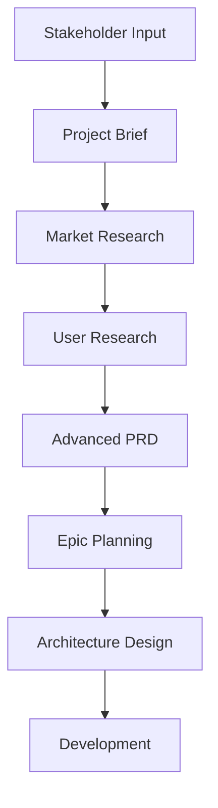

# PM Workflows & Integration Guide

## Core PM Workflow Architecture

Our PM system follows a structured approach based on BMAD methodology with enhancements for our agent architecture:

### 1. Foundation Phase
**Project Brief → PRD → Architecture**



### 2. Interactive YAML Templates

Our templates use YAML-driven configuration with `elicit: true` sections that trigger advanced elicitation methods:

- **Interactive Mode**: Section-by-section with stakeholder collaboration
- **YOLO Mode**: Complete draft generation for review
- **Advanced Elicitation**: 9-option method selection system

### 3. Agent Integration Points

| Agent | Integration | Purpose |
|-------|-------------|---------|
| Ana (Analyst) | Market research, competitive analysis | Business context |
| Ulysses (UX) | User research, design requirements | User experience |
| Archie (Architect) | Technical constraints, feasibility | System design |
| Sam (SM) | Story breakdown, sprint planning | Delivery management |
| Dave (Developer) | Technical implementation, patterns | Development guidance |

## Workflow Templates

### Greenfield Project Workflow
1. **`*create-brief`** - Foundational project brief
2. **`*create-prd-advanced`** - Comprehensive requirements
3. **`*create-epic`** - Epic and story planning
4. **`*roadmap`** - Strategic roadmap creation
5. **`*validate-prd`** - Quality assurance

### Brownfield Enhancement Workflow
1. **System Analysis** - Understand existing system
2. **`*brownfield-epic`** - Focused enhancement epic
3. **`*change-management`** - Handle scope changes
4. **Integration Validation** - Ensure compatibility

### Change Management Workflow
1. **Change Trigger** - Identify change need
2. **`*change-management`** - Systematic analysis
3. **Impact Assessment** - Evaluate effects
4. **Solution Options** - Generate alternatives
5. **Stakeholder Approval** - Get decisions
6. **Implementation** - Execute changes

## Template System

### YAML Template Structure
```yaml
template:
  id: template-name
  name: Display Name
  version: 1.0
  output:
    format: markdown
    filename: /docs/path/file.md

workflow:
  mode: interactive
  elicitation: advanced

sections:
  - id: section-name
    title: Section Title
    instruction: Detailed instructions
    elicit: true  # Triggers elicitation methods
    sections:
      - id: subsection
        title: Subsection Title
```

### Elicitation Method Integration
When `elicit: true`:
1. Present drafted content with rationale
2. Offer 9 elicitation options (1 = proceed, 2-9 = methods)
3. Execute selected method
4. Iterate until satisfactory
5. Move to next section

### Available Templates
- **project-brief.yaml** - Foundation project brief
- **prd-advanced.yaml** - Comprehensive PRD
- **roadmap-template.md** - Strategic roadmap
- **epic-template.md** - Detailed epic planning
- **stakeholder-update.md** - Progress communications

## Advanced Features

### Document Sharding
- **`*shard-document`** - Split large documents
- Automated with markdown-tree-parser
- Manual fallback included
- Maintains content integrity

### Validation System
- **pm-validation-checklist.md** - Comprehensive validation
- 10 category assessment
- Pass/Partial/Fail scoring
- Actionable recommendations

### Knowledge Base Integration
```bash
# Search before creating
./.vector_db/kb search "topic" --collection documentation
./.vector_db/kb search "architecture" --collection architecture

# Index after creating
./.vector_db/kb index --path /docs/requirements/
```

## Quality Assurance

### Validation Categories
1. Problem Definition & Context
2. MVP Scope Definition  
3. User Experience Requirements
4. Functional Requirements
5. Non-Functional Requirements
6. Epic & Story Structure
7. Technical Guidance
8. Stakeholder Alignment
9. Risk Management
10. Readiness Assessment

### Success Criteria
- **Pass**: 90%+ checklist completion
- **Partial**: 60-89% completion, needs refinement
- **Fail**: <60% completion, major work needed

## Integration Protocols

### With Ana (Analyst)
- Market research synthesis
- Competitive analysis integration
- Business case validation
- Customer insight incorporation

### With Ulysses (UX)
- User research integration
- Design requirement specification
- Journey mapping alignment
- Accessibility requirement definition

### With Archie (Architect)
- Technical constraint validation
- Architecture requirement specification
- Integration point identification
- Performance requirement definition

### With Sam (SM)
- Epic breakdown coordination
- Sprint planning alignment
- Story sizing guidance
- Velocity tracking integration

### With Dave (Developer)
- Technical feasibility validation
- Implementation pattern guidance
- Development constraint identification
- Code architecture alignment

## Best Practices

### Template Usage
- Always start with Project Brief for greenfield
- Use advanced PRD for comprehensive planning
- Apply brownfield templates for existing systems
- Run validation checklists before handoff

### Elicitation Application
- Use interactive mode for stakeholder alignment
- Apply specific methods based on context
- Document rationale for decisions
- Iterate until clarity achieved

### Change Management
- Assess impact systematically
- Generate multiple solution options
- Document all changes with rationale
- Maintain stakeholder alignment

### Knowledge Management
- Search before creating duplicates
- Index all artifacts after creation
- Cross-reference related documents
- Maintain document relationships

## Troubleshooting

### Common Issues
- **Scope Creep**: Use MVP challenge elicitation
- **Unclear Requirements**: Apply acceptance criteria deep dive
- **Stakeholder Misalignment**: Use stakeholder round table
- **Technical Uncertainty**: Engage Archie early
- **Change Overwhelm**: Apply systematic change management

### Escalation Paths
- **Complex Changes**: Full replanning with PM/Architect
- **Technical Blocks**: Engage Archie for architecture review
- **Stakeholder Conflicts**: Executive decision required
- **Resource Constraints**: Portfolio prioritization needed

## Future Enhancements

### Planned Improvements
- OKR integration templates
- Automated metrics tracking
- Portfolio management views
- Advanced analytics integration
- Customer feedback loops

### Extension Points
- Industry-specific templates
- Compliance framework integration
- Advanced risk management
- Predictive analytics
- AI-powered insights