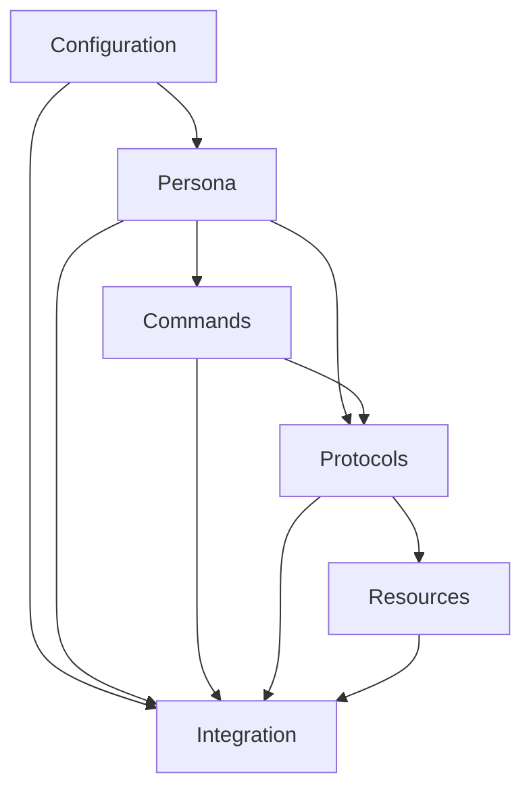

# Progressive Agent Planner - Cognitive Tool

## Purpose
Systematically decompose agent creation into manageable components with progressive building and validation.

## Execution Protocol

### Phase 1: Requirements Parsing
Parse user intent into structured requirements with validation checkpoints.

```yaml
requirements_structure:
  agent_name: ""
  agent_type: ""  # sub-agent or command
  primary_purpose: ""
  scope:
    included: []
    excluded: []
  constraints:
    must_have: []
    should_have: []
    nice_to_have: []
  integration_points: []
  validation_criteria: []
```

#### Parsing Process
1. **Extract Core Intent**
   - What problem does this agent solve?
   - Who will use this agent?
   - What makes this agent unique?

2. **Identify Type & Scope**
   - Sub-agent: One-shot, delegatable, returns result
   - Command: Interactive, multi-turn conversation
   - Define clear boundaries of responsibility

3. **Map Constraints**
   - Atomic constraints (syntax, tools, location)
   - Molecular protocols (workflows, interactions)
   - Cellular memory requirements
   - Organ-level coordination needs

4. **Generate Validation Checklist**
   ```markdown
   - [ ] Single, clear purpose defined
   - [ ] No duplicate functionality
   - [ ] Integration points identified
   - [ ] Constraints documented
   - [ ] Success criteria measurable
   ```

### Phase 2: Outline Generation
Create component outline with dependency mapping.

```yaml
component_outline:
  core_components:
    - name: "configuration"
      type: "yaml_frontmatter"
      dependencies: []
      priority: 1
    
    - name: "persona"
      type: "identity_definition"
      dependencies: ["configuration"]
      priority: 2
    
    - name: "commands"
      type: "interaction_interface"
      dependencies: ["persona"]
      priority: 3
    
    - name: "protocols"
      type: "execution_logic"
      dependencies: ["commands", "persona"]
      priority: 4
    
    - name: "resources"
      type: "support_files"
      dependencies: ["protocols"]
      priority: 5
    
    - name: "integration"
      type: "system_connections"
      dependencies: ["all"]
      priority: 6
```

#### Dependency Mapping


### Phase 3: Progressive Building
Build each component with context awareness.

```python
class AgentCreationState:
    def __init__(self, agent_name):
        self.state = {
            "agent_name": agent_name,
            "outline": [],
            "components": {},
            "current_component": "",
            "constraints": [],
            "validation_results": [],
            "context_buffer": "",
            "token_usage": 0,
            "max_tokens": 8000
        }
    
    def build_component(self, component_name):
        """Build a single component with context"""
        # Load relevant context
        context = self.get_component_context(component_name)
        
        # Check token budget
        if self.token_usage + len(context) > self.max_tokens:
            context = self.summarize_context(context)
        
        # Build component
        component = self.generate_component(component_name, context)
        
        # Validate against constraints
        validation = self.validate_component(component)
        
        # Store if valid
        if validation["passed"]:
            self.components[component_name] = component
            self.update_context_buffer(component)
        
        return validation
    
    def get_component_context(self, component_name):
        """Get relevant context for building component"""
        context = {
            "dependencies": self.get_dependencies(component_name),
            "constraints": self.get_applicable_constraints(component_name),
            "patterns": self.search_patterns(component_name),
            "examples": self.get_examples(component_name)
        }
        return context
```

### Phase 4: Context Management
Token-aware context building with progressive summarization.

```python
def build_pattern_context(pattern_type, max_tokens=2000):
    """Progressive context building with summarization"""
    context = ""
    token_count = 0
    patterns = search_kb(pattern_type)
    
    # Priority-based inclusion
    priority_patterns = prioritize_patterns(patterns)
    
    for pattern in priority_patterns:
        pattern_tokens = count_tokens(pattern)
        
        if token_count + pattern_tokens > max_tokens:
            # Summarize instead of full inclusion
            summary = summarize_pattern(pattern)
            context += f"\n[Summarized]: {summary}"
            token_count += count_tokens(summary)
        else:
            # Include full pattern
            context += f"\n[Full]: {pattern}"
            token_count += pattern_tokens
        
        # Stop if we're at capacity
        if token_count >= max_tokens * 0.95:
            break
    
    return context

def prioritize_patterns(patterns):
    """Prioritize patterns by relevance and recency"""
    scored_patterns = []
    
    for pattern in patterns:
        score = calculate_relevance_score(pattern)
        scored_patterns.append((score, pattern))
    
    # Sort by score descending
    scored_patterns.sort(key=lambda x: x[0], reverse=True)
    
    return [p[1] for p in scored_patterns]
```

### Phase 5: Validation & Coherence
Ensure all components work together.

```yaml
coherence_checks:
  atomic_molecular_alignment:
    - "All atomic constraints referenced in molecular protocols"
    - "No orphaned atomic constraints"
    - "Molecular protocols compose atomics correctly"
  
  molecular_cellular_consistency:
    - "Protocols persist state in cellular memory"
    - "Memory structures match protocol outputs"
    - "No data loss between layers"
  
  cellular_organ_coordination:
    - "Cellular memories accessible to organ functions"
    - "Organ-level intelligence emerges from cells"
    - "Cross-agent coordination possible"
  
  cross_file_references:
    - "All referenced files exist"
    - "File paths correct"
    - "Resource loading lazy and efficient"
  
  constraint_satisfaction:
    - "All must_have constraints satisfied"
    - "Majority of should_have satisfied"
    - "Constraint score in optimal range (8.0-8.5)"
```

## Usage Example

```markdown
User: *plan-agent code-reviewer

Rita: Executing Progressive Agent Planner...

### Phase 1: Requirements Parsing
Analyzing "code-reviewer" requirements:
- Type: Sub-agent (delegatable, one-shot)
- Purpose: Review code for quality, patterns, security
- Constraints: Must integrate with git, support multiple languages
- Validation: Must catch common issues, provide actionable feedback

### Phase 2: Component Outline
Generated outline:
1. Configuration (frontmatter with tools)
2. Review protocols (what to check)
3. Report templates (output format)
4. Integration points (git hooks, CI/CD)

### Phase 3: Progressive Build
Building components:
✓ Configuration created (token usage: 500/8000)
✓ Protocols defined (token usage: 2000/8000)
✓ Templates structured (token usage: 3500/8000)
✓ Integration mapped (token usage: 4200/8000)

### Phase 4: Coherence Verification
Checking alignment:
✓ Atomic→Molecular: All constraints compose correctly
✓ Molecular→Cellular: State persistence verified
✓ Cross-references: All files accessible
✓ Constraint score: 8.2 (optimal)

### Phase 5: Ready for Creation
Agent plan complete. Execute with *create-subagent code-reviewer?
```

## Integration with Rita

This cognitive tool integrates with Rita's workflow:

1. **Triggered by**: `*plan-agent` command
2. **Outputs to**: Agent creation state
3. **Feeds into**: Component generation
4. **Validates with**: Constraint validator sub-agent
5. **Documents in**: Pattern library

## Benefits

1. **Systematic**: No missed components
2. **Progressive**: Build with context awareness
3. **Token-efficient**: Smart context management
4. **Validated**: Each step verified
5. **Reusable**: Patterns extracted for future use