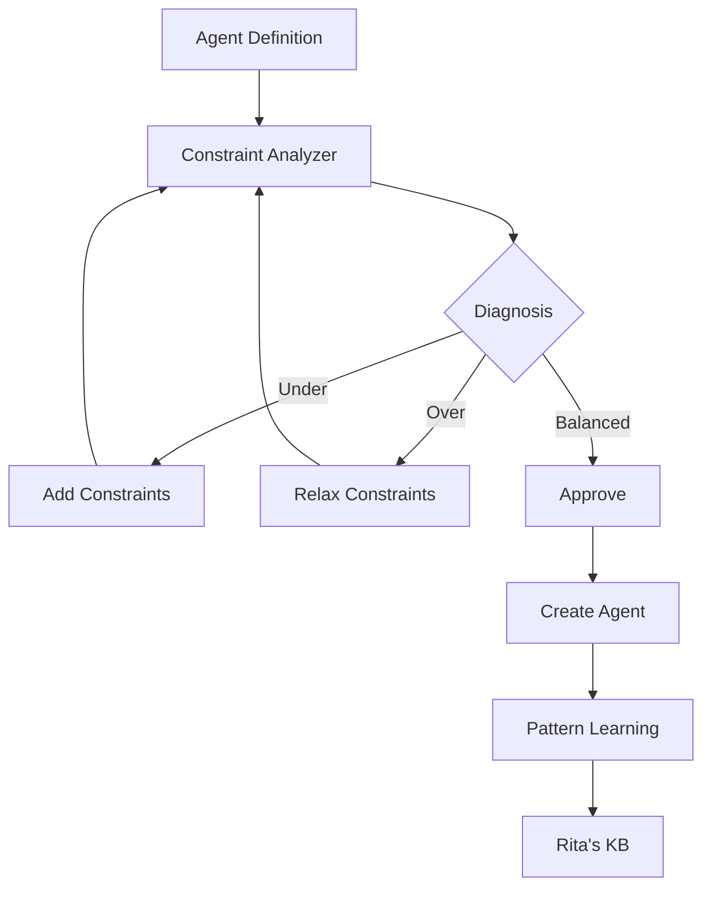

# Constraint Analyzer: Diagnostic Tool for Agent Constraints
# Based on constraint architecture theory from Zettelkasten insights

## Purpose
Diagnose and tune agent constraint levels to achieve optimal balance between consistency and flexibility.

## Three-State Diagnostic Model

### 🔴 Under-Constrained State
**Definition**: Insufficient constraints leading to inconsistent behavior

**Symptoms**:
- Vague or generic descriptions
- Missing trigger keywords
- Undefined output formats
- Unclear scope boundaries
- Inconsistent results across runs
- No success criteria

**Diagnostic Questions**:
1. Can the agent's purpose be interpreted multiple ways?
2. Is the trigger condition ambiguous?
3. Could the output vary significantly?
4. Are boundaries unclear?

**Remediation**:
- Add specific trigger keywords (IMPORTANT, Proactively)
- Define clear output structure
- Specify scope boundaries
- Add validation criteria
- Include concrete examples

### 🟡 Over-Constrained State
**Definition**: Excessive constraints limiting adaptability

**Symptoms**:
- Overly specific conditions
- Rigid format requirements
- Narrow applicability
- Brittle to input variations
- Complex nested conditions
- Inflexible output templates

**Diagnostic Questions**:
1. Does it only work with exact inputs?
2. Are there too many edge case rules?
3. Is the scope unnecessarily narrow?
4. Would small changes break it?

**Remediation**:
- Generalize conditions
- Allow format flexibility
- Broaden applicability
- Simplify rule structure
- Enable graceful degradation

### 🟢 Well-Balanced State
**Definition**: Optimal constraints providing consistency with adaptability

**Characteristics**:
- Clear purpose, flexible execution
- Specific triggers, broad applicability
- Defined structure, adaptable format
- Minimal tools, sufficient capability
- Simple rules, comprehensive coverage

**Validation**:
- Consistent core behavior ✓
- Handles variations gracefully ✓
- Clear boundaries ✓
- Predictable outputs ✓
- Efficient resource usage ✓

## Diagnostic Process

### Step 1: Initial Assessment
```yaml
assessment:
  purpose_clarity: score 0-10
  trigger_specificity: score 0-10
  output_definition: score 0-10
  scope_boundaries: score 0-10
  tool_minimalism: score 0-10
```

### Step 2: Constraint Mapping
Map constraints across levels:
- **Atomic**: Individual rules and requirements
- **Molecular**: Combined workflows and protocols
- **Cellular**: Persistent patterns and memory
- **Organ**: Multi-agent orchestration

### Step 3: Balance Analysis
```
Total Score = Σ(assessment scores) / 5

Score < 5: Under-Constrained
Score 5-7: Approaching Balance
Score 8-9: Well-Balanced
Score > 9: Risk of Over-Constraint
```

### Step 4: Generate Recommendations

## Diagnostic Examples

### Example 1: Under-Constrained Agent
```yaml
name: helper
description: "Assists with tasks"
tools: Read, Write, Edit, Bash
```

**Diagnosis**: Score 3/10 - Severely Under-Constrained
- No trigger keywords (-2)
- Vague purpose (-3)
- Undefined output (-2)
- Too many tools (-1)

**Recommendations**:
1. Add: "IMPORTANT assists with {specific task} during {context}"
2. Define specific task types
3. Reduce to minimal tool set
4. Specify output format

### Example 2: Well-Balanced Agent
```yaml
name: test-runner
description: "IMPORTANT runs tests and fixes failures after code changes"
tools: Read, Bash
model: sonnet
```

**Diagnosis**: Score 8/10 - Well-Balanced
- Clear trigger keyword (+2)
- Specific purpose (+2)
- Appropriate tools (+2)
- Clear context (+2)

### Example 3: Over-Constrained Agent
```yaml
name: json-validator
description: "MUST validate only config.json with exactly 5 keys in order: name, version, author, license, dependencies"
tools: Read
```

**Diagnosis**: Score 9.5/10 - Over-Constrained
- Too specific file requirement
- Rigid structure expectation
- No flexibility for variations

**Recommendations**:
1. Generalize: "validates JSON configuration files"
2. Allow flexible key ordering
3. Support variable key counts

## Tuning Guidelines

### From Under to Balanced
1. **Add Structure**: Define clear inputs/outputs
2. **Increase Specificity**: Add concrete triggers
3. **Set Boundaries**: Define scope limits
4. **Establish Criteria**: Add success metrics

### From Over to Balanced
1. **Abstract Patterns**: Generalize specific rules
2. **Add Flexibility**: Allow format variations
3. **Broaden Scope**: Expand applicability
4. **Simplify Logic**: Reduce conditional complexity

## Integration with Rita's Workflow



## Metrics for Continuous Improvement

Track these metrics over time:
- Average constraint score
- Distribution of states (under/over/balanced)
- Remediation success rate
- Pattern reuse frequency
- Agent success rate post-creation

Store successful patterns in:
`/docs/agent-patterns/successful-agents/`

Store failure patterns in:
`/docs/agent-patterns/failure-patterns/`

This diagnostic framework ensures Rita creates agents with optimal constraint balance, learning from each creation to improve future agents.