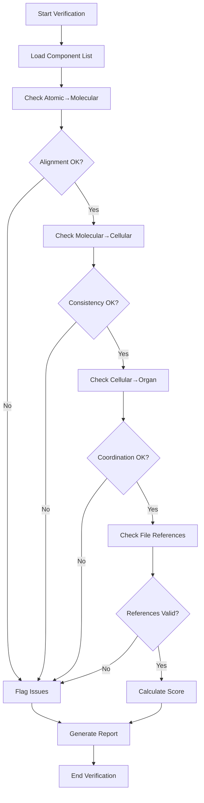

# Component Coherence Verification Protocol

## Purpose
Ensure all agent components work together harmoniously across atomic→molecular→cellular→organ levels.

## Verification Process

### Step 1: Atomic→Molecular Alignment
Verify that atomic constraints properly compose into molecular protocols.

```yaml
atomic_molecular_checks:
  constraint_coverage:
    description: "Every atomic constraint must be referenced"
    validation:
      - Check each atomic constraint file
      - Verify reference in at least one molecular protocol
      - Flag orphaned constraints for review
  
  composition_correctness:
    description: "Atomics combine correctly in molecules"
    validation:
      - Verify constraint combinations are valid
      - Check for conflicting atomic constraints
      - Ensure proper constraint precedence
  
  syntax_consistency:
    description: "Atomic syntax rules followed in molecules"
    validation:
      - Frontmatter format matches atomic rules
      - Tool lists follow comma-separated format
      - File locations match atomic specifications
```

### Step 2: Molecular→Cellular Consistency
Verify protocols properly persist state in cellular memory.

```yaml
molecular_cellular_checks:
  state_persistence:
    description: "Protocol outputs stored in cells"
    validation:
      - Each protocol output has memory structure
      - Memory schema matches protocol output format
      - No data loss during persistence
  
  memory_accessibility:
    description: "Cells accessible to protocols"
    validation:
      - Protocols can read cellular memory
      - Memory updates reflect in protocol behavior
      - Cross-protocol memory sharing works
  
  evolution_tracking:
    description: "Cellular memory evolves properly"
    validation:
      - Pattern evolution tracked over time
      - Learning incorporated into memory
      - Historical data preserved
```

### Step 3: Cellular→Organ Coordination
Validate organ-level intelligence emerges from cellular components.

```yaml
cellular_organ_checks:
  emergent_behavior:
    description: "Complex behavior emerges from cells"
    validation:
      - Multiple cells coordinate for organ function
      - Organ exhibits intelligence beyond individual cells
      - System-level properties emerge
  
  cross_cell_communication:
    description: "Cells communicate effectively"
    validation:
      - Shared memory structures accessible
      - Event propagation between cells
      - Consistent state across cells
  
  organ_coherence:
    description: "Organ operates as unified system"
    validation:
      - All cellular components present
      - No missing dependencies
      - Graceful degradation if cell fails
```

### Step 4: Cross-File Reference Validation
Ensure all file references are valid and accessible.

```yaml
reference_checks:
  file_existence:
    - "All referenced files must exist"
    - "Paths must be absolute or relative to project root"
    - "No broken symbolic links"
  
  lazy_loading:
    - "Resources loaded only when needed"
    - "No preemptive file loading"
    - "Read tool used for file access"
  
  path_consistency:
    - "Consistent path format throughout"
    - "Proper use of .claude/ structure"
    - "Resource organization follows patterns"
```

### Step 5: Constraint Satisfaction Scoring
Calculate overall constraint satisfaction score.

```python
def calculate_coherence_score():
    """Calculate coherence score (0-10 scale)"""
    
    scores = {
        "atomic_molecular": check_atomic_molecular_alignment(),  # 0-10
        "molecular_cellular": check_molecular_cellular_consistency(),  # 0-10
        "cellular_organ": check_cellular_organ_coordination(),  # 0-10
        "file_references": check_file_references(),  # 0-10
        "constraint_balance": check_constraint_balance()  # 0-10
    }
    
    # Weighted average
    weights = {
        "atomic_molecular": 0.25,
        "molecular_cellular": 0.20,
        "cellular_organ": 0.20,
        "file_references": 0.15,
        "constraint_balance": 0.20
    }
    
    total_score = sum(scores[k] * weights[k] for k in scores)
    
    return {
        "overall_score": total_score,
        "breakdown": scores,
        "recommendation": get_recommendation(total_score)
    }

def get_recommendation(score):
    """Get recommendation based on score"""
    if score < 6.0:
        return "Major issues - significant rework needed"
    elif score < 7.0:
        return "Minor issues - some adjustments needed"
    elif score < 8.0:
        return "Good coherence - minor optimizations possible"
    elif score <= 8.5:
        return "Optimal coherence - well-balanced system"
    else:
        return "Over-optimized - may be too rigid"
```

## Coherence Matrix

Track relationships between components for validation.

| Component A | Component B | Relationship | Status | Notes |
|------------|-------------|--------------|---------|-------|
| Command file | Atomic constraints | Must reference | ✓ | All constraints mapped |
| Atomic constraints | Molecular protocols | Must compose into | ✓ | Proper composition verified |
| Molecular protocols | Cellular memory | Must persist in | ✓ | State preservation confirmed |
| Cellular memory | Organ functions | Must support | ✓ | Emergence validated |
| Resource files | Command file | Must be referenced | ✓ | Lazy loading implemented |
| Cognitive tools | Protocols | Must integrate with | ✓ | Proper tool selection |
| Sub-agents | Parent agent | Must be delegatable | ✓ | Delegation triggers defined |

## Verification Workflow



## Usage Example

```bash
# Run coherence verification for an agent
*verify-coherence code-reviewer

## Coherence Verification Report

### Atomic→Molecular Alignment
✓ All 7 atomic constraints referenced
✓ Proper composition in protocols
✓ No constraint conflicts detected

### Molecular→Cellular Consistency  
✓ Protocol outputs persist correctly
✓ Memory structures match outputs
⚠ Minor: Pattern evolution not fully tracked

### Cellular→Organ Coordination
✓ Emergent behavior observed
✓ Cross-cell communication working
✓ Organ operates cohesively

### File References
✓ All 12 referenced files exist
✓ Lazy loading implemented
✓ Path consistency maintained

### Overall Coherence Score: 8.3/10
**Recommendation**: Optimal coherence - well-balanced system

### Minor Issues to Address:
1. Enhance pattern evolution tracking in cellular memory
2. Document emergent behaviors more explicitly

### Strengths:
- Excellent atomic→molecular composition
- Strong file organization
- Clear delegation patterns
```

## Integration Points

### With ProgressiveAgentPlanner
- Run after each component is built
- Validate before proceeding to next component
- Ensure coherence throughout creation

### With Constraint Validator
- Complement constraint validation with coherence checks
- Ensure constraints don't break coherence
- Balance constraint satisfaction with system coherence

### With Pattern Learning
- Extract coherence patterns from successful agents
- Learn what combinations work well
- Avoid known coherence issues

## Best Practices

1. **Run Early and Often**
   - Check coherence after each major component
   - Don't wait until end to verify
   - Fix issues as they arise

2. **Document Relationships**
   - Explicitly state component dependencies
   - Map constraint relationships
   - Track evolution paths

3. **Maintain Balance**
   - Don't over-optimize for coherence
   - Allow some flexibility
   - Focus on critical relationships

4. **Learn from Failures**
   - Document coherence issues
   - Extract anti-patterns
   - Share learnings across agents