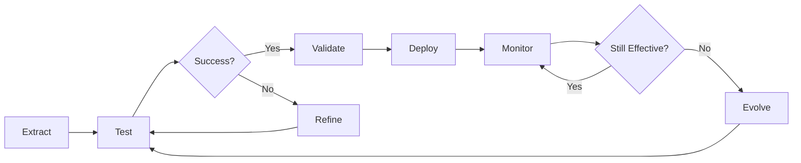

# Molecular Protocol: Pattern Extraction
# Automatically extracts successful patterns from existing agents
# Based on cognitive tools and pattern learning from Zettelkasten insights

## Protocol Overview
This protocol systematically extracts reusable patterns from successful agents, enabling Rita to learn and improve continuously.

## Pattern Extraction Framework

### Phase 1: Agent Analysis
```yaml
analysis_targets:
  - Agent configuration (name, description, tools)
  - Interaction patterns (commands, dialogue flow)
  - Constraint balance (under/over/well-constrained)
  - Success metrics (usage, rework rate, effectiveness)
  - Novel approaches (unique solutions)
```

### Phase 2: Pattern Identification
Identify patterns across multiple dimensions:

```markdown
## Pattern Dimensions

1. **Structural Patterns**
   - File organization
   - Resource layout
   - Configuration format

2. **Behavioral Patterns**
   - Trigger mechanisms
   - Interaction flows
   - Output formats

3. **Constraint Patterns**
   - Tool selection strategies
   - Scope definitions
   - Boundary enforcement

4. **Success Patterns**
   - What makes agent effective
   - User satisfaction indicators
   - Reusability factors
```

### Phase 3: Pattern Generalization
Transform specific implementations into reusable patterns:

```yaml
generalization_process:
  1. Remove agent-specific details
  2. Extract core structure
  3. Identify variable elements
  4. Create template with placeholders
  5. Document applicability conditions
```

## Extraction Process

### Step 1: Select Candidate Agents
```python
# Pseudo-code for candidate selection
candidates = []
for agent in all_agents:
    if agent.success_rate > 0.85:
        if agent.rework_rate < 0.1:
            if agent.usage_count > 5:
                candidates.append(agent)
```

### Step 2: Analyze Agent Structure
```python
def analyze_structure(agent):
    patterns = {
        'configuration': extract_config_pattern(agent),
        'tools': extract_tool_pattern(agent),
        'triggers': extract_trigger_pattern(agent),
        'interaction': extract_interaction_pattern(agent),
        'output': extract_output_pattern(agent)
    }
    return patterns
```

### Step 3: Extract Patterns
```python
def extract_patterns(agent):
    structure = analyze_structure(agent)
    
    # Find recurring elements
    patterns = []
    for element in structure:
        if is_reusable(element):
            pattern = generalize(element)
            patterns.append(pattern)
    
    return patterns
```

### Step 4: Validate Patterns
```python
def validate_pattern(pattern):
    # Test pattern with variations
    test_cases = generate_variations(pattern)
    success_count = 0
    
    for test in test_cases:
        if apply_pattern(test).is_valid():
            success_count += 1
    
    return success_count / len(test_cases) > 0.8
```

## Pattern Categories

### Tool Selection Patterns

#### Minimal Reader
```yaml
pattern_name: minimal_reader
applicable_when: "Agent only needs to analyze existing content"
tools: [Read]
effectiveness: 0.92
example_agents: [doc-analyzer, code-reviewer]
```

#### Local Modifier
```yaml
pattern_name: local_modifier
applicable_when: "Agent needs to read and modify files"
tools: [Read, Edit]
effectiveness: 0.88
example_agents: [typo-fixer, format-updater]
```

#### Test Runner
```yaml
pattern_name: test_runner
applicable_when: "Agent needs to execute and analyze tests"
tools: [Read, Bash]
effectiveness: 0.90
example_agents: [test-runner, ci-validator]
```

### Interaction Patterns

#### Numbered Options
```yaml
pattern_name: numbered_options
description: "Present choices as numbered list"
origin: ana
adoption_rate: 0.85
benefits:
  - Clear decision points
  - Easy user selection
  - Structured flow
```

#### Progressive Disclosure
```yaml
pattern_name: progressive_disclosure
description: "Reveal information gradually"
origin: tina
adoption_rate: 0.75
benefits:
  - Avoid overwhelming user
  - Maintain engagement
  - Adaptive to user level
```

#### Socratic Dialogue
```yaml
pattern_name: socratic_dialogue
description: "Guide through questions"
origin: tina
adoption_rate: 0.70
benefits:
  - Deep understanding
  - Active learning
  - Self-discovery
```

### Trigger Patterns

#### Proactive Helper
```yaml
pattern_name: proactive_helper
trigger: "IMPORTANT or Proactively in description"
use_when: "Agent should activate automatically"
example: "IMPORTANT runs tests after code changes"
success_rate: 0.88
```

#### Explicit Command
```yaml
pattern_name: explicit_command
trigger: "/command invocation"
use_when: "User needs explicit control"
example: "/analyst for brainstorming"
success_rate: 0.92
```

## Pattern Storage Format

### Pattern Template
```yaml
pattern:
  id: "ptr_001"
  name: "pattern_name"
  category: "tool_selection|interaction|trigger|constraint"
  origin:
    agent: "source_agent"
    date: "2025-08-15"
    version: "1.0"
  
  structure:
    required_elements: []
    optional_elements: []
    constraints: []
  
  applicability:
    use_when: "Conditions when pattern applies"
    avoid_when: "Conditions when pattern doesn't apply"
    prerequisites: []
  
  metrics:
    success_rate: 0.00
    adoption_rate: 0.00
    evolution_count: 0
    last_used: "date"
  
  examples:
    successful_uses: []
    failed_attempts: []
  
  variations:
    - variant_1: "description"
    - variant_2: "description"
```

## Automated Extraction Rules

### Always Extract
1. **High Success Patterns**: Success rate > 90%
2. **Widely Adopted**: Used by 3+ agents
3. **Novel Solutions**: Unique effective approaches
4. **Stable Patterns**: Unchanged for 5+ uses

### Never Extract
1. **Failed Patterns**: Success rate < 60%
2. **Overly Specific**: Only works for one agent
3. **Deprecated Approaches**: Replaced by better patterns
4. **Unsafe Patterns**: Violate safety constraints

## Pattern Evolution Tracking

### Evolution Triggers
```yaml
triggers:
  - Pattern success rate drops below 75%
  - New variant shows 10% improvement
  - Conflict with new constraint
  - User feedback indicates issue
```

### Evolution Process
```yaml
process:
  1. Identify improvement opportunity
  2. Create pattern variant
  3. A/B test variants
  4. Measure effectiveness
  5. Promote better variant
  6. Archive old version
```

## Integration with Rita's Systems

### With Pattern Evolution Cell
```python
# Store extracted patterns
def store_pattern(pattern):
    evolution_cell = load_cell('pattern-evolution.yaml')
    evolution_cell.add_pattern(pattern)
    evolution_cell.track_lineage(pattern.origin)
    save_cell(evolution_cell)
```

### With Knowledge Base
```bash
# Index patterns for searchability
./.vector_db/kb index --path /docs/agent-patterns/extracted/
```

### With Agent Genealogy
```python
# Track pattern inheritance
def track_inheritance(pattern, agent):
    genealogy = load_cell('agent-genealogy.yaml')
    genealogy.record_pattern_flow(
        pattern=pattern,
        from_agent=pattern.origin,
        to_agent=agent
    )
    save_cell(genealogy)
```

## Extraction Examples

### Example 1: Extracting Tool Pattern
```markdown
## Analyzing: test-runner

### Observed Structure:
- Tools: Read, Bash
- Purpose: Run tests and fix failures
- Trigger: After code changes

### Extracted Pattern:
**Name**: minimal_test_executor
**Tools**: Read, Bash
**When to use**: Need to run tests and analyze results
**Constraint**: No file modification, only execution
**Success Rate**: 92%
```

### Example 2: Extracting Interaction Pattern
```markdown
## Analyzing: ana

### Observed Structure:
- Uses numbered lists for options
- Provides 3-5 choices typically
- Waits for user selection

### Extracted Pattern:
**Name**: structured_choice_presentation
**Format**: 
1. Option one
2. Option two
3. Option three

**When to use**: Multiple paths available
**Benefits**: Clear, easy selection
**Success Rate**: 89%
```

## Pattern Library Management

### Organization
```
/docs/agent-patterns/
├── extracted/
│   ├── tool-patterns/
│   ├── interaction-patterns/
│   ├── trigger-patterns/
│   └── constraint-patterns/
├── validated/
│   └── (patterns with >85% success)
├── experimental/
│   └── (new patterns being tested)
└── archived/
    └── (deprecated patterns)
```

### Pattern Lifecycle


## Success Metrics

### Extraction Effectiveness
- Patterns extracted per week: Target 5+
- Pattern reuse rate: Target 70%
- Success rate of extracted patterns: Target 85%
- Time to extraction: Target < 2 minutes

### Pattern Quality
- Average success rate: > 85%
- Adoption rate: > 60%
- Evolution frequency: < 20% per month
- Deprecation rate: < 10% per quarter

This protocol ensures Rita continuously learns from successful agents, building a growing library of proven patterns that improve agent creation quality over time.