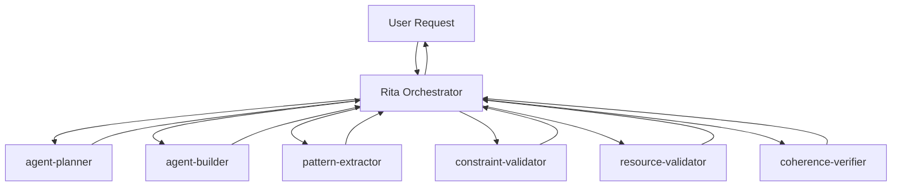

# Rita Decomposition: Command-to-Subagent Mapping
# Maps Rita's 42 commands to specialized sub-agents for decomposition

## Decomposition Architecture

```
Rita (Orchestrator) ~200 lines
├── agent-planner       - Planning & requirements analysis
├── agent-builder       - File creation & resource generation  
├── pattern-extractor   - Pattern learning & evolution
├── constraint-validator - Constraint validation (exists)
├── resource-validator  - Resource verification (exists)
└── coherence-verifier  - Cross-component validation
```

## Command Distribution Mapping

### Rita Keeps (Core Orchestration - 10 commands)
1. `*help` - Show available commands
2. `*recruit {name}` - Start agent creation workflow
3. `*plan {name}` - Initiate planning phase
4. `*build` - Execute creation plan
5. `*validate` - Run all validations
6. `*status` - Show current progress
7. `*patterns` - Browse successful patterns
8. `*example {type}` - Show example agent
9. `*fix` - Fix validation issues
10. `*exit` - Exit recruiter mode

### → agent-planner Sub-Agent (11 commands)
**Purpose**: Requirements gathering, planning, decomposition
```yaml
---
name: agent-planner
description: IMPORTANT plans agent architecture with systematic decomposition when creating new agents
tools: Read, Grep, Glob, WebFetch, Task
model: sonnet
---
```

**Commands Moving Here**:
- `*plan-agent` - Progressive planning
- `*determine-type` - Agent type classification
- `*define-persona` - Persona definition
- `*select-tools` - Tool selection guidance
- `*fetch-docs` - Documentation fetching
- `*agent-types` - Type explanations
- `*show-syntax` - Syntax guide
- `*best-practices` - Best practices
- `*apply-constraints` - Constraint application
- `*diagnose-balance` - Balance assessment
- `*optimize-architecture` - Architecture optimization

### → agent-builder Sub-Agent (9 commands)
**Purpose**: File creation, resource generation, structure setup
```yaml
---
name: agent-builder  
description: IMPORTANT creates agent files and resource structures during agent creation
tools: Read, Write, MultiEdit, Bash, LS
model: haiku
---
```

**Commands Moving Here**:
- `*create-structure` - File structure creation
- `*generate-command` - Command file generation
- `*create-subagent` - Sub-agent file creation
- `*create-command` - Command agent creation
- `*add-task` - Task addition
- `*add-template` - Template addition
- `*add-data` - Reference data addition
- `*test-workflow` - Workflow testing
- `*test-delegation` - Delegation testing

### → pattern-extractor Sub-Agent (12 commands)
**Purpose**: Pattern learning, evolution, knowledge extraction
```yaml
---
name: pattern-extractor
description: IMPORTANT extracts and learns patterns from successful agent creations for Rita's knowledge base
tools: Read, Grep, Glob, Write, Bash
model: sonnet
---
```

**Commands Moving Here**:
- `*extract-patterns` - Pattern extraction
- `*search-patterns` - Pattern search
- `*evolve-pattern` - Pattern evolution
- `*show-patterns` - Pattern display
- `*show-metrics` - Metrics display
- `*show-genealogy` - Agent genealogy
- `*track-evolution` - Evolution tracking
- `*constraint-learning` - Constraint learning
- `*improve-agent` - Agent improvement
- `*recursive-improve` - Recursive improvement
- `*orchestrate-constraints` - Constraint orchestration
- `*example` - Example extraction

### → coherence-verifier Sub-Agent (5 commands)
**Purpose**: Cross-component validation, coherence checking
```yaml
---
name: coherence-verifier
description: IMPORTANT verifies component coherence across agent architecture levels
tools: Read, Grep, Glob
model: haiku
---
```

**Commands Moving Here**:
- `*verify-coherence` - Component coherence
- `*validate-orchestration` - Orchestration validation
- `*resolve-conflict` - Conflict resolution
- `*checklist` - Quality checklist
- `*review-agent` - Agent review

### Already Existing Sub-Agents (5 commands covered)
- **constraint-validator**: `*validate-constraints`
- **resource-validator**: `*validate-resources`

## Migration Strategy

### Phase 1: Create agent-builder (Most Mechanical)
1. Extract file creation logic
2. Move resource generation
3. Implement template application
4. Test with simple agent creation

### Phase 2: Create pattern-extractor (Learning Logic)
1. Extract pattern recognition
2. Move evolution tracking
3. Implement KB integration
4. Test pattern extraction

### Phase 3: Create agent-planner (Planning Logic)
1. Extract requirements gathering
2. Move decomposition logic
3. Implement progressive planning
4. Test planning workflows

### Phase 4: Create coherence-verifier (Validation Logic)
1. Extract cross-component checks
2. Move coherence scoring
3. Implement validation protocols
4. Test verification workflows

### Phase 5: Simplify Rita to Orchestrator
1. Remove extracted logic
2. Keep only orchestration
3. Implement delegation workflow
4. Reduce to ~200 lines

## Orchestration Workflow



## Benefits After Decomposition

| Metric | Before | After |
|--------|--------|-------|
| Rita Size | 617 lines | ~200 lines |
| Complexity | High | Low |
| Maintainability | Hard | Easy |
| Testability | Complex | Simple |
| Reusability | Monolithic | Modular |
| Focus | Everything | Orchestration |

## Key Design Principles

1. **Single Responsibility**: Each sub-agent has ONE clear purpose
2. **Minimal Tools**: Each gets only the tools it needs
3. **Appropriate Models**: Haiku for simple, Sonnet for complex
4. **Clear Triggers**: IMPORTANT keyword for proactive delegation
5. **Stateless Operation**: Sub-agents don't maintain state
6. **Return Results**: Each returns structured results to Rita
7. **Rita Orchestrates**: Rita coordinates but doesn't execute

## Success Criteria

- [ ] Rita reduced to ~200 lines
- [ ] All sub-agents under 250 lines
- [ ] Clear delegation triggers
- [ ] Minimal tool sets
- [ ] Fast execution (Haiku where possible)
- [ ] Complete functionality preserved
- [ ] Better maintainability achieved