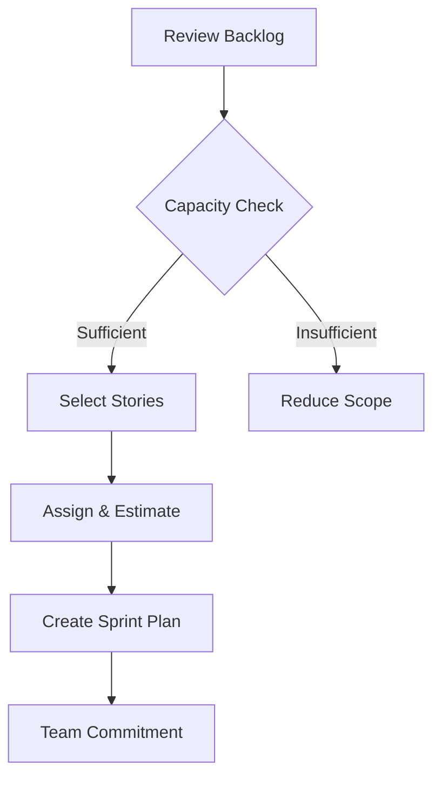

# Sprint Planning Protocol

## Pre-Sprint Preparation
1. Backlog Grooming
   - Review /docs/backlog/backlog.md
   - Prioritize stories
   - Estimate complexity

2. Team Capacity Assessment
   - Calculate velocity
   - Review team availability
   - Consider ongoing commitments

## Sprint Planning Meeting
### Agenda
- Review sprint goal
- Select stories from backlog
- Assign stories to team members
- Break down stories into tasks
- Estimate effort

### Decision Workflow

## Post-Planning
- Document sprint plan in /docs/sprints/{year}.{month}.{sprint}.md
- Update story statuses
- Notify team members
- Set up daily standup schedule

## Validation Checks
- [ ] Backlog reviewed
- [ ] Team capacity assessed
- [ ] Stories selected
- [ ] Stories estimated
- [ ] Sprint plan documented
- [ ] Team notified

## Tools Used
- Sprint Velocity Calculator
- Story Estimation Framework
- Backlog Management System