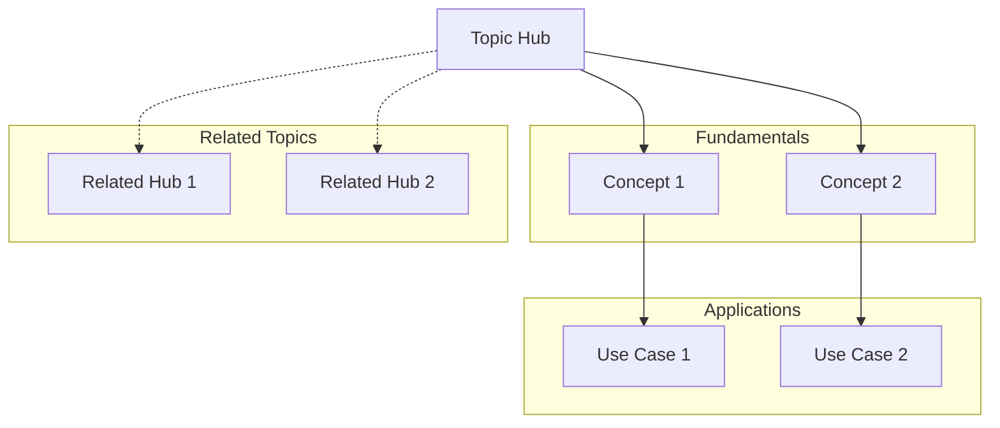

# Hub Note Template

## ID: [YYYYMMDD-HHMMSS-HUB]

# 🌐 [Topic] Knowledge Hub

## Overview
[Brief description of this knowledge domain and why it's important]

## Core Concepts
### Fundamental Principles
1. [[Note-ID]] - [Principle name and brief description]
2. [[Note-ID]] - [Principle name and brief description]
3. [[Note-ID]] - [Principle name and brief description]

### Key Definitions
- **[Term]**: [[Note-ID]] - [Brief definition]
- **[Term]**: [[Note-ID]] - [Brief definition]
- **[Term]**: [[Note-ID]] - [Brief definition]

## Knowledge Structure

### Prerequisites
Notes to understand first:
- [[Note-ID]]: [Why it's needed]
- [[Note-ID]]: [Why it's needed]

### Core Knowledge
Central notes for this topic:
- [[Note-ID]]: [Main concept]
- [[Note-ID]]: [Main concept]
- [[Note-ID]]: [Main concept]

### Advanced Topics
Deeper explorations:
- [[Note-ID]]: [Advanced concept]
- [[Note-ID]]: [Advanced concept]

### Applications
Practical uses:
- [[Note-ID]]: [Application area]
- [[Note-ID]]: [Application area]

## Learning Paths

### Beginner Path
1. Start with: [[Note-ID]]
2. Then explore: [[Note-ID]]
3. Apply with: [[Note-ID]]

### Intermediate Path
1. Review: [[Note-ID]]
2. Deep dive: [[Note-ID]]
3. Connect to: [[Note-ID]]

### Advanced Path
1. Synthesize: [[Note-ID]]
2. Challenge: [[Note-ID]]
3. Extend: [[Note-ID]]

## Concept Map


## Questions & Explorations

### Answered Questions
- ✅ [Question]: See [[Note-ID]]
- ✅ [Question]: See [[Note-ID]]

### Open Questions
- ❓ [Unresolved question]
- ❓ [Area needing exploration]
- ❓ [Hypothesis to test]

## Resources & References

### Internal Notes
- Literature notes: [[Note-IDs]]
- Case studies: [[Note-IDs]]
- Examples: [[Note-IDs]]

### External Resources
- Primary sources: [List]
- Recommended reading: [List]
- Tools & frameworks: [List]

## Evolution Log
### Major Updates
- [Date]: [What changed and why]
- [Date]: [What changed and why]

### Pattern Recognition
- [Pattern observed across notes]
- [Emerging theme or principle]

## Tags
#hub #[topic] #[domain] #navigation

## Metadata
```yaml
type: hub
topic: [main topic]
subtopics: [list]
note_count: [number of linked notes]
last_updated: [date]
maturity: [emerging|growing|established|mature]
```