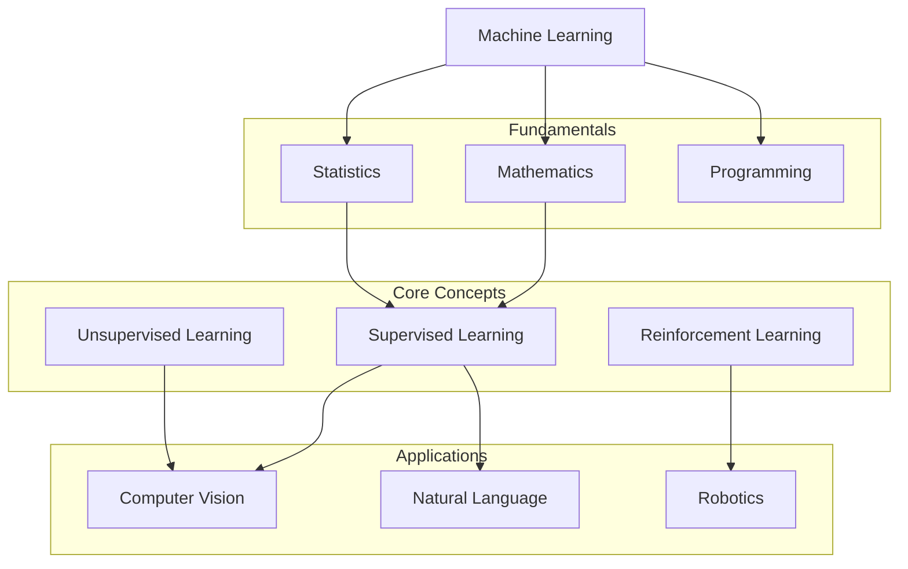
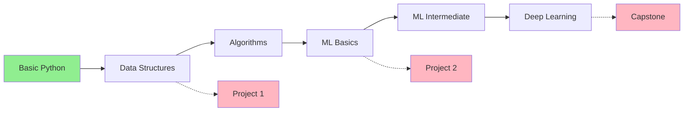
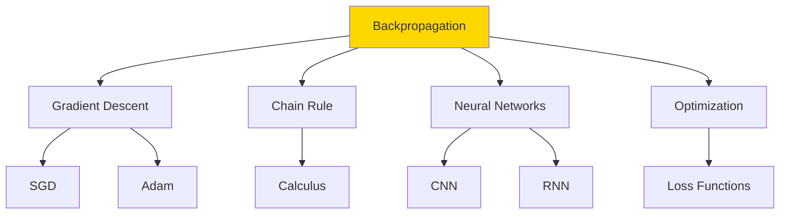
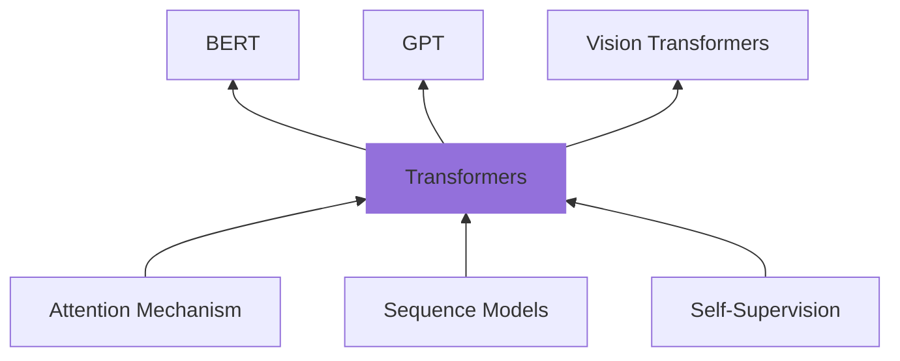
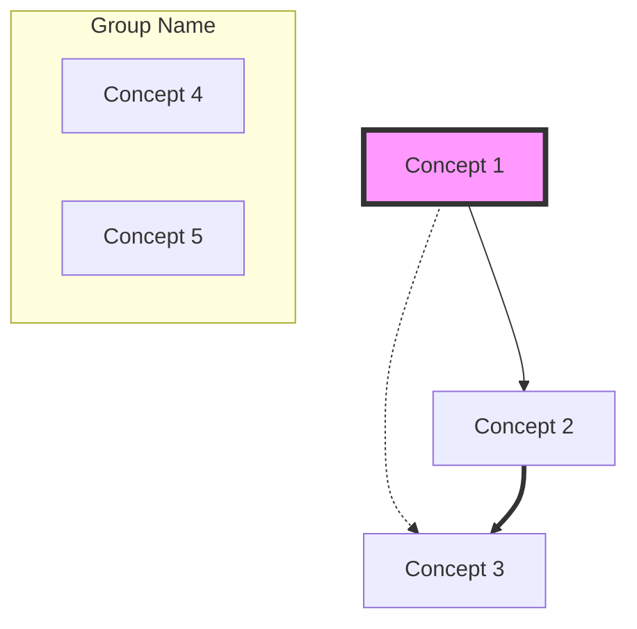
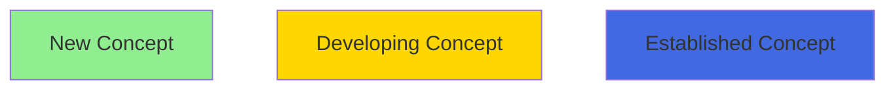
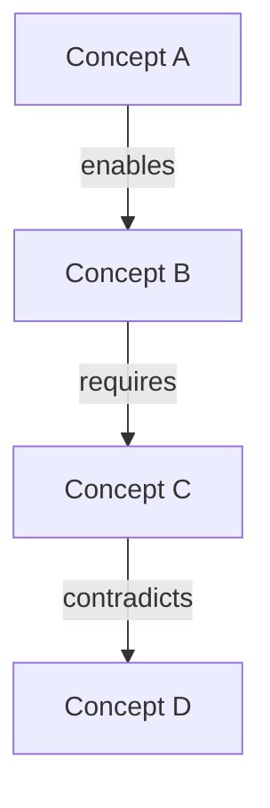
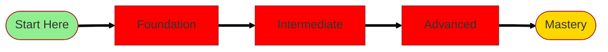

# Concept Mapping Workflow

## Overview
Transform your Zettelkasten notes into visual knowledge graphs that reveal patterns, connections, and learning paths.

## Types of Concept Maps

### 1. Domain Overview Map
Shows all major concepts in a knowledge area:


### 2. Learning Path Map
Shows progression through concepts:


### 3. Connection Network Map
Shows how a single concept connects:


### 4. Synthesis Map
Shows how ideas combine:


## Creating Concept Maps

### Step 1: Gather Related Notes
```bash
# Find all notes with specific tag
grep -l "#machine-learning" zettelkasten/**/*.md

# Find notes with specific connections
grep -l "\[\[central-note-id\]\]" zettelkasten/**/*.md

# Find notes in date range
find zettelkasten -name "*.md" -mtime -30
```

### Step 2: Identify Structure Type

#### Hierarchical Structure
Best for:
- Learning prerequisites
- Taxonomies
- Organizational charts
- Decision trees

#### Network Structure
Best for:
- Interconnected concepts
- Influence relationships
- System interactions
- Knowledge webs

#### Flow Structure
Best for:
- Processes
- Learning paths
- Cause and effect
- Temporal sequences

#### Radial Structure
Best for:
- Central concept exploration
- Mind mapping
- Feature analysis
- Characteristic breakdown

### Step 3: Extract Key Elements

#### Nodes (Concepts)
- Note titles
- Core insights
- Key terms
- Important questions

#### Edges (Relationships)
- "Builds on"
- "Contrasts with"
- "Enables"
- "Is example of"
- "Requires"
- "Leads to"

#### Clusters (Groups)
- By domain
- By complexity level
- By time period
- By application area

### Step 4: Generate Mermaid Diagram

#### Basic Template


#### Relationship Types
- `-->` Solid arrow (strong connection)
- `-.->` Dotted arrow (weak connection)
- `==>` Thick arrow (critical path)
- `---` Line without arrow (association)

### Step 5: Enhance with Metadata

#### Node Styling by Maturity


#### Edge Labels


## Automated Map Generation

### Python Script for Note Network
```python
#!/usr/bin/env python3
import os
import re
from collections import defaultdict

def generate_concept_map(directory):
    """Generate Mermaid diagram from note connections"""
    
    connections = defaultdict(list)
    notes = {}
    
    # Parse all notes
    for root, dirs, files in os.walk(directory):
        for file in files:
            if file.endswith('.md'):
                note_id = file.replace('.md', '')
                filepath = os.path.join(root, file)
                
                with open(filepath, 'r') as f:
                    content = f.read()
                    
                    # Extract title
                    title_match = re.search(r'^# (.+)$', content, re.M)
                    if title_match:
                        notes[note_id] = title_match.group(1)
                    
                    # Extract connections
                    links = re.findall(r'\[\[([^\]]+)\]\]', content)
                    for link in links:
                        connections[note_id].append(link)
    
    # Generate Mermaid
    mermaid = ["graph TD"]
    
    # Add nodes
    for note_id, title in notes.items():
        safe_id = note_id.replace('-', '_')
        mermaid.append(f"    {safe_id}[{title}]")
    
    # Add connections
    for source, targets in connections.items():
        safe_source = source.replace('-', '_')
        for target in targets:
            if target in notes:
                safe_target = target.replace('-', '_')
                mermaid.append(f"    {safe_source} --> {safe_target}")
    
    return '\n'.join(mermaid)

# Generate map
map_code = generate_concept_map('zettelkasten/permanent')
print(map_code)
```

### Interactive D3.js Visualization
```html
<!DOCTYPE html>
<html>
<head>
    <script src="https://d3js.org/d3.v7.min.js"></script>
    <style>
        .node {
            fill: #69b3a2;
            stroke: #000;
            stroke-width: 1.5px;
        }
        .link {
            stroke: #999;
            stroke-opacity: 0.6;
        }
        .label {
            font: 12px sans-serif;
            pointer-events: none;
        }
    </style>
</head>
<body>
    <svg width="960" height="600"></svg>
    <script>
        // Load note data
        d3.json("notes.json").then(function(data) {
            // Create force simulation
            const simulation = d3.forceSimulation(data.nodes)
                .force("link", d3.forceLink(data.links).id(d => d.id))
                .force("charge", d3.forceManyBody().strength(-300))
                .force("center", d3.forceCenter(480, 300));
            
            // Create SVG elements
            const svg = d3.select("svg");
            
            const link = svg.selectAll(".link")
                .data(data.links)
                .enter().append("line")
                .attr("class", "link");
            
            const node = svg.selectAll(".node")
                .data(data.nodes)
                .enter().append("circle")
                .attr("class", "node")
                .attr("r", 5)
                .call(d3.drag()
                    .on("start", dragstarted)
                    .on("drag", dragged)
                    .on("end", dragended));
            
            // Add labels
            const label = svg.selectAll(".label")
                .data(data.nodes)
                .enter().append("text")
                .attr("class", "label")
                .text(d => d.title);
            
            // Update positions
            simulation.on("tick", () => {
                link
                    .attr("x1", d => d.source.x)
                    .attr("y1", d => d.source.y)
                    .attr("x2", d => d.target.x)
                    .attr("y2", d => d.target.y);
                
                node
                    .attr("cx", d => d.x)
                    .attr("cy", d => d.y);
                
                label
                    .attr("x", d => d.x + 8)
                    .attr("y", d => d.y + 3);
            });
        });
    </script>
</body>
</html>
```

## Map Analysis Techniques

### Pattern Recognition
Look for:
- Dense clusters (key topic areas)
- Bridge nodes (connecting different domains)
- Isolated nodes (needs integration)
- Long paths (complex dependencies)
- Cycles (reinforcing concepts)

### Gap Analysis
Identify:
- Missing connections
- Underdeveloped areas
- Potential synthesis points
- Learning prerequisites not documented

### Path Finding
Discover:
- Shortest learning paths
- Alternative routes to understanding
- Critical concepts (many paths pass through)
- Optional vs required knowledge

## Export Formats

### For Documentation
```markdown
## Knowledge Map


### Key Nodes
- **Central Concepts**: [List]
- **Prerequisites**: [List]
- **Applications**: [List]

### Learning Paths
1. Beginner: A → B → C
2. Intermediate: D → E → F
3. Advanced: G → H → I
```

### For Presentation


### For Analysis
```csv
source,target,relationship,strength
note1,note2,builds_on,strong
note2,note3,enables,medium
note3,note4,contrasts,weak
```

## Integration with Learning

### Before Learning Session
1. Generate map of target area
2. Identify prerequisites
3. Plan learning path
4. Note current position

### During Learning
1. Add new nodes as discovered
2. Mark traversed paths
3. Note unexpected connections
4. Identify missing links

### After Learning
1. Update map with new knowledge
2. Reorganize if patterns emerge
3. Highlight insights
4. Plan next exploration

## Remember
- Maps are thinking tools, not just displays
- Keep maps focused (max 20-30 nodes)
- Use consistent relationship types
- Update maps as understanding evolves
- Different views reveal different insights