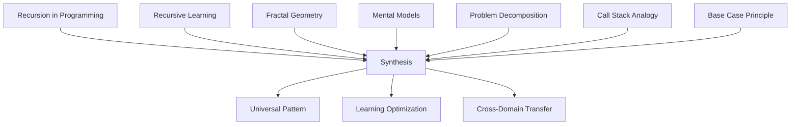

# Automatic Synthesis Protocol

## Purpose
Automatically detect opportunities for synthesis and generate meta-insights from clusters of related notes.

## Synthesis Triggers

```yaml
synthesis_triggers:
  cluster_size:
    threshold: ">= 5 related notes"
    description: "When enough related notes accumulate"
    action: "Generate cluster synthesis"
    
  time_based:
    interval: "weekly"
    description: "Regular synthesis review"
    action: "Review recent notes for synthesis"
    
  emergence:
    indicator: "new pattern detected"
    description: "When patterns emerge across notes"
    action: "Capture emergent insight"
    
  contradiction:
    indicator: "multiple contradictions"
    description: "When conflicting ideas need resolution"
    action: "Create reconciliation synthesis"
    
  question_accumulation:
    threshold: ">= 3 related questions"
    description: "When questions cluster around topic"
    action: "Generate exploratory synthesis"
    
  complexity_threshold:
    indicator: "interconnection density > 0.7"
    description: "When relationships become complex"
    action: "Create simplifying synthesis"
```

## Synthesis Process

### Step 1: Identify Clusters
Find strongly connected components in the knowledge graph.

```python
class SynthesisDetector:
    def __init__(self, note_matrix):
        self.matrix = note_matrix
        self.synthesis_queue = []
        self.completed_syntheses = []
        
    def identify_synthesis_candidates(self):
        """Identify notes ready for synthesis"""
        
        candidates = []
        
        # Cluster-based candidates
        clusters = self.matrix.identify_clusters(min_cluster_size=5)
        for cluster in clusters:
            if not self.has_recent_synthesis(cluster["notes"]):
                candidates.append({
                    "type": "cluster",
                    "notes": cluster["notes"],
                    "theme": cluster["theme"],
                    "priority": cluster["density"] * cluster["size"],
                    "reason": f"Cluster of {cluster['size']} notes on {cluster['theme']}"
                })
        
        # Pattern-based candidates
        patterns = self.detect_patterns()
        for pattern in patterns:
            if pattern["confidence"] > 0.7:
                candidates.append({
                    "type": "pattern",
                    "notes": pattern["notes"],
                    "theme": pattern["pattern_type"],
                    "priority": pattern["confidence"] * len(pattern["notes"]),
                    "reason": f"Pattern detected: {pattern['description']}"
                })
        
        # Contradiction-based candidates
        contradictions = self.matrix.find_contradictions()
        if len(contradictions) >= 3:
            related_notes = self.get_contradiction_notes(contradictions)
            candidates.append({
                "type": "contradiction",
                "notes": related_notes,
                "theme": "Resolving contradictions",
                "priority": len(contradictions) * 0.9,
                "reason": f"{len(contradictions)} contradictions need resolution"
            })
        
        # Question-based candidates
        questions = self.find_question_clusters()
        for q_cluster in questions:
            if len(q_cluster["questions"]) >= 3:
                candidates.append({
                    "type": "exploration",
                    "notes": q_cluster["related_notes"],
                    "theme": q_cluster["topic"],
                    "priority": len(q_cluster["questions"]) * 0.7,
                    "reason": f"Multiple questions about {q_cluster['topic']}"
                })
        
        return sorted(candidates, key=lambda x: x["priority"], reverse=True)
    
    def detect_patterns(self):
        """Detect patterns across notes"""
        
        patterns = []
        
        # Look for recurring themes
        theme_frequencies = self.analyze_themes()
        for theme, data in theme_frequencies.items():
            if data["frequency"] >= 4:
                patterns.append({
                    "pattern_type": "recurring_theme",
                    "description": f"Recurring theme: {theme}",
                    "notes": data["notes"],
                    "confidence": min(1.0, data["frequency"] / 10)
                })
        
        # Look for progression patterns
        chains = self.find_knowledge_chains()
        for chain in chains:
            if len(chain) >= 4:
                patterns.append({
                    "pattern_type": "knowledge_progression",
                    "description": f"Knowledge building sequence",
                    "notes": chain,
                    "confidence": 0.8
                })
        
        # Look for analogical patterns
        analogies = self.find_analogies()
        for analogy_group in analogies:
            if len(analogy_group) >= 3:
                patterns.append({
                    "pattern_type": "analogical",
                    "description": "Cross-domain pattern",
                    "notes": analogy_group,
                    "confidence": 0.75
                })
        
        return patterns
```

### Step 2: Generate Synthesis
Create a synthesis note from identified clusters.

```python
class SynthesisGenerator:
    def __init__(self, notes, synthesis_type):
        self.notes = notes
        self.synthesis_type = synthesis_type
        self.synthesis_content = []
        
    def generate_synthesis(self):
        """Generate complete synthesis note"""
        
        synthesis = {
            "title": self.generate_title(),
            "type": "synthesis",
            "content": self.build_content(),
            "source_notes": [n["id"] for n in self.notes],
            "insights": self.extract_insights(),
            "connections": self.map_connections(),
            "questions": self.generate_questions(),
            "applications": self.identify_applications(),
            "metadata": {
                "synthesis_type": self.synthesis_type,
                "created": datetime.now(),
                "confidence": self.calculate_confidence(),
                "complexity": self.assess_complexity()
            }
        }
        
        return synthesis
    
    def build_content(self):
        """Build synthesis content"""
        
        content = []
        
        # Opening summary
        content.append(f"# {self.generate_title()}")
        content.append("")
        content.append(self.generate_summary())
        content.append("")
        
        # Common patterns
        if self.synthesis_type == "cluster":
            content.append("## Common Patterns")
            patterns = self.extract_common_patterns()
            for pattern in patterns:
                content.append(f"- {pattern}")
            content.append("")
        
        # Contradictions and resolutions
        elif self.synthesis_type == "contradiction":
            content.append("## Contradictions Identified")
            contradictions = self.identify_contradictions()
            for contradiction in contradictions:
                content.append(f"### {contradiction['topic']}")
                content.append(f"- View A: {contradiction['view_a']}")
                content.append(f"- View B: {contradiction['view_b']}")
                content.append(f"- Resolution: {contradiction['resolution']}")
                content.append("")
        
        # Emergent insights
        content.append("## Emergent Insights")
        insights = self.extract_insights()
        for i, insight in enumerate(insights, 1):
            content.append(f"{i}. {insight['description']}")
            content.append(f"   - Evidence: {insight['evidence']}")
            content.append(f"   - Implications: {insight['implications']}")
            content.append("")
        
        # Meta-patterns
        content.append("## Meta-Patterns")
        meta_patterns = self.identify_meta_patterns()
        for pattern in meta_patterns:
            content.append(f"- **{pattern['name']}**: {pattern['description']}")
        content.append("")
        
        # Connections map
        content.append("## Connection Map")
        content.append("```mermaid")
        content.append(self.generate_connection_diagram())
        content.append("```")
        content.append("")
        
        # Source notes
        content.append("## Source Notes")
        for note in self.notes[:10]:  # Limit to avoid overwhelming
            content.append(f"- [[{note['id']}]] - {note['title']}")
        if len(self.notes) > 10:
            content.append(f"- ... and {len(self.notes) - 10} more")
        
        return "\n".join(content)
    
    def extract_insights(self):
        """Extract key insights from note cluster"""
        
        insights = []
        
        # Find recurring concepts
        concepts = self.extract_concepts()
        concept_freq = {}
        for concept in concepts:
            concept_freq[concept] = concept_freq.get(concept, 0) + 1
        
        # Insights from high-frequency concepts
        for concept, freq in sorted(concept_freq.items(), 
                                   key=lambda x: x[1], reverse=True)[:5]:
            if freq >= 3:
                insight = {
                    "description": f"{concept} appears across multiple contexts",
                    "evidence": f"Found in {freq} notes",
                    "implications": self.analyze_implications(concept),
                    "confidence": min(1.0, freq / len(self.notes))
                }
                insights.append(insight)
        
        # Insights from relationship patterns
        relationship_insights = self.analyze_relationships()
        insights.extend(relationship_insights)
        
        # Insights from progression
        if self.synthesis_type == "knowledge_progression":
            progression_insight = self.analyze_progression()
            if progression_insight:
                insights.append(progression_insight)
        
        return insights
    
    def identify_meta_patterns(self):
        """Identify patterns about patterns"""
        
        meta_patterns = []
        
        # Check for fractal patterns (same pattern at different scales)
        fractal = self.check_fractal_pattern()
        if fractal:
            meta_patterns.append({
                "name": "Fractal Structure",
                "description": f"Pattern repeats at different scales: {fractal}"
            })
        
        # Check for emergence (whole greater than sum)
        emergence = self.check_emergence()
        if emergence:
            meta_patterns.append({
                "name": "Emergent Property",
                "description": f"Collective behavior not present in individuals: {emergence}"
            })
        
        # Check for convergence (different paths same conclusion)
        convergence = self.check_convergence()
        if convergence:
            meta_patterns.append({
                "name": "Convergent Evolution",
                "description": f"Multiple paths lead to: {convergence}"
            })
        
        return meta_patterns
```

### Step 3: Update Graph
Add synthesis note and update relationships.

```python
def update_graph_with_synthesis(matrix, synthesis_note):
    """Update the knowledge graph with new synthesis"""
    
    # Add synthesis note to matrix
    matrix.add_note(synthesis_note["id"], synthesis_note)
    
    # Connect synthesis to source notes
    for source_id in synthesis_note["source_notes"]:
        matrix.add_relationship(
            source_id,
            synthesis_note["id"],
            "synthesizes",
            strength=0.8,
            metadata={"auto_generated": True}
        )
    
    # Add cross-connections discovered during synthesis
    for connection in synthesis_note["connections"]:
        if not matrix.has_relationship(connection["from"], connection["to"]):
            matrix.add_relationship(
                connection["from"],
                connection["to"],
                connection["type"],
                strength=connection["strength"],
                metadata={"discovered_during_synthesis": True}
            )
    
    # Mark cluster as synthesized
    matrix.mark_cluster_synthesized(synthesis_note["source_notes"])
    
    # Trigger re-analysis of graph structure
    matrix.recalculate_centrality()
    matrix.identify_clusters()
    
    return matrix
```

## Automatic Synthesis Scheduler

```python
class SynthesisScheduler:
    def __init__(self, zettelkasten):
        self.zk = zettelkasten
        self.schedule = {
            "daily": self.daily_synthesis,
            "weekly": self.weekly_synthesis,
            "triggered": self.triggered_synthesis
        }
        
    def daily_synthesis(self):
        """Quick daily synthesis of new notes"""
        
        # Get notes from last 24 hours
        recent_notes = self.zk.get_recent_notes(hours=24)
        
        if len(recent_notes) >= 3:
            # Quick synthesis of daily learning
            synthesis = self.generate_daily_summary(recent_notes)
            self.zk.add_note(synthesis)
    
    def weekly_synthesis(self):
        """Comprehensive weekly synthesis"""
        
        # Run full synthesis detection
        detector = SynthesisDetector(self.zk.matrix)
        candidates = detector.identify_synthesis_candidates()
        
        # Process top candidates
        for candidate in candidates[:3]:  # Limit to top 3
            generator = SynthesisGenerator(
                candidate["notes"],
                candidate["type"]
            )
            synthesis = generator.generate_synthesis()
            
            # Add to Zettelkasten
            self.zk.add_note(synthesis)
            update_graph_with_synthesis(self.zk.matrix, synthesis)
            
            # Log synthesis
            self.log_synthesis(synthesis, candidate["reason"])
    
    def triggered_synthesis(self, trigger_type, data):
        """Handle triggered synthesis events"""
        
        if trigger_type == "cluster_threshold":
            # Cluster reached critical size
            self.synthesize_cluster(data["cluster"])
            
        elif trigger_type == "contradiction_detected":
            # Multiple contradictions need resolution
            self.synthesize_contradictions(data["contradictions"])
            
        elif trigger_type == "pattern_emerged":
            # New pattern detected
            self.synthesize_pattern(data["pattern"])
```

## Example Synthesis Output

```markdown
# Synthesis: Recursive Learning Patterns

This synthesis emerges from 7 interconnected notes exploring recursion across different domains - programming, learning, and natural systems.

## Common Patterns
- Self-reference as a fundamental mechanism
- Base cases prevent infinite loops
- Decomposition into similar subproblems
- Stack-based state management
- Exponential growth potential

## Emergent Insights

1. Recursion is a universal problem-solving pattern
   - Evidence: Appears in code, learning, fractals, and biological systems
   - Implications: Can transfer recursion understanding across domains

2. The base case principle applies to learning itself
   - Evidence: Learning needs stopping conditions to consolidate
   - Implications: Recursive learning needs reflection points

3. Mental models mirror recursive data structures
   - Evidence: Hierarchical knowledge organization resembles tree structures
   - Implications: Can optimize learning using CS data structure principles

## Meta-Patterns

- **Fractal Structure**: The pattern of breaking down problems recursively itself follows a recursive pattern
- **Emergent Complexity**: Simple recursive rules generate complex behaviors
- **Universal Principle**: Same pattern manifests across scales and domains

## Connection Map


## Applications
- Design learning curricula with recursive structure
- Apply programming patterns to knowledge organization
- Use base case principle for learning consolidation
- Implement recursive note-taking strategies

## Open Questions
- How deep can recursive learning go before cognitive overload?
- What are the "stack overflow" equivalents in human learning?
- Can we formalize recursive learning algorithms?

## Source Notes
- [[20240315_recursion_basics]] - Recursion in Programming
- [[20240316_learning_patterns]] - Patterns in Learning
- [[20240317_fractal_thinking]] - Fractal Thinking
- [[20240318_mental_models]] - Hierarchical Mental Models
- [[20240319_problem_decomposition]] - Decomposition Strategies
- [[20240320_memory_structures]] - Memory as Stack
- [[20240321_base_cases]] - The Importance of Base Cases
```

## Benefits

1. **Automatic Insight Generation**: Discovers insights without manual review
2. **Pattern Recognition**: Identifies patterns humans might miss
3. **Knowledge Consolidation**: Reduces redundancy, increases clarity
4. **Contradiction Resolution**: Automatically addresses conflicts
5. **Emergent Understanding**: Surfaces higher-order insights
6. **Scalable Knowledge Management**: Handles growing knowledge base efficiently