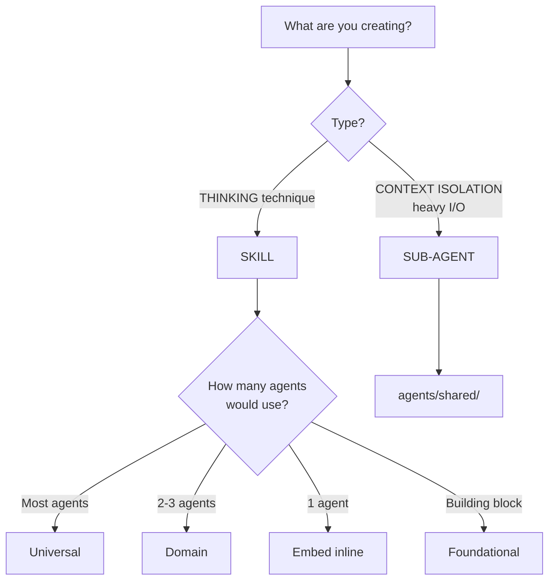

# Djinn Architecture

The core design principle that guides all decisions in Djinn.

## The "Think vs Do" Distinction

**Skills teach HOW to think. Sub-agents isolate context.**

This is the fundamental insight: reasoning and execution have different needs.

### Reasoning (Skills)
- Requires full conversation context
- Needs access to other skills
- Must be done directly, not delegated
- Guides HOW to approach problems

### Execution (Sub-agents)
- Heavy I/O that would pollute context
- Produces summarized outputs
- Process is disposable, result matters
- Does NOT need deep reasoning

## Architecture Layers

```
┌─────────────────────────────────────────────────────────────┐
│  FOUNDATIONAL SKILLS (building blocks)                      │
│  role-playing │ devils-advocate                             │
├─────────────────────────────────────────────────────────────┤
│  UNIVERSAL SKILLS (most agents use)                         │
│  ideation │ root-cause │ teacher                            │
├─────────────────────────────────────────────────────────────┤
│  DOMAIN SKILLS (cluster-specific)                           │
│  strategic-analysis │ user-research │ agent-recruitment     │
├─────────────────────────────────────────────────────────────┤
│  ORCHESTRATORS - Personas (WHEN & WHY)                      │
│  Ana (Analyst) │ Archie (Architect) │ Rita (Recruiter)      │
├─────────────────────────────────────────────────────────────┤
│  SUB-AGENTS - Context Isolation (heavy I/O)                 │
│  market-researcher │ competitive-analyzer │ knowledge-harv  │
└─────────────────────────────────────────────────────────────┘
```

## Project Structure

```
.claude/
├── commands/              # Orchestrators (Claude Code implementation)
│   ├── analyst.md
│   ├── architect.md
│   └── recruiter.md
├── skills/                # Auto-activating thinking techniques
│   ├── root-cause/
│   │   ├── SKILL.md
│   │   └── cookbook/
│   ├── ideation/
│   ├── strategic-analysis/
│   └── ...
├── agents/
│   └── shared/            # Sub-agents for context isolation
│       ├── market-researcher.md
│       ├── competitive-analyzer.md
│       └── knowledge-harvester.md
└── resources/             # Templates, checklists per agent
    ├── analyst/
    │   └── templates/
    └── architect/
        ├── templates/
        └── checklists/
```

## Components

### Skills

Skills are reusable thinking techniques that auto-activate based on conversation context.

**Structure:**
```
.claude/skills/{name}/
├── SKILL.md           # Main skill definition, triggers, overview
└── cookbook/          # Detailed technique guides
    ├── technique1.md
    ├── technique2.md
    └── technique3.md
```

**Tiers:**

| Tier | What it is | Examples |
|------|------------|----------|
| **Foundational** | Building blocks other skills compose | role-playing, devils-advocate |
| **Universal** | Most agents use | ideation, root-cause, teacher |
| **Domain** | Cluster-specific (2-3 agents) | strategic-analysis, user-research, agent-recruitment |

**When to Create a Skill:**
- It's a thinking technique (not execution)
- 2+ agents would benefit
- It's a recognized methodology
- It requires reasoning (can't be delegated)

### Sub-agents

Sub-agents are ONLY for context isolation - keeping heavy I/O work separate from the main conversation.

**Implementation:** `.claude/agents/shared/{name}.md`

**Current Sub-agents:**

| Sub-agent | Purpose |
|-----------|---------|
| `market-researcher` | Web research for market analysis |
| `competitive-analyzer` | Competitive landscape analysis |
| `knowledge-harvester` | Harvest external sources into Basic Memory |

**When to Use Sub-agents:**
- Parallel execution needed
- Heavy I/O that would flood context
- Process is disposable, only output matters

**When NOT to Use Sub-agents:**
- Reasoning work (needs skill access)
- Validation (requires judgment)
- Interactive work (can't ask follow-ups)
- Architecture decisions (needs full context)

**Important:** Sub-agents return synthesis to orchestrators. Orchestrators handle all KB writes. See [[Orchestrator]].

### Orchestrators

Orchestrators are workflow personas that combine skills and sub-agents to guide users through complex tasks.

**Implementation:** `.claude/commands/{name}.md` (invoked via `/name` in Claude Code)

**Current Orchestrators:**

| Orchestrator | Persona | Focus |
|--------------|---------|-------|
| Analyst | Ana | Research, brainstorming, strategic analysis |
| Architect | Archie | System design, ADRs, diagrams |
| Recruiter | Rita | Creating new agents |

## Extending Djinn

Use these frameworks when adding new capabilities to Djinn.

### Decision Flowchart



### Reusability Assessment

Before creating, ask: **Who else would use this?**

**For Skills:**
- Is this a thinking technique (not execution)?
- Would 2+ agents benefit?
- Is it a recognized methodology?
- Does it require reasoning (can't be delegated)?

**If all yes → Create skill**

**For Sub-agents:**
- Is this for context isolation (heavy I/O)?
- Does it NOT need deep reasoning?
- Can it return a summary instead of raw data?
- Would the process flood main context?

**If all yes → Create sub-agent in `agents/shared/`**

### Design Rules

**DO:**
1. **Skills do work directly** - Don't delegate reasoning
2. **Start embedded** - Extract to skill only when 2+ agents need it
3. **Use cookbook pattern** - SKILL.md + cookbook/*.md
4. **Put all sub-agents in shared/** - Context isolation is always shared
5. **Search Basic Memory first** - Before creating any note

**DON'T:**
1. **Never create sub-agents for reasoning** - They can't call skills
2. **Never skip the cookbook** - Skills need detailed technique docs
3. **Never make Tier 1 too early** - Start at Tier 2, promote when proven
4. **Never duplicate thinking techniques** - Extract to skill instead

## Reference

### File Locations (Claude Code Implementation)

| Creating... | Location |
|-------------|----------|
| Orchestrator | `.claude/commands/{name}.md` |
| Skill | `.claude/skills/{name}/SKILL.md` |
| Skill technique | `.claude/skills/{name}/cookbook/{technique}.md` |
| Sub-agent | `.claude/agents/shared/{name}.md` |
| Template | `.claude/resources/{agent}/templates/{file}` |
| Checklist | `.claude/resources/{agent}/checklists/{file}` |

### Common Mistakes

**Creating Sub-agents for Reasoning**
```
BAD: Sub-agent for validation or planning
GOOD: Do reasoning directly in the skill/orchestrator
```

**Over-sharing**
Creating skills that only one agent actually uses.
**Fix:** Start embedded, extract when second user emerges.

**Under-sharing**
Duplicating thinking techniques across agents.
**Fix:** Extract to skill when you see duplication.

**Wrong Type**
Making context isolation into skills (or vice versa).
**Fix:** Skills guide thinking, sub-agents isolate I/O.

## Relations

- [[project]] - Vision and goals
- [[guide]] - How to install and extend
- [[Orchestrator]] - Sub-agents return synthesis, orchestrators write to KB