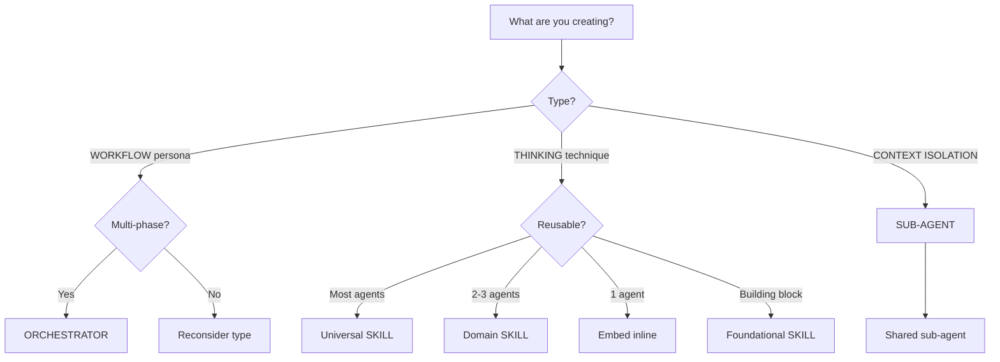

# Djinn Architecture

The core design principle: **Skills teach HOW to think. Sub-agents isolate context.**

## Components

See [[Catalog]] for current orchestrators, skills, and sub-agents.

### Orchestrators

Orchestrators are workflow personas that guide users through complex tasks. See [[Orchestrator]] pattern for full details.

**Characteristics:**
- Has a persona with name and identity
- Guides users through multi-phase workflows
- Coordinates skills for thinking, sub-agents for heavy I/O
- Does reasoning directly, never delegates thinking
- Handles all memory writes (sub-agents return synthesis)

**When to Create an Orchestrator:**
- Workflow requires multiple phases
- User needs guided multi-step process
- Need to coordinate skills and sub-agents
- Domain has clear boundaries

**When NOT to Create an Orchestrator:**
- Single-step task (just do it directly)
- No workflow coordination needed
- Skill alone would suffice

### Skills

Skills are reusable thinking techniques that auto-activate based on conversation context. See [[Skill]] pattern for full details.

**Tiers:**

| Tier | What it is |
|------|------------|
| **Foundational** | Building blocks other skills compose |
| **Universal** | Most agents use, may compose foundational |
| **Domain** | Cluster-specific (2-3 agents) |

**When to Create a Skill:**
- It's a thinking technique (not execution)
- 2+ agents would benefit
- It's a recognized methodology
- It requires reasoning (can't be delegated)

### Sub-agents

Sub-agents are ONLY for context isolation - keeping heavy I/O work separate from the main conversation. See [[Sub-agent]] pattern for full details.

**Tiers:**

| Tier | What it is |
|------|------------|
| **Foundational** | Used by all orchestrators |
| **Domain** | Specific to 2-3 related orchestrators |

**When to Use Sub-agents:**
- Parallel execution needed
- Heavy I/O that would flood context
- Process is disposable, only output matters

**When NOT to Use Sub-agents:**
- Reasoning work (needs skill access)
- Validation (requires judgment)
- Interactive work (can't ask follow-ups)
- Architecture decisions (needs full context)

**Important:** Sub-agents return synthesis to orchestrators. Orchestrators handle all memory writes.

## Workflow

See [[Orchestrator Workflow]] for the full diagram.

**1. Discovery:**
- [[Analyst]] understands the problem, challenges assumptions, creates brief

**2. Context:**
- [[Architect]] defines technical constraints, ADRs (informed by brief)
- [[UX]] researches users, creates personas and specs (informed by brief)

**3. Planning:**
- [[PM]] synthesizes all inputs into epics

**4. Execution:**
- [[SM]] breaks epics into validated stories
- [[Dev]] implements stories

**Key principle:** It all starts with Analyst - you can't do architecture or UX without understanding the problem first. Each stage produces validated output that becomes the source of truth for the next.

## Extending Djinn

Use these frameworks when adding new capabilities to Djinn.

### Decision Flowchart



### Reusability Assessment

Before creating, ask: **What type of capability is this?**

**For Orchestrators:**
- Does it need a persona with clear boundaries?
- Is there a multi-phase workflow to guide?
- Will it coordinate skills and/or sub-agents?
- Does it need to manage memory writes?

**If yes → Create orchestrator**

**For Skills:**
- Is this a thinking technique (not execution)?
- Would 2+ agents benefit?
- Is it a recognized methodology?
- Does it require reasoning (can't be delegated)?

**If all yes → Create skill**

**For Sub-agents:**
- Is this for context isolation (heavy I/O)?
- Does it NOT need deep reasoning?
- Can it return a summary instead of raw data?
- Would the process flood main context?

**If all yes → Create shared sub-agent**

### Design Rules

**DO:**
1. **Skills do work directly** - Don't delegate reasoning
2. **Start embedded** - Extract to skill only when 2+ agents need it
3. **Use progressive disclosure** - Overview + detailed technique docs
4. **Share sub-agents** - Context isolation is always shared
5. **Search memory first** - Before creating any note

**DON'T:**
1. **Never create sub-agents for reasoning** - They can't call skills
2. **Never skip technique docs** - Skills need detailed guides
3. **Never make Universal too early** - Start at Domain, promote when proven
4. **Never duplicate thinking techniques** - Extract to skill instead

## Common Mistakes

**Creating Sub-agents for Reasoning**
```
BAD: Sub-agent for validation or planning
GOOD: Do reasoning directly in the skill/orchestrator
```

**Over-sharing**
Creating skills that only one agent actually uses.
**Fix:** Start embedded, extract when second user emerges.

**Under-sharing**
Duplicating thinking techniques across agents.
**Fix:** Extract to skill when you see duplication.

**Wrong Type**
Making context isolation into skills (or vice versa).
**Fix:** Skills guide thinking, sub-agents isolate I/O.

## Relations

- [[Project]] - Vision and goals
- [[Claude Code Guide]] - Installation and usage
- [[Catalog]] - Current skills, orchestrators, sub-agents

**Diagrams:**
- [[Orchestrator Workflow]] - The pipeline from Analyst to Dev

**Patterns:**
- [[Skill]] - Thinking techniques pattern
- [[Sub-agent]] - Context isolation pattern
- [[Orchestrator]] - Workflow personas pattern
- [[Memory]] - Docs-first knowledge management

**Implementation:**
- [[Claude Code Implementation]] - File locations and syntax for Claude Code