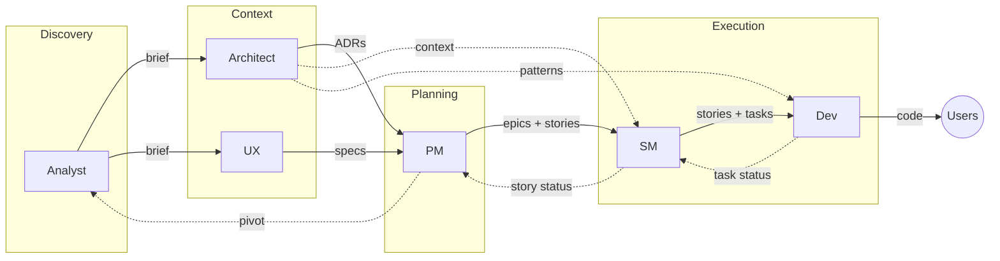

# Orchestrator Workflow

How to use Djinn's orchestrators to go from idea to code.

## Session Management

**One orchestrator per chat.** Start a new conversation when switching between orchestrators.

**Why:**
- Each orchestrator maintains persona and context throughout the session
- Mixing orchestrators in one chat causes context confusion
- Memory (Basic Memory) persists across sessions - your work isn't lost

**Correct Usage:**
```
Chat 1: /analyst → work through discovery → end session
Chat 2: /architect → review brief, create ADRs → end session  
Chat 3: /pm → synthesize into epics → end session
```

**Avoid:**
```
Same chat: /analyst → /architect → /pm  ❌
```

## Quick Start

| Goal | Command | Orchestrator |
|------|---------|--------------|
| Validate an idea | `/analyst` | Ana |
| Design architecture | `/architect` | Archie |
| Research users | `/ux` | Ulysses |
| Plan product/epics | `/pm` | Paul |
| Create stories | `/sm` | Sam |
| Implement code | `/dev` | Dave |
| Create new agents | `/recruiter` | Rita |

## The Workflow


**Down:** Work flows from problem understanding to code
**Up:** Status and learnings flow back, enabling pivots

**Key handoffs:**
- **PM → SM:** Epics with stories (PM creates both)
- **SM → Dev:** Stories broken into tasks (SM creates tasks)
- **Dev:** Works on tasks only, closes story when all tasks done
## Phases

### 1. Discovery

**When:** You have an idea but haven't validated it
**Use:** `/analyst`
**Output:** Project brief
**Next:** Move to Context when brief is validated

[[Analyst]] challenges assumptions, researches the problem, and creates a grounded brief.

### 2. Context

**When:** You have a validated brief
**Use:** `/architect` and `/ux`
**Output:** ADRs, constraints, personas, specs
**Next:** Move to Planning when context is complete

[[Architect]] defines technical constraints and patterns.
[[UX]] researches users and defines frontend specs.

### 3. Planning
**When:** You have brief + technical + user context
**Use:** `/pm`
**Output:** Epics with stories (features)
**Next:** Move to Execution when epics are approved

[[PM]] synthesizes all inputs into epics and breaks them into stories. Stories define the deliverables; SM will break them into tasks.
### 4. Execution
**When:** You have approved epics with stories
**Use:** `/sm` then `/dev`
**Output:** Tasks → Working code

[[SM]] breaks stories into tasks and plans sprints. Stories have sprint labels; tasks inherit context from their parent story.
[[Dev]] implements tasks only. When all tasks are done, Dev closes the story.
## Feedback Loop
Status flows up. Pivots happen when needed.

**Dev → SM:** Task completed, story completed, blockers, discovered issues
**SM → PM:** Sprint progress, velocity, epic completion, risks
**PM → Analyst:** Pivot signals when assumptions invalidated

This is inspect and adapt - feedback enables course correction at any level.
## Example: Adding User Authentication
1. `/analyst` - "I want to add user authentication"
   - Challenges assumptions, researches auth approaches
   - → Brief with requirements

2. `/architect` - Review brief, define constraints
   - → ADR for auth pattern (JWT vs sessions)

3. `/ux` - Research user needs
   - → Login flow, error states, personas

4. `/pm` - Synthesize into epic with stories
   - → "User Authentication" epic
   - → Stories: "Login flow", "Registration", "Password reset"

5. `/sm` - Break stories into tasks, plan sprint
   - → Tasks for "Login flow": form component, validation, API integration
   - → Assign story to sprint

6. `/dev` - Implement tasks
   - → Claims task, implements, closes task
   - → When all tasks done, closes story
   - → Status flows up to SM
## Extend the Framework

Want to create new orchestrators, skills, or sub-agents?

Use `/recruiter` - Rita guides you through the process.

## Relations

- [[Architecture]] - Design principles
- [[Catalog]] - All components listed