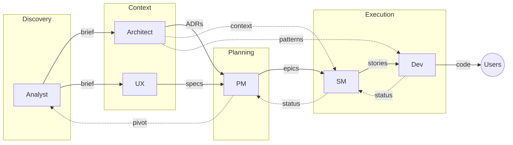

# Orchestrator Workflow

How to use Djinn's orchestrators to go from idea to code.

## Quick Start

| Goal | Command | Orchestrator |
|------|---------|--------------|
| Validate an idea | `/analyst` | Ana |
| Design architecture | `/architect` | Archie |
| Research users | `/ux` | Ulysses |
| Plan product/epics | `/pm` | Paul |
| Create stories | `/sm` | Sam |
| Implement code | `/dev` | Dave |
| Create new agents | `/recruiter` | Rita |

## The Workflow

**Down:** Work flows from problem understanding to code
**Up:** Status and learnings flow back, enabling pivots

## Phases

### 1. Discovery

**When:** You have an idea but haven't validated it
**Use:** `/analyst`
**Output:** Project brief
**Next:** Move to Context when brief is validated

[[Analyst]] challenges assumptions, researches the problem, and creates a grounded brief.

### 2. Context

**When:** You have a validated brief
**Use:** `/architect` and `/ux`
**Output:** ADRs, constraints, personas, specs
**Next:** Move to Planning when context is complete

[[Architect]] defines technical constraints and patterns.
[[UX]] researches users and defines frontend specs.

### 3. Planning

**When:** You have brief + technical + user context
**Use:** `/pm`
**Output:** Epics with acceptance criteria
**Next:** Move to Execution when epics are approved

[[PM]] synthesizes all inputs into well-informed epics.

### 4. Execution

**When:** You have approved epics
**Use:** `/sm` then `/dev`
**Output:** Validated stories → Working code

[[SM]] breaks epics into validated stories - the contract for implementation.
[[Dev]] implements stories faithfully. If the story is wrong, fix the story first.

## Feedback Loop

Status flows up. Pivots happen when needed.

**Dev → SM:** Story completed, blockers, scope changes
**SM → PM:** Epic progress, velocity, risks
**PM → Analyst:** Pivot signals when assumptions invalidated

This is inspect and adapt - feedback enables course correction at any level.

## Example: Adding User Authentication

1. `/analyst` - "I want to add user authentication"
   - Challenges assumptions, researches auth approaches
   - → Brief with requirements

2. `/architect` - Review brief, define constraints
   - → ADR for auth pattern (JWT vs sessions)

3. `/ux` - Research user needs
   - → Login flow, error states, personas

4. `/pm` - Synthesize into epic
   - → "User Authentication" epic with stories

5. `/sm` - Create validated stories
   - → "Implement login form" story (validated, complete)

6. `/dev` - Implement
   - → Working code, tests
   - Updates story status → SM

## Extend the Framework

Want to create new orchestrators, skills, or sub-agents?

Use `/recruiter` - Rita guides you through the process.

## Relations

- [[Architecture]] - Design principles
- [[Catalog]] - All components listed