# Agent Workflow and Context Flow Diagrams

## Overview
This document visualizes the complete workflow of how commands delegate to sub-agents, showing context flow and interaction patterns.

## 1. Master Command Architecture

```mermaid
graph TB
    subgraph "User Interface Layer"
        User[User Input]
    end
    
    subgraph "Command Layer (Entry Points)"
        analyst["/analyst<br/>Ana"]
        ux["/ux<br/>Ulysses"]
        pm["/pm<br/>Paul"]
        architect["/architect<br/>Archie"]
        sm["/sm<br/>Sam"]
        dev["/dev<br/>Dave"]
        teacher["/teacher<br/>Tina"]
        recruiter["/recruiter<br/>Rita"]
    end
    
    subgraph "Shared Sub-Agents (Available to All)"
        kb["kb-analyst<br/>Universal KB Operations"]
        qa["qa-reviewer<br/>Quality Assurance"]
        harvester["knowledge-harvester<br/>Documentation Harvesting"]
        plan_val["plan-validator<br/>Plan Validation"]
    end
    
    subgraph "Specialized Sub-Agents"
        subgraph "Analyst Sub-Agents"
            research_arch["research-architect"]
            doc_gen["documentation-generator"]
            competitive["competitive-analyzer"]
            market["market-researcher"]
            insight["insight-synthesizer"]
        end
        
        subgraph "UX Sub-Agents"
            user_research["user-researcher"]
            usability["usability-validator"]
            design["design-creator"]
            frontend["frontend-specifier"]
        end
        
        subgraph "PM Sub-Agents"
            product_strat["product-strategist"]
            stakeholder["stakeholder-coordinator"]
            change_coord["change-coordinator"]
            exec_track["execution-tracker"]
            doc_proc["document-processor"]
        end
        
        subgraph "Architect Sub-Agents"
            system_design["system-designer"]
            arch_review["architecture-reviewer"]
            adr["adr-manager"]
            pattern_lib["pattern-librarian"]
            diagram["diagram-generator"]
        end
        
        subgraph "SM Sub-Agents"
            story_create["story-creator"]
            story_valid["story-validator"]
            sprint_plan["sprint-planner"]
            retro["retrospective-facilitator"]
            change_analyze["change-analyzer"]
        end
        
        subgraph "Teacher Sub-Agents"
            zk_capture["zettelkasten-capture"]
            zk_synth["zettelkasten-synthesizer"]
            zk_relate["zettelkasten-relationship-mapper"]
            gap_analyze["learning-gap-analyzer"]
            misconception["misconception-detector"]
            path_plan["learning-path-planner"]
            difficulty["concept-difficulty-ranker"]
            assessment["assessment-generator"]
        end
        
        subgraph "Recruiter Sub-Agents"
            agent_plan["agent-planner"]
            agent_build["agent-builder"]
            pattern_extract["pattern-extractor"]
            arch_analyze["architecture-analyst"]
            resource_val["resource-validator"]
            constraint_val["constraint-validator"]
            coherence["coherence-verifier"]
        end
    end
    
    User --> analyst & ux & pm & architect & sm & dev & teacher & recruiter
    
    %% Shared agent connections (all commands can use)
    analyst & ux & pm & architect & sm & dev & teacher & recruiter -.-> kb & qa & harvester & plan_val
    
    %% Specific sub-agent connections
    analyst --> research_arch & doc_gen & competitive & market & insight
    ux --> user_research & usability & design & frontend
    pm --> product_strat & stakeholder & change_coord & exec_track & doc_proc
    architect --> system_design & arch_review & adr & pattern_lib & diagram
    sm --> story_create & story_valid & sprint_plan & retro & change_analyze
    teacher --> zk_capture & zk_synth & zk_relate & gap_analyze & misconception & path_plan & difficulty & assessment
    recruiter --> agent_plan & agent_build & pattern_extract & arch_analyze & resource_val & constraint_val & coherence
    
    style kb fill:#e1f5fe
    style qa fill:#e1f5fe
    style harvester fill:#e1f5fe
    style plan_val fill:#e1f5fe
```

## 2. Context Flow Pattern

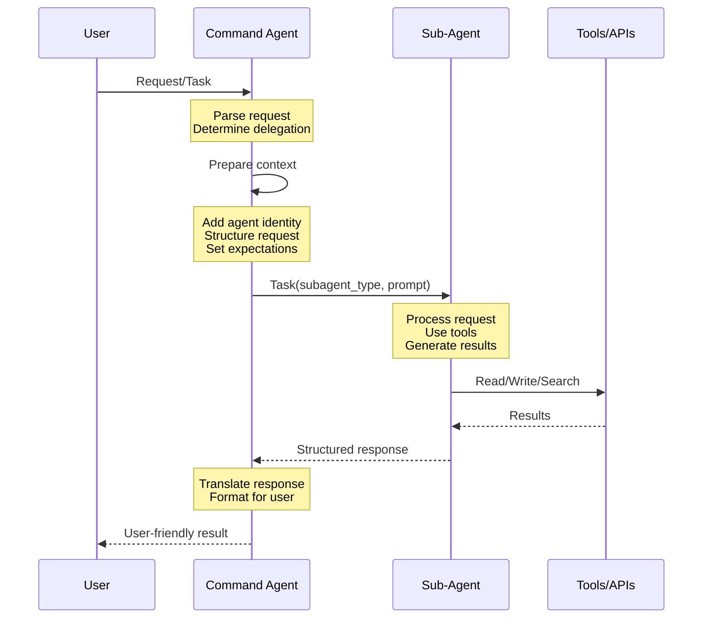

## 3. Analyst (Ana) Workflow

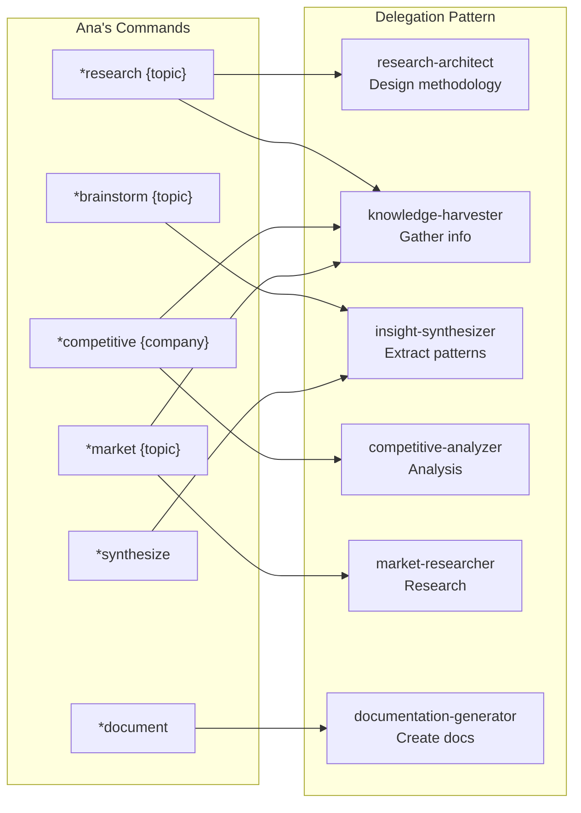

## 4. UX Designer (Ulysses) Workflow

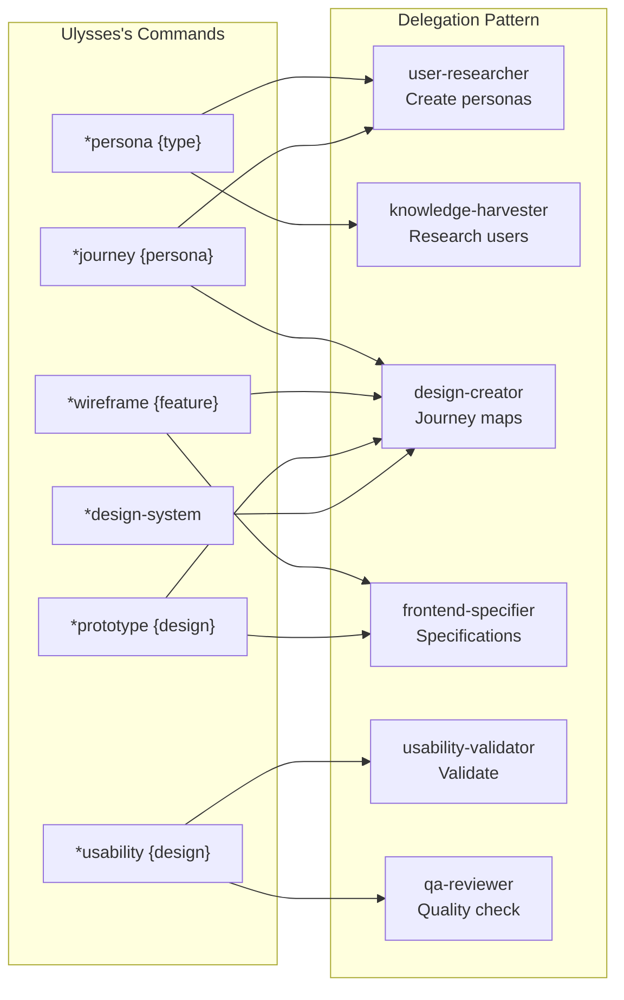

## 5. Product Manager (Paul) Workflow

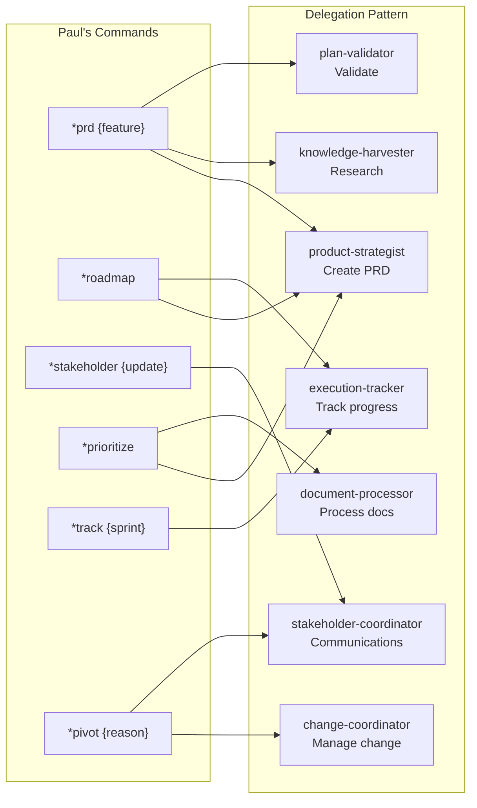

## 6. Architect (Archie) Workflow

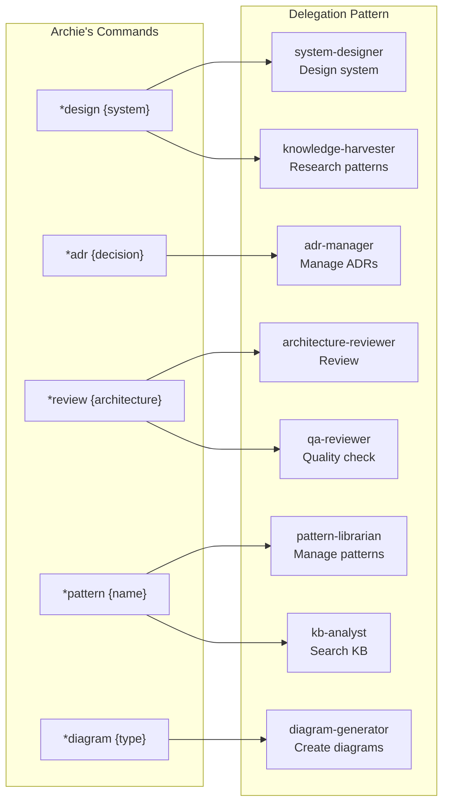

## 7. Scrum Master (Sam) Workflow

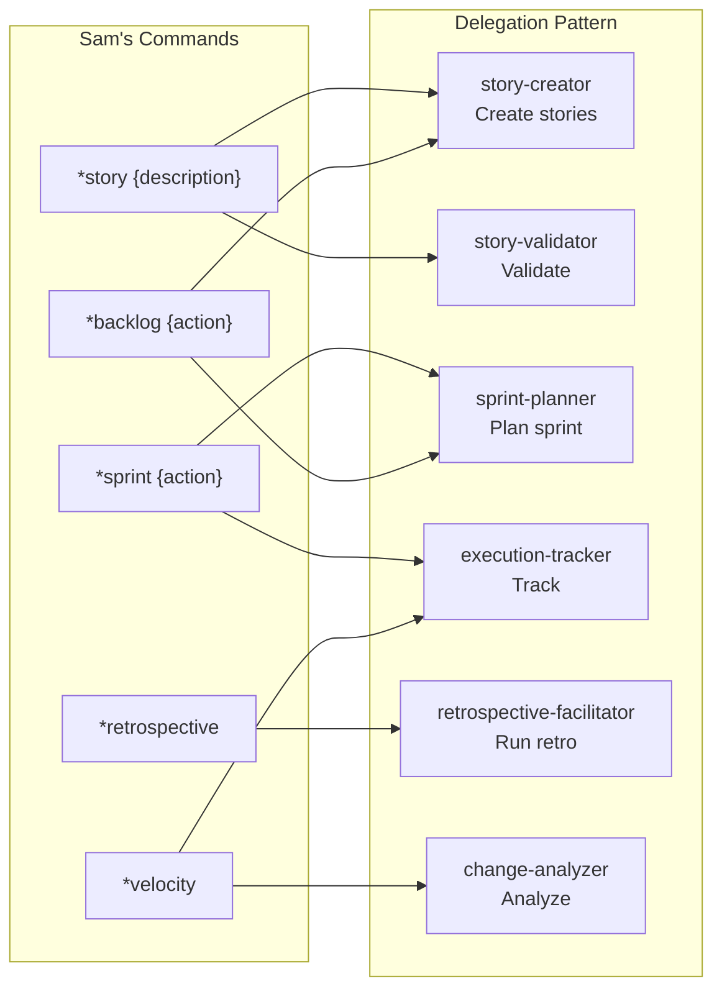

## 8. Teacher (Tina) Workflow

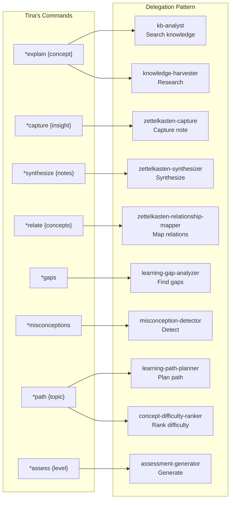

## 9. Recruiter (Rita) Workflow

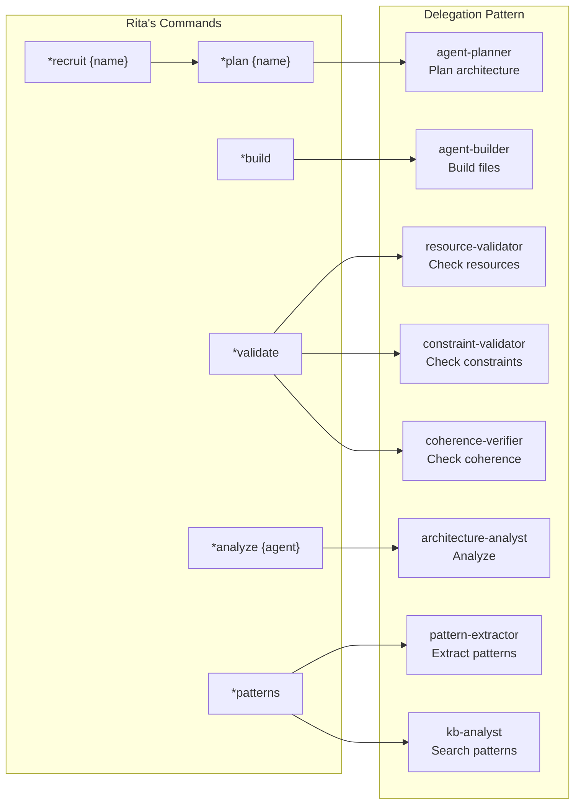

## 10. Developer (Dave) Workflow

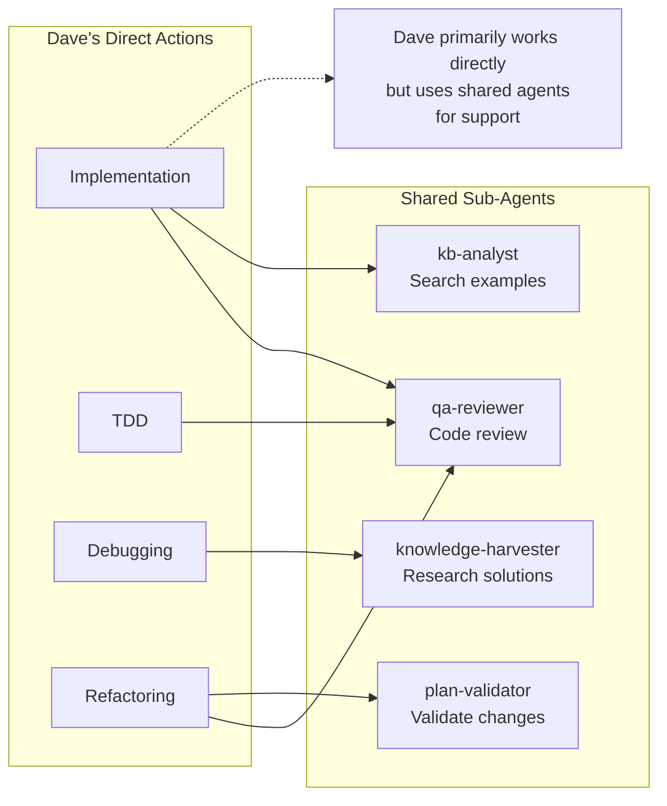

## 11. Context Preparation Examples

### Example 1: Ana delegates to market-researcher

```yaml
User Request: "Research the AI coding assistant market"

Ana's Context Preparation:
  agent_context: "You are being invoked by Ana (analyst command)"
  task: "Comprehensive market research on AI coding assistants"
  scope: "Market size, key players, trends, opportunities"
  format: "Structured market research report"
  return_to: "Ana for synthesis and presentation"
  
market-researcher receives:
  - Clear task definition
  - Scope boundaries
  - Expected output format
  - No direct user interaction needed
```

### Example 2: Rita delegates to agent-planner

```yaml
User Request: "*recruit code-reviewer"

Rita's Context Preparation:
  agent_context: "Request from Rita's orchestration workflow"
  task: "Analyze and plan agent architecture for: code-reviewer"
  requirements:
    - Determine agent type (command/subagent)
    - Analyze complexity and decomposition needs
    - Select appropriate tools and model
    - Calculate constraint balance score
  return_format: "Structured analysis (not for end user)"
  
agent-planner receives:
  - Specific analysis requirements
  - Clear output structure needed
  - Instructions to report to Rita only
```

## 12. Shared Agent Access Pattern

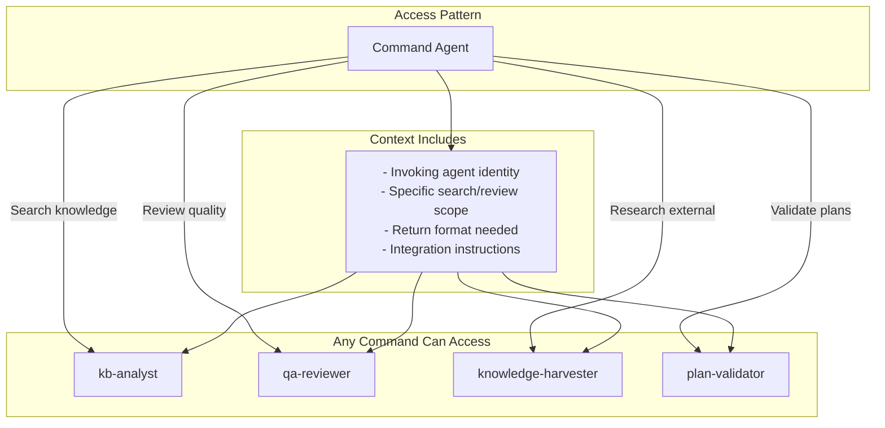

## 13. Decision Flow for Delegation

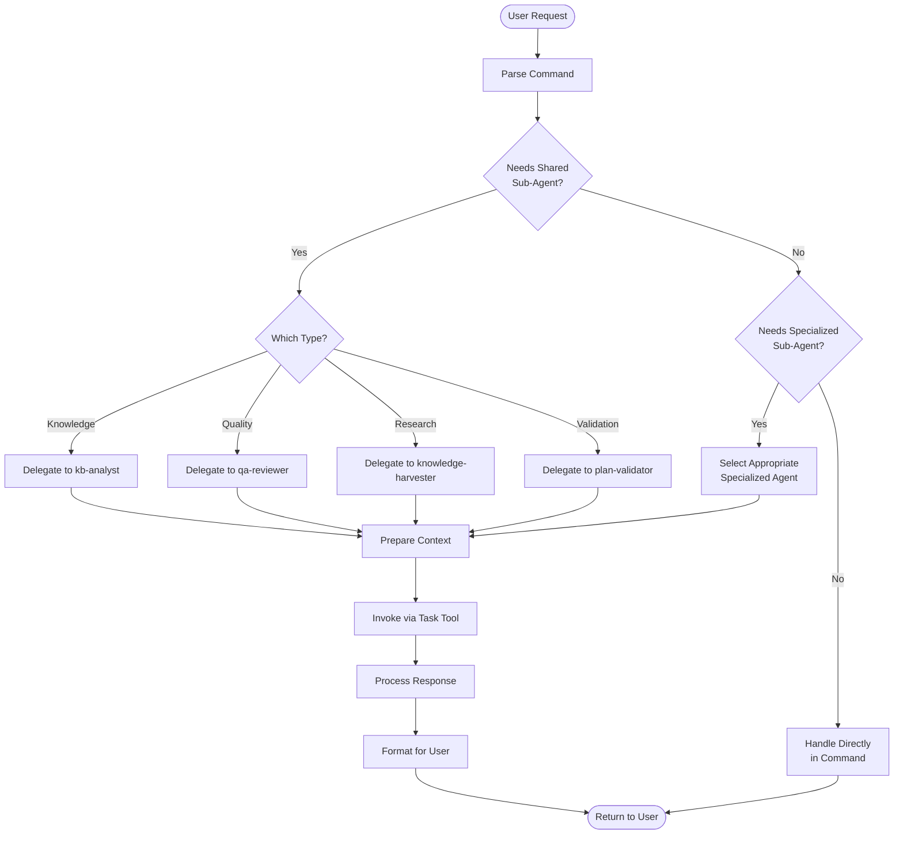

## 14. Error Handling and Recovery

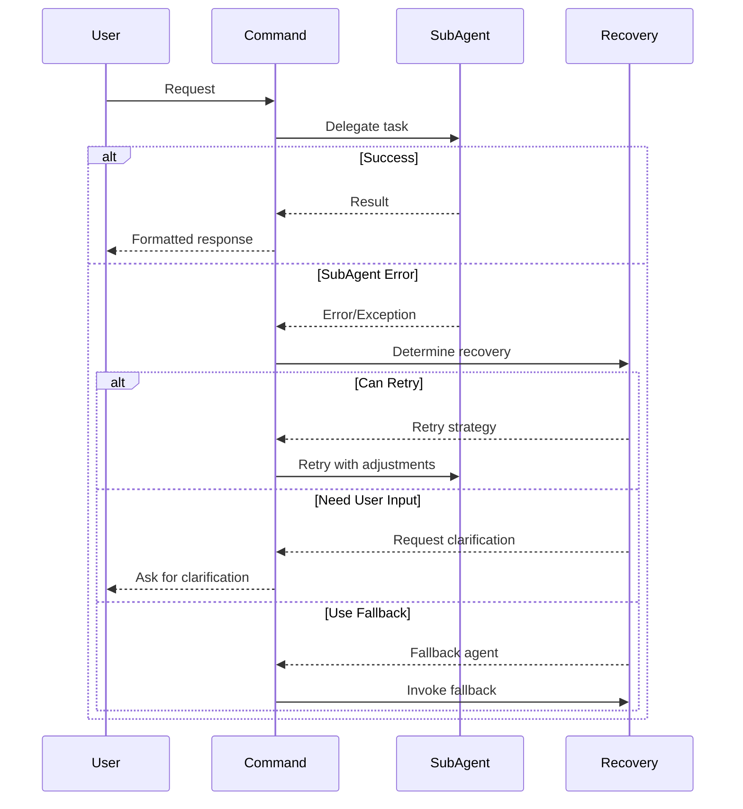

## 15. Cross-Command Product Development Lifecycle

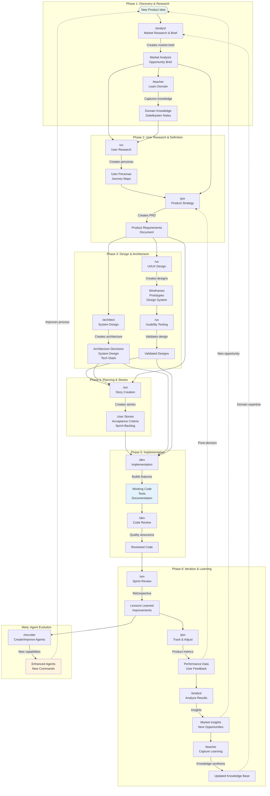

## 16. Detailed Cross-Command Workflow Sequence

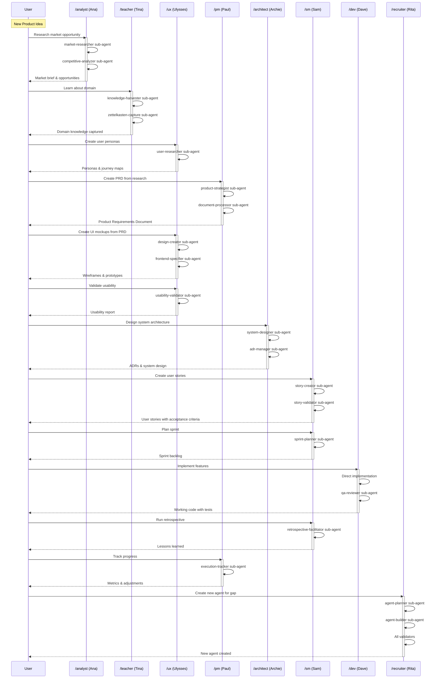

## 17. Command Handoff Patterns

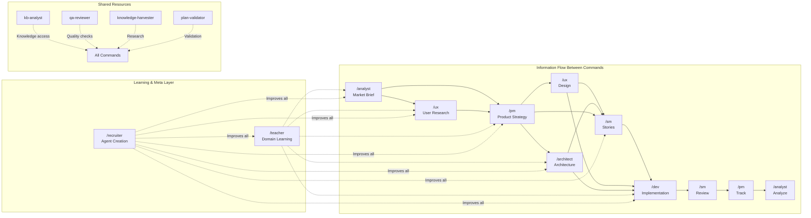

## 18. Typical Product Development Scenarios

### Scenario 1: New Feature Development

```yaml
Flow:
  1. Analyst:
     - Research competitive features
     - Identify market opportunity
     - Output: Feature opportunity brief
  
  2. Teacher:
     - Learn about technical domain
     - Capture key concepts
     - Output: Knowledge notes
  
  3. UX:
     - Research user needs
     - Create personas
     - Output: User personas, journey maps
  
  4. PM:
     - Synthesize research into PRD
     - Define success metrics
     - Output: Product Requirements Document
  
  5. UX:
     - Design wireframes
     - Create prototypes
     - Validate usability
     - Output: Validated designs
  
  6. Architect:
     - Design technical solution
     - Make architecture decisions
     - Output: ADRs, system design
  
  7. SM:
     - Break down into stories
     - Plan sprints
     - Output: Sprint backlog
  
  8. Dev:
     - Implement features
     - Write tests
     - Output: Working code
  
  9. SM:
     - Review sprint
     - Run retrospective
     - Output: Improvements
  
  10. PM:
      - Track metrics
      - Adjust strategy
      - Output: Product updates
```

### Scenario 2: Technical Debt Reduction

```yaml
Flow:
  1. Dev:
     - Identify technical debt
     - Output: Debt assessment
  
  2. Architect:
     - Review architecture
     - Propose improvements
     - Output: Refactoring plan
  
  3. PM:
     - Prioritize against features
     - Output: Technical debt PRD
  
  4. SM:
     - Create refactoring stories
     - Plan debt reduction sprint
     - Output: Technical backlog
  
  5. Dev:
     - Implement improvements
     - Output: Refactored code
  
  6. Teacher:
     - Document patterns learned
     - Output: Knowledge base updates
```

### Scenario 3: Agent Capability Gap

```yaml
Flow:
  1. Any Command:
     - Identifies missing capability
     - Output: Gap description
  
  2. Recruiter:
     - Plans new agent architecture
     - Output: Agent plan
  
  3. Recruiter:
     - Builds agent files
     - Output: New agent
  
  4. Recruiter:
     - Validates agent
     - Output: Validated agent
  
  5. Teacher:
     - Documents new capability
     - Output: Usage documentation
  
  6. Original Command:
     - Uses new agent
     - Output: Enhanced workflow
```

## 19. Meta-Command: Recruiter Workflow

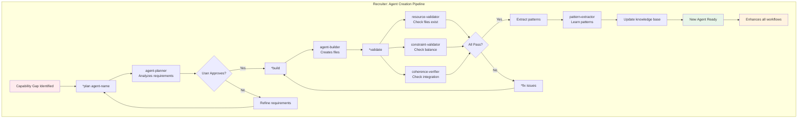

## 20. Teacher: Learning Integration

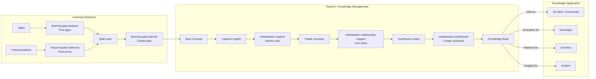

## Summary

This comprehensive diagram set shows:

1. **Master Architecture**: How all commands and sub-agents are organized
2. **Context Flow**: How context is prepared and passed between layers
3. **Command-Specific Workflows**: Each command's delegation patterns
4. **Shared Agent Access**: How any command can use shared sub-agents
5. **Decision Flows**: Logic for determining when to delegate
6. **Error Handling**: Recovery patterns for failures

### Key Patterns:

- **Commands are orchestrators**: They parse, delegate, and format responses
- **Sub-agents are specialists**: They do one thing well with minimal tools
- **Context is structured**: Each delegation includes clear context and expectations
- **Shared agents are universal**: Available to all commands for common needs
- **Users see unified responses**: Sub-agents never directly address users

This architecture enables:
- **Modularity**: Easy to add/modify agents
- **Reusability**: Shared agents reduce duplication
- **Maintainability**: Clear boundaries and responsibilities
- **Scalability**: Can grow without increasing complexity
- **Consistency**: Unified patterns across all commands