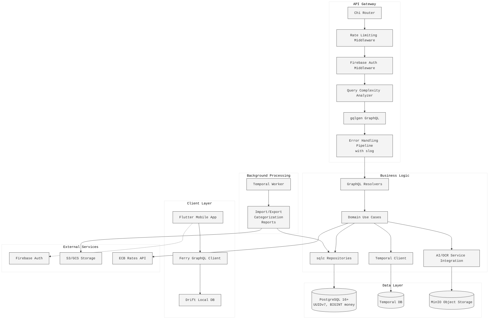

# System Overview

```mermaid
%%{init: {'theme':'base', 'themeVariables': { 'fontSize': '16px', 'primaryColor': '#f4f4f4', 'primaryBorderColor': '#333', 'lineColor': '#333', 'fontFamily': 'monospace'}}}%%
graph TB
    subgraph "Client Layer"
        Mobile[Flutter Mobile App]
        Mobile --> Ferry[Ferry GraphQL Client]
        Ferry --> Cache[Drift Local DB]
    end
    
    subgraph "API Gateway"
        Chi[Chi Router]
        Chi --> RateLimiter[Rate Limiting Middleware]
        RateLimiter --> Auth[Firebase Auth Middleware]
        Auth --> QryAnalyzer[Query Complexity Analyzer]
        QryAnalyzer --> GQL[gqlgen GraphQL]
        GQL --> ErrHandler[Error Handling Pipeline\nwith slog]
    end
    
    subgraph "Business Logic"
        ErrHandler --> Resolvers[GraphQL Resolvers]
        Resolvers --> UseCases[Domain Use Cases]
        UseCases --> Repo[sqlc Repositories]
        UseCases --> Temporal[Temporal Client]
        UseCases --> OCRService[AI/OCR Service Integration]
    end
    
    subgraph "Data Layer"
        Repo --> PG[(PostgreSQL 16+<br/>UUIDv7, BIGINT money)]
        Temporal --> TempDB[(Temporal DB)]
        OCRService --> MinIO[(MinIO Object Storage)]
    end
    
    subgraph "Background Processing"
        TempWorker[Temporal Worker]
        TempWorker --> Workflows[Import/Export<br/>Categorization<br/>Reports]
        Workflows --> Repo
    end
    
    subgraph "External Services"
        Firebase[Firebase Auth]
        S3[S3/GCS Storage]
        ECB[ECB Rates API]
    end
    
    Mobile -.-> Firebase
    Workflows --> S3
    UseCases --> ECB
```