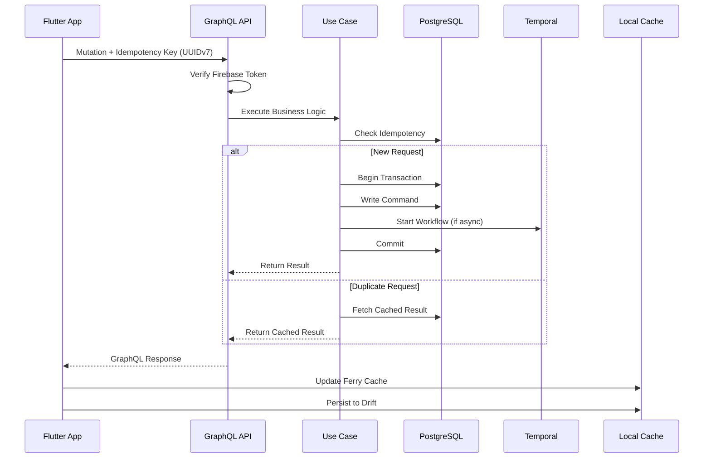

# Data Flow

```mermaid
sequenceDiagram
    participant App as Flutter App
    participant API as GraphQL API
    participant UC as Use Case
    participant DB as PostgreSQL
    participant Temp as Temporal
    participant Cache as Local Cache
    
    App->>API: Mutation + Idempotency Key (UUIDv7)
    API->>API: Verify Firebase Token
    API->>UC: Execute Business Logic
    UC->>DB: Check Idempotency
    alt New Request
        UC->>DB: Begin Transaction
        UC->>DB: Write Command
        UC->>Temp: Start Workflow (if async)
        UC->>DB: Commit
        UC-->>API: Return Result
    else Duplicate Request
        UC->>DB: Fetch Cached Result
        UC-->>API: Return Cached Result
    end
    API-->>App: GraphQL Response
    App->>Cache: Update Ferry Cache
    App->>Cache: Persist to Drift
```
