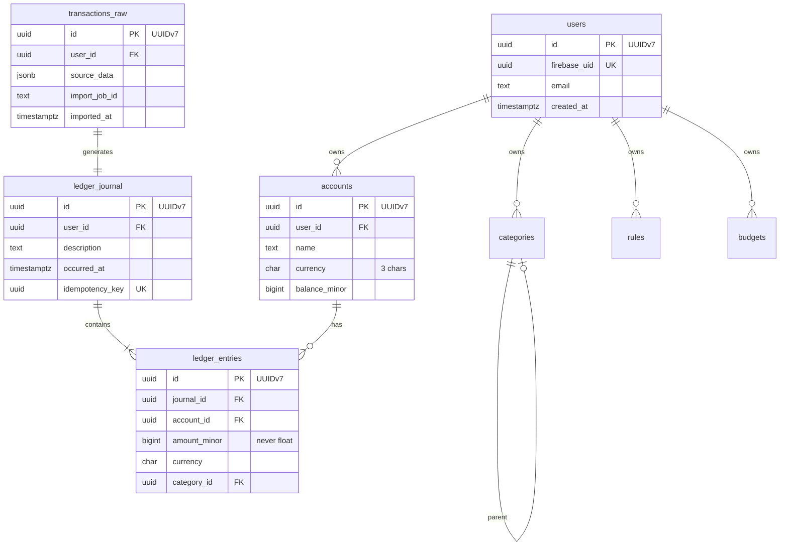

# Database Schema

```mermaid
erDiagram
    users ||--o{ accounts : owns
    users ||--o{ categories : owns
    users ||--o{ rules : owns
    users ||--o{ budgets : owns
    accounts ||--o{ ledger_entries : has
    ledger_journal ||--|{ ledger_entries : contains
    transactions_raw ||--|| ledger_journal : generates
    categories ||--o| categories : parent
    
    users {
        uuid id PK "UUIDv7"
        uuid firebase_uid UK
        text email
        timestamptz created_at
    }
    
    accounts {
        uuid id PK "UUIDv7"
        uuid user_id FK
        text name
        char currency "3 chars"
        bigint balance_minor
    }
    
    ledger_journal {
        uuid id PK "UUIDv7"
        uuid user_id FK
        text description
        timestamptz occurred_at
        uuid idempotency_key UK
    }
    
    ledger_entries {
        uuid id PK "UUIDv7"
        uuid journal_id FK
        uuid account_id FK
        bigint amount_minor "never float"
        char currency
        uuid category_id FK
    }
    
    transactions_raw {
        uuid id PK "UUIDv7"
        uuid user_id FK
        jsonb source_data
        text import_job_id
        timestamptz imported_at
    }
```
