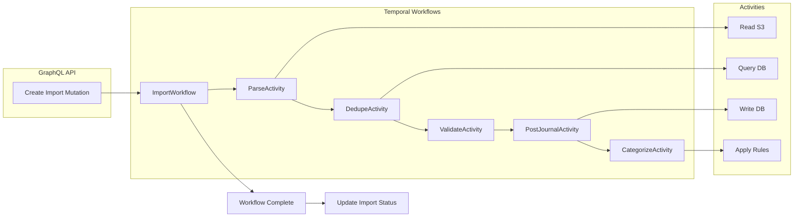

#Temporal Workflow

```mermaid
graph LR
    subgraph "GraphQL API"
        Mutation[Create Import Mutation]
    end
    
    subgraph "Temporal Workflows"
        Import[ImportWorkflow]
        Import --> Parse[ParseActivity]
        Parse --> Dedupe[DedupeActivity]
        Dedupe --> Validate[ValidateActivity]
        Validate --> Post[PostJournalActivity]
        Post --> Categorize[CategorizeActivity]
    end
    
    subgraph "Activities"
        Parse --> S3R[Read S3]
        Dedupe --> DBR1[Query DB]
        Post --> DBW[Write DB]
        Categorize --> Rules[Apply Rules]
    end
    
    Mutation --> Import
    Import --> Complete[Workflow Complete]
    Complete --> Notify[Update Import Status]
```
