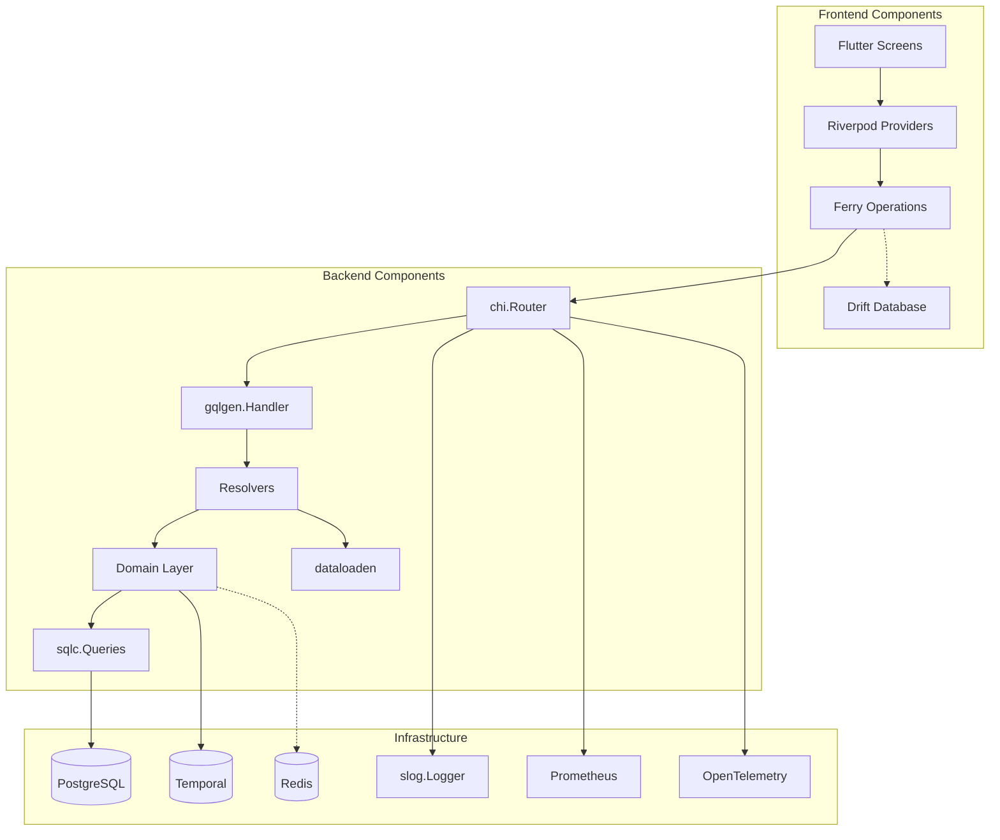

#Component Interaction

```mermaid
graph TD
    subgraph "Frontend Components"
        Screen[Flutter Screens]
        Provider[Riverpod Providers]
        Ferry[Ferry Operations]
        Drift[Drift Database]
    end
    
    subgraph "Backend Components"
        Router[chi.Router]
        GQLHandler[gqlgen.Handler]
        Resolvers[Resolvers]
        Domain[Domain Layer]
        DataLoader[dataloaden]
        Repository[sqlc.Queries]
    end
    
    subgraph "Infrastructure"
        Postgres[(PostgreSQL)]
        Temporal[(Temporal)]
        Redis[(Redis)]
        Logger[slog.Logger]
        Metrics[Prometheus]
        Tracer[OpenTelemetry]
    end
    
    Screen --> Provider
    Provider --> Ferry
    Ferry --> Router
    Ferry -.-> Drift
    
    Router --> GQLHandler
    GQLHandler --> Resolvers
    Resolvers --> Domain
    Resolvers --> DataLoader
    Domain --> Repository
    Repository --> Postgres
    Domain --> Temporal
    
    Router --> Logger
    Router --> Metrics
    Router --> Tracer
    Domain -.-> Redis
```
