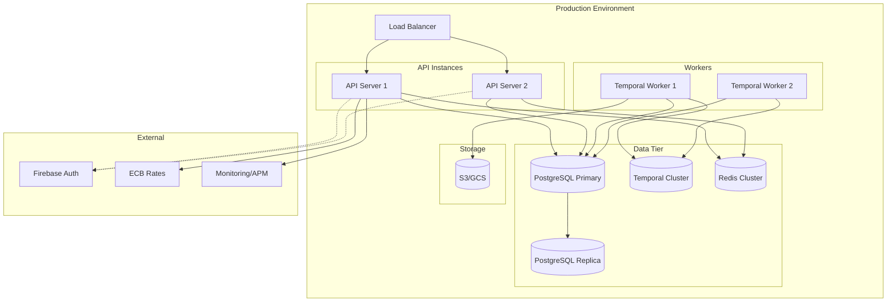

#Deployment

```mermaid
graph TB
    subgraph "Production Environment"
        LB[Load Balancer]
        
        subgraph "API Instances"
            API1[API Server 1]
            API2[API Server 2]
        end
        
        subgraph "Workers"
            W1[Temporal Worker 1]
            W2[Temporal Worker 2]
        end
        
        subgraph "Data Tier"
            PG[(PostgreSQL Primary)]
            PGR[(PostgreSQL Replica)]
            TEMP[(Temporal Cluster)]
            REDIS[(Redis Cluster)]
        end
        
        subgraph "Storage"
            S3[(S3/GCS)]
        end
    end
    
    subgraph "External"
        FB[Firebase Auth]
        ECB[ECB Rates]
        APM[Monitoring/APM]
    end
    
    LB --> API1
    LB --> API2
    API1 --> PG
    API2 --> PG
    API1 --> REDIS
    API2 --> REDIS
    W1 --> TEMP
    W2 --> TEMP
    W1 --> PG
    W2 --> PG
    W1 --> S3
    PG --> PGR
    API1 -.-> FB
    API2 -.-> FB
    API1 --> ECB
    API1 --> APM
```
