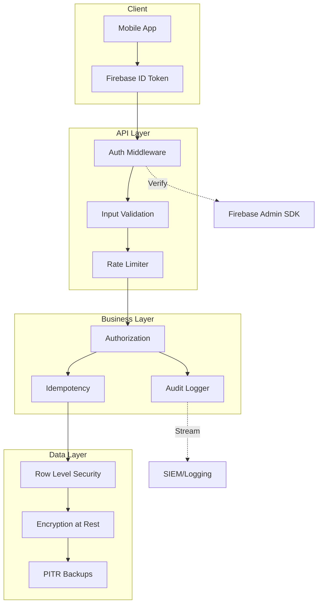

#Security Layers

```mermaid
graph TB
    subgraph "Client"
        App[Mobile App]
        Token[Firebase ID Token]
    end
    
    subgraph "API Layer"
        MW[Auth Middleware]
        Val[Input Validation]
        RL[Rate Limiter]
    end
    
    subgraph "Business Layer"
        Auth[Authorization]
        Audit[Audit Logger]
        Idemp[Idempotency]
    end
    
    subgraph "Data Layer"
        RLS[Row Level Security]
        Encrypt[Encryption at Rest]
        Backup[PITR Backups]
    end
    
    App --> Token
    Token --> MW
    MW --> Val
    Val --> RL
    RL --> Auth
    Auth --> Audit
    Auth --> Idemp
    Idemp --> RLS
    RLS --> Encrypt
    Encrypt --> Backup
    
    MW -.-> |Verify| FB[Firebase Admin SDK]
    Audit -.-> |Stream| SIEM[SIEM/Logging]
```
