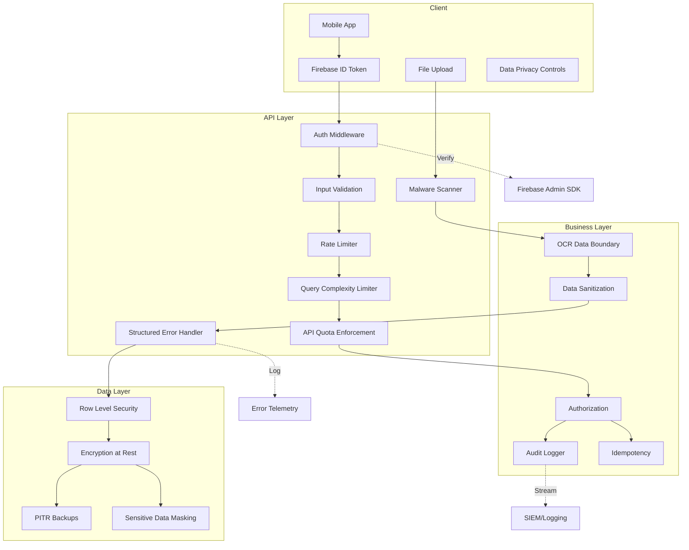

# Security Layers

## Security Layer Components

### Client Layer
- **Firebase ID Token**: Authentication token
- **Data Privacy Controls**: User-level privacy settings
- **File Upload**: Secure file submission interface

### API Layer
- **Auth Middleware**: Token validation
- **Input Validation**: Request schema and type checking
- **Rate Limiter**: Prevents abuse via request throttling
- **Query Complexity Limiter**: Protects against resource-intensive queries
- **API Quota Enforcement**: Tiered access control
- **Malware Scanner**: File upload security
- **Structured Error Handler**: Controlled error responses

### Business Layer
- **Authorization**: Role-based access control
- **Audit Logger**: Comprehensive activity tracking
- **Idempotency**: Prevents duplicate transactions
- **OCR Data Boundary**: Isolation of OCR processing
- **Data Sanitization**: Removes potentially harmful content

### Data Layer
- **Row Level Security**: Fine-grained data access
- **Encryption at Rest**: Data protection
- **Point-in-Time Recovery Backups**: Data resilience
- **Sensitive Data Masking**: Protects confidential information