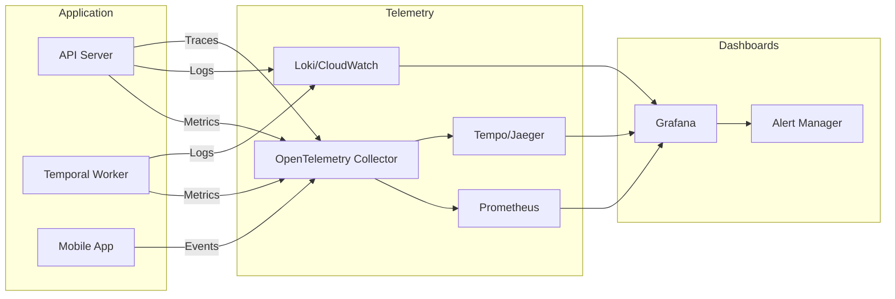

#Monitoring

```mermaid
graph LR
    subgraph "Application"
        API[API Server]
        Worker[Temporal Worker]
        Mobile[Mobile App]
    end
    
    subgraph "Telemetry"
        OTel[OpenTelemetry Collector]
        Prom[Prometheus]
        Loki[Loki/CloudWatch]
        Tempo[Tempo/Jaeger]
    end
    
    subgraph "Dashboards"
        Grafana[Grafana]
        Alerts[Alert Manager]
    end
    
    API --> |Metrics| OTel
    API --> |Logs| Loki
    API --> |Traces| OTel
    Worker --> |Metrics| OTel
    Worker --> |Logs| Loki
    Mobile --> |Events| OTel
    
    OTel --> Prom
    OTel --> Tempo
    Prom --> Grafana
    Loki --> Grafana
    Tempo --> Grafana
    Grafana --> Alerts
```
