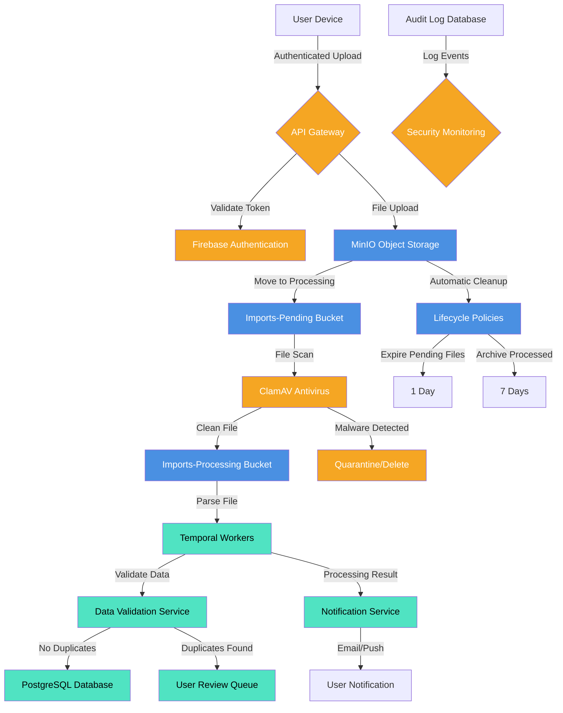

# File Storage and Data Import Architecture

## Context
Secure, compliant file storage for financial data imports with automated processing and lifecycle management.

## Architecture Diagram

## Key Components

### 1. Storage Architecture
- **MinIO Object Storage**: S3-compatible storage
- **Buckets**:
  - `imports-pending`: Initial file upload
  - `imports-processing`: Active file processing
  - `imports-archive`: Processed file retention

### 2. Security Layers
- Firebase Authentication
- File type and size validation
- ClamAV malware scanning
- User-specific access policies

### 3. Processing Pipeline
- Temporal workers for asynchronous processing
- Data validation and deduplication
- Background import to PostgreSQL
- User review for complex imports

### 4. Lifecycle Management
- Automatic file expiration
  - Pending files: 1 day
  - Processed files: 7 days
- Audit logging for all file operations

## Compliance and Monitoring
- Comprehensive audit trail
- Security event monitoring
- GDPR and financial regulation compliance

## Deployment Context
- Deployed on Hetzner VPS
- Docker containerized (MinIO, ClamAV)
- Minimal resource footprint (~700MB RAM)

## Future Migration Path
Potential cloud storage providers:
1. Cloudflare R2
2. Backblaze B2
3. AWS S3 Intelligent-Tiering

## Risks and Mitigations
- Service failure: Automatic restart, health checks
- Storage exhaustion: User quotas, aggressive cleanup
- False-positive malware detection: Whitelisting, manual review
