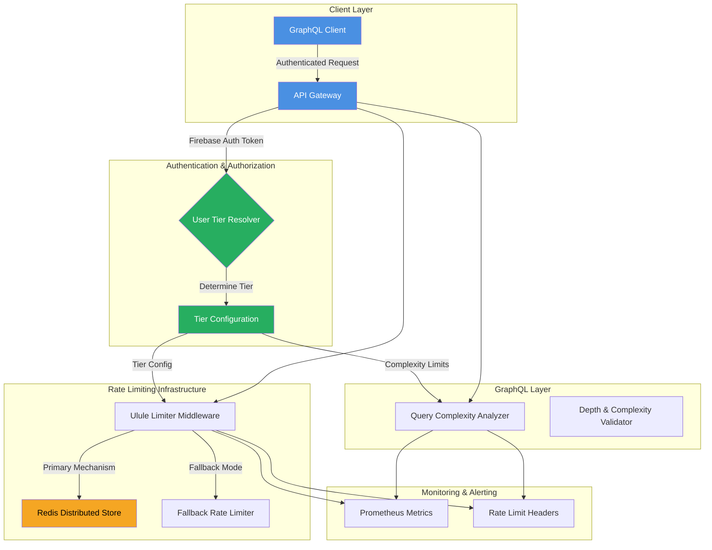

# Rate Limiting and API Quota Architecture

## Context
Distributed rate limiting and GraphQL query complexity management for multi-tier API access.

## Rate Limiting Components

### Key Features
- **User Tiers**: Free (100 req/hour) vs Premium (1000 req/hour)
- **GraphQL Protection**: 
  - Query complexity analysis
  - Depth limiting
- **Distributed Management**: Redis-backed state
- **Fallback Mechanism**: In-memory rate limiting

### Quota Enforcement Points
1. User Authentication
2. API Gateway 
3. GraphQL Middleware
4. Rate Limiting Middleware

### Monitoring Outputs
- Prometheus Metrics
- Rate Limit HTTP Headers
- Detailed Error Responses

## Performance Characteristics
- Latency: <0.5ms per request
- Memory: ~100 bytes per active user
- Redis Operations: ~300 ops/second

## Error Handling Strategies
- Graceful rate limit exceeded responses
- Fallback to in-memory limiting
- Detailed tier and complexity information
