# Error Handling & Logging Architecture

## Overview
Comprehensive error handling strategy for Go services, leveraging slog and standard library patterns.

```mermaid
graph TD
    subgraph "Error Classification"
        A[Error Origin] --> |Custom Types| B[Validation Error]
        A --> |Sentinel Errors| C[Not Found Error]
        A --> |Structured Errors| D[External Service Error]
        A --> |Authentication| E[Unauthorized Error]
    end

    subgraph "Logging Pipeline"
        F[Correlation ID Generation] --> G[Context-Aware Logger]
        G --> |Environment Config| H{Log Handler}
        H -->|Production| I[JSON Structured Logs]
        H -->|Development| J[Text Structured Logs]
    end

    subgraph "Error Handling Flow"
        K[Request Received] --> L[Middleware Request Logger]
        L --> M[Error Processing]
        M --> |Wrap with Context| N[fmt.Errorf Wrapping]
        N --> |Check Error Type| O{Error Classification}
        O -->|Validation Error| P[400 Bad Request]
        O -->|Not Found| Q[404 Not Found]
        O -->|External Service| R[502 Bad Gateway]
        O -->|Authentication| S[401 Unauthorized]
        O -->|Unhandled| T[500 Internal Server Error]
    end

    subgraph "Circuit Breaker"
        U[External Service Call] --> V{Circuit State}
        V -->|Closed| W[Normal Operation]
        V -->|Open| X[Fail Fast]
        V -->|Half-Open| Y[Retry Attempt]
    end

    subgraph "Observability"
        Z[Error Logging] --> AA[Performance Metrics]
        Z --> AB[Audit Trail]
        Z --> AC[Alerting System]
    end

    classDef core fill:#4A90E2,color:white;
    classDef data fill:#F5A623,color:black;
    classDef error fill:#E74C3C,color:white;

    class A,B,C,D,E core
    class F,G,H,I,J data
    class K,L,M,N,O,P,Q,R,S,T error
    class U,V,W,X,Y error
    class Z,AA,AB,AC core
```

## Key Components

### Error Classification
- **Validation Errors**: Field-level validation failures
- **Not Found Errors**: Resource lookup failures
- **External Service Errors**: Third-party integration issues
- **Authentication Errors**: Access control violations

### Logging Strategy
- Context-aware structured logging
- Environment-specific log formats
- Correlation ID for request tracing
- Performance and security-conscious design

### Error Handling Principles
- Minimal information exposure
- Standardized error responses
- Contextual error wrapping
- Comprehensive error classification

### Circuit Breaker Mechanism
- Protect against cascading failures
- Automatic service recovery
- Configurable failure thresholds
- State management (Closed/Open/Half-Open)

### Observability Features
- Performance metrics tracking
- Comprehensive audit trails
- Integrated alerting system
- Detailed error context preservation

## Design Rationale
- Leverages Go 1.21+ slog structured logging
- Follows Go error handling idioms
- Supports financial application compliance
- Minimizes performance overhead
- Enables effective debugging and monitoring

## References
- ADR-20250120-error-handling-logging-strategy.md
- Go Standard Library Error Handling
- slog Package Documentation