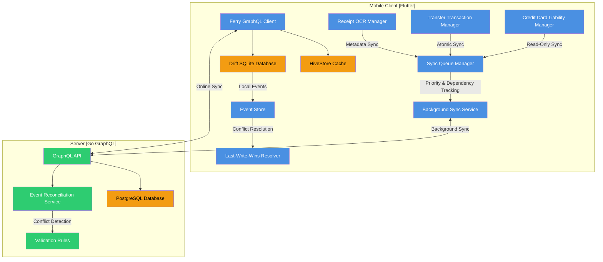

# Mobile Offline-First Synchronization Architecture

## Context
Comprehensive offline-first data synchronization for financial mobile application with complex data models and strict consistency requirements.

## Key Synchronization Patterns

### Data Flow
1. **Offline Operations**: Create/update entities locally
2. **Sync Queue**: Prioritized background synchronization
3. **Conflict Resolution**: Last-Write-Wins with server validation
4. **Eventual Consistency**: Guaranteed data reconciliation

### Component Responsibilities
- **Ferry GraphQL Client**: 
  - Normalized caching
  - Online/offline state management
- **Drift SQLite**: 
  - Local persistent storage
  - Type-safe queries
- **Sync Queue Manager**:
  - Priority-based synchronization
  - Dependency tracking
- **Event Store**:
  - Immutable event logging
  - Atomic transaction groups
- **Conflict Resolver**:
  - Last-Write-Wins strategy
  - Server-side validation

## Sync Priority Matrix
1. System Institutions (200)
2. User Institutions (150)
3. Accounts (140)
4. Credit Card Liabilities (120)
5. Transactions (100)
6. Transfers (90)
7. Receipts (50)
8. Categories/Budgets (30)

## Constraints & Guarantees
- Complete offline functionality
- Battery-aware background sync
- Zero financial data loss
- Predictable conflict resolution