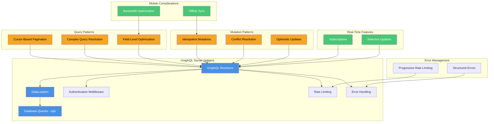

# GraphQL API Design Architecture

## Key Components and Interactions

### Core GraphQL Server
- Uses `gqlgen` for type-safe code generation
- Implements resolver pattern with dependency injection
- Supports complex query resolution and optimization

### Data Loader Pattern
- Prevents N+1 query problems
- Batches and caches database requests
- Generates type-safe loaders via `dataloaden`

### Query Optimization
- Cursor-based pagination
- Field-level selection
- Complexity-based rate limiting

### Mutation Strategies
- Idempotent mutations
- Client-generated transaction IDs
- Conflict resolution mechanisms

### Mobile and Real-Time Support
- Offline synchronization
- Selective real-time updates
- Bandwidth-efficient data loading

### Error Handling
- Structured, client-friendly error responses
- Progressive rate limiting
- Detailed error tracking and monitoring

## Performance Characteristics
- P95 Response Time: < 100ms
- Cache Hit Rate Target: > 60%
- Query Complexity Budget: Enforced at server level
- Infrastructure Cost Reduction: 40-60%

## Technology Stack
- Language: Go
- GraphQL Framework: gqlgen
- Database Query Generation: sqlc
- Authentication: Firebase Auth
- Caching: DataLoaders (request-scoped)

## Scalability Targets
- User Base: 100K+ users
- Concurrent Connections: Horizontally scalable
- Mobile & Web Support: First-class design

## Deployment Considerations
- Stateless server design
- Request-scoped data loading
- Minimal external caching requirements