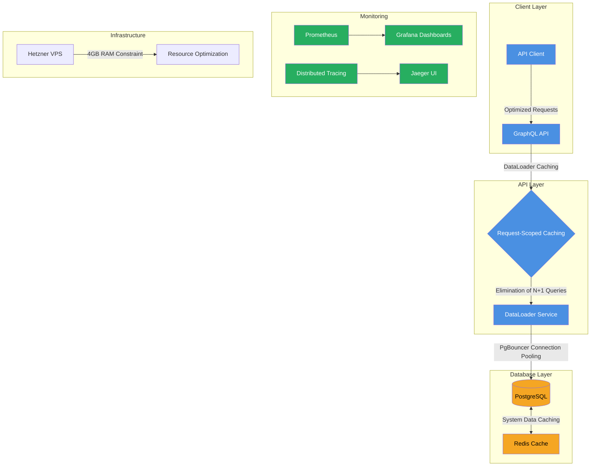

# Performance and Scalability Architecture

## Context
Performance architecture focusing on database-centric progressive enhancement, optimized for Hetzner VPS constraints (4GB RAM) with sub-200ms API response targets.

## Key Performance Strategies
- **DataLoader Pattern**: Eliminates N+1 queries through batched, cached data retrieval
- **Connection Pooling**: PgBouncer managing 25 PostgreSQL connections
- **Caching Strategy**: 
  - Request-scoped caching 
  - Redis ONLY for system-level data
- **Response Target**: < 200ms API responses
- **Infrastructure**: Optimized for 4GB RAM Hetzner VPS

## Monitoring Components
- Prometheus for metrics collection
- Grafana for performance dashboards
- Jaeger for distributed tracing

## Constraints and Optimizations
- Minimal external caching
- Database-centric performance model
- Progressive enhancement approach