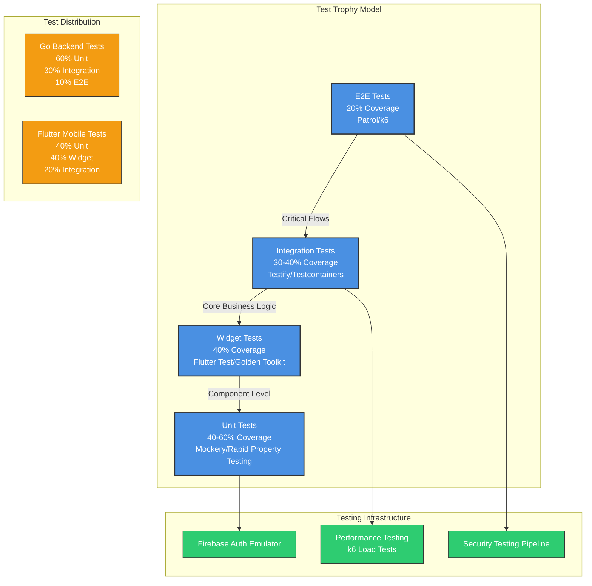

# Testing Architecture: Trophy Model

## Key Testing Principles
- Trophy Model emphasizes integration tests
- Selective TDD for critical paths
- Comprehensive test coverage across layers
- Performance and security integrated into testing strategy

## Testing Tools
### Backend (Go)
- Testify for test suites
- Mockery for mocking
- Testcontainers for integration testing
- Rapid property testing for complex logic

### Mobile (Flutter)
- flutter_test for unit/widget tests
- Mocktail for mocking
- Patrol for E2E testing
- Golden Toolkit for visual regression

## Test Distribution
- Go: 60% Unit, 30% Integration, 10% E2E
- Flutter: 40% Unit, 40% Widget, 20% Integration

## Infrastructure
- Firebase Auth Emulators
- Security Testing Pipeline
- Performance Testing with k6