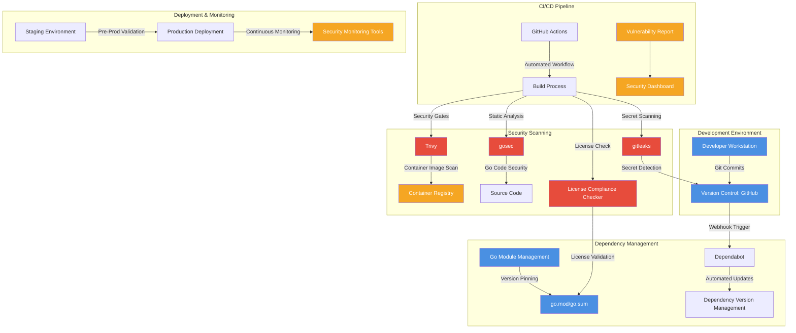

# Dependency Management and Security Scanning Architecture

## Context
Comprehensive security and dependency management strategy for the project, integrating multiple tools and processes to ensure software supply chain security.

## Security Scanning Components

### Dependency Management
- **Tool**: Go Modules
- **Strategy**: Version pinning in go.mod/go.sum
- **Update Policy**:
  - Immediate: Security updates
  - Weekly: Minor version updates
  - Monthly: Major version updates

### Security Scanning Tools
1. **Trivy**
   - Container image vulnerability scanning
   - SBOM (Software Bill of Materials) generation

2. **gosec**
   - Static code analysis for Go
   - Identifies security vulnerabilities in source code

3. **gitleaks**
   - Comprehensive secret scanning
   - Prevents credentials from entering version control

4. **License Compliance Checker**
   - Validates open-source licenses
   - Ensures compliance with organizational policies

### CI/CD Integration
- GitHub Actions as primary workflow engine
- Automated security gates
- Blocking of insecure or non-compliant code
- Comprehensive reporting

## Deployment Strategy
- Staged rollout with security validations
- Continuous monitoring of deployed environments
- Automated rollback capabilities for security incidents

## Key Security Principles
- Shift-left security approach
- Automated and continuous scanning
- Comprehensive visibility
- Proactive vulnerability management