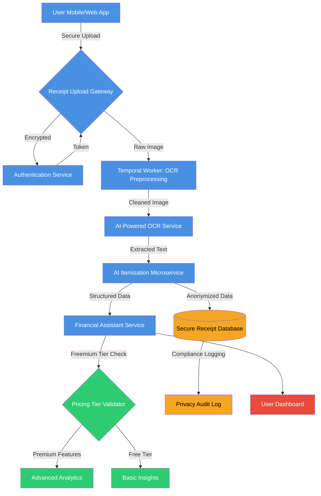

# AI/OCR Services Integration Architecture

## Context
Comprehensive system architecture for AI-powered OCR receipt itemization with privacy-first approach and freemium model optimization.

## Key Components
1. **Receipt Upload Gateway**: Secure, encrypted receipt upload
2. **Authentication Service**: User verification and access control
3. **Temporal Workers**: Background processing for OCR preprocessing
4. **AI-Powered OCR Service**: 90%+ accuracy text extraction
5. **AI Itemization Microservice**: Intelligent receipt parsing
6. **Financial Assistant Service**: Insights and recommendations
7. **Pricing Tier Validator**: Freemium model enforcement
8. **Secure Receipt Database**: Anonymized, compliant data storage
9. **Privacy Audit Log**: Comprehensive tracking of data usage

## Privacy and Performance Highlights
- End-to-end encryption
- Anonymized data processing
- Temporal workers for async processing
- Freemium feature gating
- Compliance-first design

## Performance Targets
- OCR Accuracy: 90%+
- Processing Latency: < 500ms
- Privacy Compliance: GDPR, CCPA