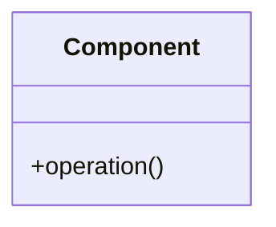

# [Pattern Name]

## Intent
<!-- One-sentence description of what this pattern does -->

## Also Known As
<!-- Alternative names for this pattern -->

## Motivation
<!-- 
- Problem scenario that motivates this pattern
- Why existing solutions are inadequate
-->

## Applicability
<!-- 
When to use this pattern:
- Specific situations or conditions
- Types of problems it solves
-->

## Structure
<!-- 
Visual representation of the pattern (diagram)
Can use Mermaid or PlantUML
-->



## Participants
<!-- 
Key components/classes and their responsibilities:
- Component A: Does X
- Component B: Does Y
-->

## Collaborations
<!-- How the participants work together -->

## Implementation

### Code Example
```python
# Example implementation
```

### Implementation Guidelines
<!-- 
- Step-by-step implementation guide
- Key considerations
- Common pitfalls
-->

## Consequences

### Benefits
<!-- Advantages of using this pattern -->
- 
- 

### Drawbacks
<!-- Disadvantages or trade-offs -->
- 
- 

### Trade-offs
<!-- Specific trade-offs to consider -->
- 
- 

## Known Uses
<!-- Real-world examples where this pattern is used -->
- 
- 

## Related Patterns
<!-- 
- Patterns that are similar or complementary
- Patterns that can be used together
- Alternative patterns
-->

## Sample Code
<!-- More extensive code examples in different languages -->

### Python
```python
```

### JavaScript
```javascript
```

## References
<!-- Books, articles, or other resources about this pattern -->
- 