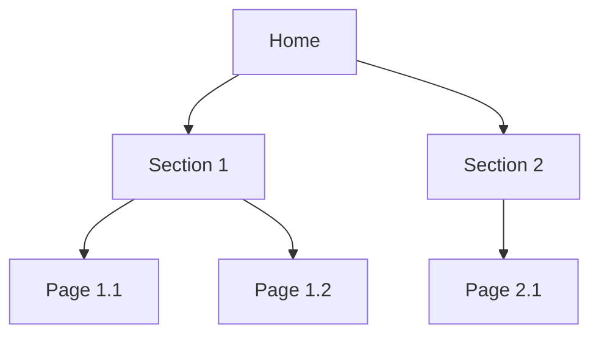
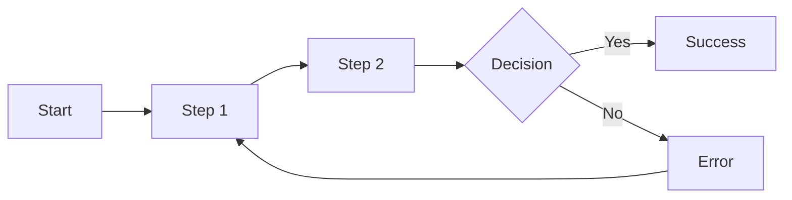

# Frontend Specification: [Project Name]

## Document Information
| Field | Value |
|-------|-------|
| **Project** | [Project Name] |
| **Version** | [Version] |
| **Date** | [Date] |
| **Author** | [Author] |
| **Status** | [Draft / Review / Approved] |

---

## 1. Introduction & Scope

### Project Overview
[Brief description of what's being built and why]

### UX Goals
| Goal | Description | Target Metric |
|------|-------------|---------------|
| [Goal] | [Description] | [Measurable target] |
| [Goal] | [Description] | [Measurable target] |

### Core Design Principles
1. **[Principle]**: [How it applies to this project]
2. **[Principle]**: [How it applies to this project]
3. **[Principle]**: [How it applies to this project]

### Target Personas
<!-- Link to persona documents -->
| Persona | Primary Needs | Key Pain Points |
|---------|---------------|-----------------|
| [[persona-1]] | [Needs] | [Pain points] |
| [[persona-2]] | [Needs] | [Pain points] |

---

## 2. Information Architecture

### Site Map

### Navigation Structure
| Nav Type | Items | Behavior |
|----------|-------|----------|
| Primary | [Items] | [Desktop/mobile behavior] |
| Secondary | [Items] | [Behavior] |
| Footer | [Items] | [Behavior] |

### Search Strategy
- **Search scope**: [What's searchable]
- **Results display**: [How results shown]
- **Filters**: [Available filters]

---

## 3. User Flows

### Flow 1: [Flow Name]

**User Goal**: [What user is trying to accomplish]
**Entry Points**: [Where they start]
**Success Criteria**: [How we know they succeeded]

**Edge Cases**:
| Case | Handling |
|------|----------|
| [Edge case] | [How handled] |
| [Edge case] | [How handled] |

### Flow 2: [Flow Name]
[Repeat structure]

---

## 4. Component Requirements

### Core Components

#### [Component Name]
| Aspect | Specification |
|--------|---------------|
| Purpose | [What it does] |
| Variants | [Different versions] |
| States | [Default, hover, active, disabled, error, loading] |
| Props | [Key configurable properties] |

**Behavior**:
- [Interaction behavior]
- [State changes]

**Accessibility**:
- [ARIA requirements]
- [Keyboard interaction]

#### [Component Name]
[Repeat structure]

---

## 5. Visual Design Standards

### Color Palette
| Role | Color | Hex | Usage |
|------|-------|-----|-------|
| Primary | [Name] | [#XXXXXX] | [When used] |
| Secondary | [Name] | [#XXXXXX] | [When used] |
| Accent | [Name] | [#XXXXXX] | [When used] |
| Success | [Name] | [#XXXXXX] | Positive feedback |
| Warning | [Name] | [#XXXXXX] | Cautions |
| Error | [Name] | [#XXXXXX] | Errors |
| Neutral | [Name] | [#XXXXXX] | Backgrounds, borders |

### Typography
| Element | Font | Size | Weight | Line Height |
|---------|------|------|--------|-------------|
| H1 | [Font] | [Size] | [Weight] | [LH] |
| H2 | [Font] | [Size] | [Weight] | [LH] |
| H3 | [Font] | [Size] | [Weight] | [LH] |
| Body | [Font] | [Size] | [Weight] | [LH] |
| Small | [Font] | [Size] | [Weight] | [LH] |

### Spacing & Layout
- **Grid System**: [e.g., 12-column, 8px base]
- **Spacing Scale**: [4, 8, 16, 24, 32, 48, 64]
- **Container Max Width**: [Width]

### Iconography
- **Library**: [Icon library used]
- **Sizes**: [Sizes available]
- **Style**: [Outlined / Filled / etc.]

---

## 6. Responsive Strategy

### Breakpoints
| Name | Min Width | Target Devices |
|------|-----------|----------------|
| Mobile | 0px | Phones |
| Tablet | 768px | Tablets |
| Desktop | 1024px | Laptops, monitors |
| Wide | 1440px | Large monitors |

### Adaptation Patterns
| Breakpoint | Layout Changes | Navigation Changes |
|------------|----------------|-------------------|
| Mobile | [Changes] | [Changes] |
| Tablet | [Changes] | [Changes] |
| Desktop | [Changes] | [Changes] |

---

## 7. Accessibility Requirements

### Compliance Target
**Standard**: WCAG 2.1 Level [A / AA / AAA]

### Requirements Checklist
| Category | Requirement | Target |
|----------|-------------|--------|
| **Perceivable** | | |
| Color contrast | Normal text | 4.5:1 minimum |
| Color contrast | Large text | 3:1 minimum |
| Alt text | All meaningful images | Required |
| **Operable** | | |
| Keyboard | All functionality | Full support |
| Focus visible | All interactive elements | Required |
| Touch targets | Minimum size | 44x44px |
| **Understandable** | | |
| Form labels | All inputs | Required |
| Error messages | Clear and actionable | Required |
| **Robust** | | |
| Screen reader | Core flows | Tested |

### Testing Strategy
- **Automated**: [Tools used]
- **Manual**: [Screen readers tested]
- **User testing**: [Plan for users with disabilities]

---

## 8. Performance Requirements

### Core Web Vitals Targets
| Metric | Target | Maximum |
|--------|--------|---------|
| LCP (Largest Contentful Paint) | < 2.5s | < 4s |
| FID (First Input Delay) | < 100ms | < 300ms |
| CLS (Cumulative Layout Shift) | < 0.1 | < 0.25 |

### Design Impact
| Element | Strategy |
|---------|----------|
| Images | [Format, lazy loading, sizing] |
| Fonts | [Loading strategy, fallbacks] |
| Animations | [Budget, reduced motion support] |
| Components | [Lazy loading strategy] |

---

## 9. Content Strategy

### Content Types
| Type | Source | Format | Update Frequency |
|------|--------|--------|------------------|
| [Type] | [Source] | [Format] | [Frequency] |

### State Handling
| State | Design Approach |
|-------|-----------------|
| Loading | [How shown] |
| Empty | [What displayed] |
| Error | [How communicated] |
| Success | [How confirmed] |

---

## 10. Integration Points

### API Integration
| Endpoint | Purpose | Notes |
|----------|---------|-------|
| [Endpoint] | [Purpose] | [Notes] |

### Third-Party Services
| Service | Purpose | Integration Method |
|---------|---------|-------------------|
| [Service] | [Purpose] | [Method] |

### Analytics Events
| Event | Trigger | Data Captured |
|-------|---------|---------------|
| [Event name] | [When fired] | [Properties] |

---

## 11. Browser Support

### Supported Browsers
| Browser | Version | Support Level |
|---------|---------|---------------|
| Chrome | Latest 2 | Full |
| Firefox | Latest 2 | Full |
| Safari | Latest 2 | Full |
| Edge | Latest 2 | Full |
| Mobile Safari | iOS 14+ | Full |
| Chrome Android | Latest | Full |

### Progressive Enhancement
[Strategy for older browsers]

---

## 12. Implementation Guidelines

### Development Handoff
- **Design files**: [Link to Figma/Sketch]
- **Asset format**: [PNG/SVG/WebP]
- **Design tokens**: [Format and location]

### Quality Assurance
| Check | Method | Criteria |
|-------|--------|----------|
| Visual accuracy | Side-by-side | Match design |
| Responsiveness | Device testing | All breakpoints |
| Accessibility | axe + manual | AA compliant |
| Performance | Lighthouse | Core Web Vitals pass |

---

## Appendices

### A. Design File References
- [Link to design files]
- [Link to prototype]

### B. Research Sources
- [[persona-1]] - Primary persona
- [[journey-map]] - User journey
- [[research-notes]] - Research findings

### C. Change Log
| Date | Version | Changes | Author |
|------|---------|---------|--------|
| [Date] | 1.0 | Initial specification | [Author] |

---

## Relations
- [[project]] - Project context
- [[architecture]] - Technical architecture
- [[prd]] - Product requirements
