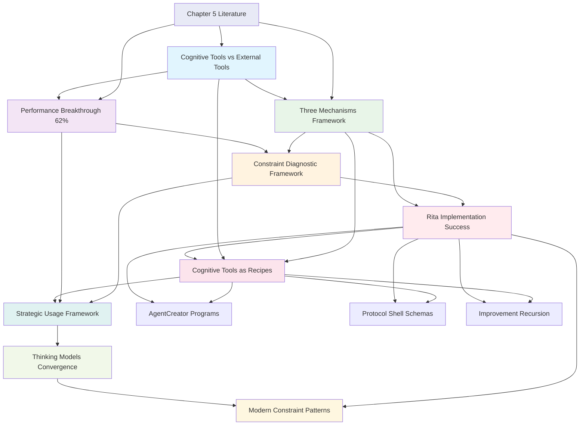

# Cognitive Tools Hub: Chapter 5 Insights & Implementation

## Overview
This hub organizes all Chapter 5 cognitive tools insights, from foundational theory through practical implementation. It captures the revolutionary understanding that cognitive tools enhance LLM performance by constraining reasoning processes rather than adding information, validated through both IBM Zurich research (62% improvement) and Rita's successful implementation.

## Core Discovery Cluster

### Fundamental Distinction
[[20250815-192100-cognitive-tools-vs-external-tools-distinction]] - Cognitive Tools vs External Tools: Internal Reasoning vs New Capabilities
- **Revolutionary Insight**: Cognitive tools constrain HOW models think (internal reasoning), external tools extend WHAT they can do (new capabilities)
- **Architecture Principle**: Mental discipline vs physical instruments - both needed but serve different optimization targets
- **Rita Validation**: Subagent delegation of external tools reduces cognitive load while main agent uses cognitive tools

### Performance Breakthrough
[[20250815-192300-cognitive-tools-performance-breakthrough]] - IBM Zurich Cognitive Tools Performance Breakthrough: 62% Improvement
- **Research Evidence**: GPT-4.1 performance improved from 26.7% to 43.3% using structured reasoning templates
- **Core Mechanism**: Cognitive tools as "guardrails" prevent reasoning shortcuts while enhancing capability
- **Counter-Intuitive**: Constraining reasoning patterns paradoxically improves model performance
- **Foundation**: Evidence that LLMs often need guidance to use their full reasoning capacity

## Implementation Framework

### Three-Mechanism Architecture
[[20250815-192400-three-cognitive-tool-mechanisms]] - Three Core Cognitive Tool Mechanisms: Programs, Schemas, Recursive Prompting
- **Comprehensive Framework**: Mirrors human cognitive processes through three complementary mechanisms
- **Prompt Programs**: Structured reasoning patterns (like heuristics) - process guidance
- **Context Schemas**: Organized information structures (like mental schemas) - information standardization  
- **Recursive Prompting**: Self-improvement loops (like cognitive reflection) - quality enhancement
- **Design Principle**: All three needed for robust reasoning systems

### Quality Optimization
[[20250815-192200-constraint-application-diagnostic-framework]] - Constraint Application Diagnostic Framework: Under/Over/Well-Constrained
- **Diagnostic Categories**: Three states for optimizing constraint balance
- **Underconstrained**: Lacks consistency, needs more structure
- **Overconstrained**: Too rigid, works only with exact examples  
- **Well-balanced**: Consistent core with adaptability
- **Optimization Tool**: Provides actionable guidance for iterating cognitive tools

## Practical Validation

### Working Implementation
[[20250815-192500-rita-cognitive-tools-implementation-success]] - Rita as Successful Cognitive Tools Implementation
- **Complete Validation**: Rita successfully demonstrates all three cognitive tool mechanisms in practice
- **Architecture Success**: AgentCreator (programs), Protocol shells (schemas), Improvement cycles (recursion)
- **Theory-Practice Bridge**: Proves cognitive tools framework through real system with measurable improvements
- **Design Patterns**: Provides template for building similar cognitive tool systems

### Process Metaphors
[[20250815-172500-cognitive-tools-as-recipes]] - Cognitive Tools as Recipes
- **Core Insight**: Cognitive tools provide "recipes" that prevent models from cutting corners
- **Process Focus**: Shape HOW models think, not just WHAT they think about
- **Recipe Pattern**: Step-by-step procedures that encode expert reasoning processes
- **Quality Mechanism**: Prevent improvisation mistakes through structured procedures

## Strategic Decision Framework

### Usage Strategy
[[20250815-172300-when-to-use-thinking-models-vs-cognitive-tools]] - When to Use Thinking Models vs Cognitive Tools
- **Strategic Pattern**: Use thinking models for discovery, cognitive tools for deployment
- **Exploration Phase**: Thinking models explore solution space (o1, Claude thinking)
- **Exploitation Phase**: Convert discovered patterns into cognitive tools for reliable execution
- **Development Lifecycle**: Thinking models for R&D, cognitive tools for production

### Modern Convergence
[[20250815-172200-cognitive-tools-thinking-models-convergence]] - Cognitive Tools vs Thinking Models - The Convergence
- **Evolution Insight**: Originally different (hidden vs explicit), modern thinking models now expose reasoning
- **Convergence Pattern**: Both becoming exposed iterative constraint refinement
- **Key Difference**: WHO controls constraints (model vs prompt engineer)
- **Unified Framework**: Exposed iterative reasoning as fundamental enhancement pattern

## Source Literature Foundation

### Primary Research Base
[[20250815-192000-LIT-cognitive-tools-chapter5]] - Context Engineering Chapter 5: Cognitive Tools - Core Research Insights
- **Source**: Context Engineering Foundations Chapter 5
- **Key Research**: IBM Zurich 62% improvement, Singapore-MIT MEM1 research  
- **Framework Extension**: Biological metaphor progression: Atoms→Molecules→Cells→Organs→Cognition
- **Literature Foundation**: Comprehensive capture of cognitive tools framework and research evidence

## Concept Relationships

## Learning Progression

### Phase 1: Theoretical Foundation (COMPLETE)
- ✅ **BREAKTHROUGH**: Cognitive tools vs external tools architectural distinction
- ✅ **BREAKTHROUGH**: IBM Zurich 62% performance improvement validation  
- ✅ **BREAKTHROUGH**: Three-mechanism framework (Programs, Schemas, Recursion)
- ✅ **BREAKTHROUGH**: Constraint application diagnostic framework
- ✅ **VALIDATION**: Literature foundation established through Chapter 5 research

### Phase 2: Implementation Validation (COMPLETE)
- ✅ **BREAKTHROUGH**: Rita as working cognitive tools implementation
- ✅ **VALIDATION**: All three mechanisms successfully implemented in practice
- ✅ **BREAKTHROUGH**: Cognitive tools as reasoning recipes framework
- ✅ **VALIDATION**: Theory-practice bridge established through measurable improvements

### Phase 3: Strategic Framework (COMPLETE)
- ✅ **BREAKTHROUGH**: Discovery-to-deployment strategic usage framework
- ✅ **BREAKTHROUGH**: Thinking models convergence understanding
- ✅ **INSIGHT**: Modern constraint pattern evolution
- ✅ **FRAMEWORK**: Complete cognitive tools decision architecture

### Phase 4: Advanced Applications (NEXT)
- 🔄 Cognitive tool libraries for different reasoning domains
- 🔄 Automated constraint optimization systems
- 🔄 Hybrid thinking model + cognitive tool architectures
- ⏳ Cognitive tool effectiveness measurement frameworks
- ⏳ Cross-domain cognitive tool pattern extraction
- ⏳ Cognitive tool design automation tools

## Implementation Patterns

### Rita's Cognitive Tool Architecture
**Prompt Programs**: 
- AgentCreator: Structured agent creation process
- PersonaBuilder: Systematic persona development
- CommandDesigner: Methodical command creation
- ResourceArchitect: Organized resource design

**Context Schemas**:
- Protocol shells with intent/input/process/output structure
- Standardized request/response formats
- Validation criteria specifications
- Quality checkpoint definitions

**Recursive Prompting**:
- Improvement cycles with constraint validation
- Self-reflection and refinement loops
- Quality measurement and optimization
- Adaptive constraint tuning

### Design Principles
1. **Process Over Content**: Focus on HOW to think, not WHAT to think about
2. **Constraint Balance**: Optimize for well-constrained (consistent + adaptable)  
3. **Mechanism Integration**: Use all three mechanisms synergistically
4. **Discovery-to-Deployment**: Think models→explore, cognitive tools→execute
5. **External Tool Delegation**: Separate reasoning constraints from capability extensions

## Key Questions to Explore

### Immediate Research Directions
1. How do cognitive tools interact with modern reasoning models (o1, Claude thinking)?
2. Can we automatically extract cognitive tools from successful thinking model outputs?
3. What are the failure modes of over-constraining reasoning with cognitive tools?
4. How do we measure cognitive tool effectiveness beyond performance metrics?

### Implementation Challenges
1. What's the optimal balance between the three cognitive tool mechanisms?
2. How do we design cognitive tools that adapt to different expertise levels?
3. When does cognitive tool overhead exceed the benefits?
4. How do we create domain-agnostic cognitive tool libraries?

### Advanced Applications  
1. Can cognitive tools be learned automatically from expert reasoning patterns?
2. How do we design hybrid systems combining thinking models and cognitive tools?
3. What are optimal cognitive tool combinations for different reasoning domains?
4. How do we scale cognitive tool architectures to complex multi-agent systems?

## Future Research Directions

### Theory Development
- Cognitive tool effectiveness measurement frameworks
- Constraint optimization algorithms for reasoning systems
- Cross-domain cognitive tool pattern analysis
- Cognitive load optimization in tool design

### Practical Applications
- Cognitive tool libraries for common reasoning patterns
- Automated cognitive tool extraction from successful interactions
- Domain-specific cognitive tool specialization
- Integration strategies with existing AI architectures

### Advanced Systems
- Self-optimizing cognitive tool systems
- Cognitive tool recommendation engines
- Hybrid reasoning architectures (thinking models + cognitive tools)
- Large-scale cognitive tool orchestration frameworks

## Connected Learning Areas

### Strong Connections
- **Context Engineering Foundations**: Cognitive tools as constraint architecture extension
- **Multi-Agent Systems**: Rita's cognitive tool implementation as validation
- **Constraint Satisfaction**: Diagnostic framework as constraint optimization
- **Human Cognitive Science**: Three mechanisms mirror human heuristics, schemas, reflection

### Potential Connections
- **Software Engineering**: Design patterns for cognitive tool architectures
- **Quality Assurance**: Constraint validation and measurement systems
- **Learning Sciences**: Discovery-to-deployment pedagogical frameworks
- **Systems Design**: Recursive improvement and optimization methodologies

## Review Schedule
- **Weekly**: Review implementation patterns and effectiveness in Rita
- **Monthly**: Assess cognitive tool framework evolution and new research
- **Quarterly**: Evaluate framework completeness and identify research gaps

---

**Hub Created**: 2025-08-19 18:15  
**Source Period**: Chapter 5 study session 2025-08-15  
**Connected Notes**: 8 permanent notes + 1 literature note  
**Implementation Status**: Complete theoretical framework + validated practical implementation  
**Maturity**: Foundational framework established with working proof-of-concept

## Tags
#hub #cognitive-tools #chapter5 #performance-optimization #reasoning-patterns #constraint-application #rita-implementation #framework-validation