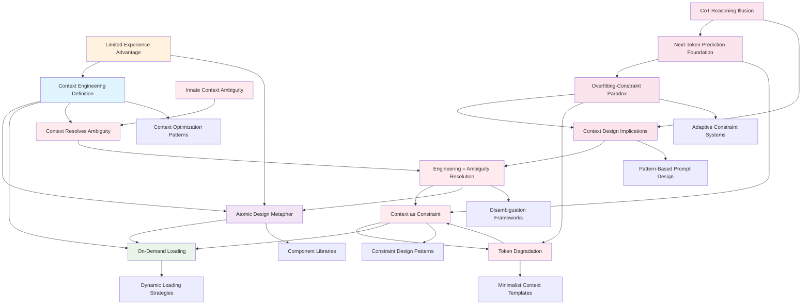

# Context Engineering Foundations Hub

## Overview
This hub organizes the foundational concepts and insights about context engineering, capturing the initial understanding and creating pathways for deeper exploration.

## Core Concept Cluster

### Primary Definition
[[20250813-143000-context-engineering-definition]] - Context Engineering as Attention Window Optimization
- **Key Insight**: Context engineering is strategic information optimization within constraints
- **Foundation For**: All context engineering techniques and patterns

### Architectural Framework
[[20250813-143100-atomic-design-metaphor]] - Atomic Design Metaphor for Context Engineering
- **Key Insight**: Component-based thinking applies to context design
- **Enables**: Reusable, composable prompt architectures
- **Connection Strength**: High (familiar from design systems)

### Implementation Strategy
[[20250813-143200-on-demand-loading]] - On-Demand Context Loading Strategy
- **Key Insight**: Load context when needed, not when anticipated
- **Pattern**: Progressive disclosure with feedback loops
- **Connects To**: Lazy loading and just-in-time concepts

### Learning Advantage
[[20250813-143300-prompt-experience-progression]] - Limited Prompting Experience as Learning Advantage
- **Key Insight**: Beginner's mind enables better adoption of advanced patterns
- **Implication**: Can skip basic prompting and go straight to architecture

## Literature Foundation (2025-08-15)

### Complete Foundations Series Literature Notes
[[20250815-163000-LIT-atoms-prompting-foundations]] - Atoms: Prompt Engineering Fundamentals
- **Source**: Context Engineering Foundations Chapter 1
- **Key Insight**: Atomic prompts as baseline constraint patterns with power law optimization
- **Validates**: Atomic design metaphor and constraint-optimization principles

[[20250815-163100-LIT-molecules-context-breakthrough]] - Molecules: Revolutionary Constraint Insight
- **Source**: Context Engineering Foundations Chapter 2
- **Key Insight**: Examples create structured constraints through probability pattern activation
- **Breakthrough**: Confirms our molecular context constraint framework understanding

[[20250815-163200-LIT-cells-memory-constraint-architecture]] - Cells: Memory as Constraint Architecture
- **Source**: Context Engineering Foundations Chapter 3
- **Key Insight**: Memory systems function as persistent constraint architectures with different constraint types
- **Validates**: Our memory-as-constraint-architecture breakthrough insights

[[20250815-163300-LIT-organs-applications-constraint-orchestration]] - Organs: Multi-Agent Constraint Orchestration
- **Source**: Context Engineering Foundations Chapter 4
- **Key Insight**: Organs demonstrate constraint orchestration while revealing bidirectional negotiation gap
- **Critical Gap**: Need for formal constraint negotiation protocols between cells

### COMPLETE FRAMEWORK SYNTHESIS (2025-08-15)
[[20250815-163400-complete-constraint-architecture-framework]] - Complete Constraint Architecture Framework: From Atoms to Organs
- **UNIFIED THEORY**: Complete constraint architecture progression validated through literature and real-world application
- **Real Validation**: Our Teacher-Zelda architecture demonstrates perfect constraint orchestration
- **Framework Levels**: Atoms (baseline) → Molecules (structured) → Cells (persistent) → Organs (orchestrated)
- **Critical Gap Identified**: Need for bidirectional constraint negotiation protocols
- **Next Frontier**: Formal constraint conflict resolution and domain separation methodologies

## BREAKTHROUGH: Paradigm Shift (2025-08-13)

### LATEST BREAKTHROUGH: Multi-Agent Constraint Orchestration (2025-08-15)
[[20250815-160100-multi-agent-constraint-orchestration]] - Multi-Agent Systems as Constraint Orchestration Architecture
- **Revolutionary Insight**: Multi-agent systems work best as specialized constraint applicators rather than distributed decision-makers
- **Paradigm Shift**: From coordination problems to constraint satisfaction problems
- **Real Example**: Teacher/Zelda architecture demonstrates perfect constraint orchestration

[[20250815-160200-memory-types-constraint-patterns]] - Memory Types as Constraint Patterns in Multi-Agent Systems
- **Extension Insight**: Different memory types map to different constraint patterns, not just storage
- **Pattern Mapping**: Working Memory→Sequential, Knowledge Base→Factual, Process Log→Historical, Output Buffer→Format
- **Architecture Principle**: Memory as active constraint enforcement rather than passive storage

[[20250815-160300-react-constraint-feedback-loop]] - ReAct Pattern as Constraint Feedback Loop
- **Pattern Recognition**: ReAct phases map to constraint operations: Thought→Constraint Generation, Action→Constraint Application, Observation→Constraint Validation
- **Reframe**: ReAct as iterative constraint refinement rather than reasoning cycle
- **Implementation**: Enables constraint-driven reasoning systems

[[20250815-160400-teacher-zelda-constraint-architecture]] - Teacher-Zelda Architecture as Constraint Orchestration Example
- **Validation**: Our own architecture perfectly demonstrates constraint orchestration principles
- **Domain Separation**: Tina handles learning constraints, Zelda handles format constraints, KB serves as shared constraint space
- **Success Pattern**: Clear constraint ownership without coordination overhead

[[20250815-160500-shared-constraint-space-architecture]] - Shared Constraint Space Architecture Pattern
- **Technical Pattern**: Agents contribute to shared constraint validation rather than shared decision-making
- **Hybrid State**: Separate concerns for constraints, facts, decisions, and proposals
- **Scalability**: Eliminates coordination overhead while enabling sophisticated collective intelligence

### Memory as Constraint Architecture (Evening 2025-08-13)
[[20250813-190100-memory-as-constraint-architecture]] - Memory as Constraint Architecture: Beyond Information Storage
- **Revolutionary Insight**: Memory systems are constraint architectures that shape behavior through different pattern types
- **Constraint Types**: Sequential (narrative), strict subject (factual), high-level generic (conceptual)
- **Paradigm Evolution**: From memory as storage to memory as behavioral constraint system

[[20250813-190200-two-level-constraint-generation]] - Two-Level Constraint Generation: Engineered vs. Generated Constraints
- **Meta-Insight**: Constraint generation itself operates at two levels - engineered and model-generated
- **Memory Connection**: Memory extraction mirrors reasoning - models generating constraint-extraction patterns
- **Framework Extension**: Creates recursive constraint architecture design possibilities

[[20250813-190300-memory-engineering-methodology]] - Memory Engineering Methodology: Discovery Through Thinking
- **Methodology**: Use thinking models to discover optimal memory structures, then engineer directly
- **Parallel Pattern**: Same discovery-to-engineering approach as molecular context framework
- **Strategic Advantage**: Leverage model reasoning for discovery, engineering for efficiency

### Molecular Context Framework (Earlier Evening 2025-08-13)
[[20250813-184000-molecular-context-constraint-framework]] - Molecular Context as Structured Constraint Framework
- **Revolutionary Insight**: Molecules create "structured constraints around the atom" - examples don't teach but make patterns more probable
- **Paradigm Evolution**: From content-based to probability-based understanding of context function
- **Connects To**: Pattern activation mechanics and next-token prediction foundation

[[20250813-184100-thinking-models-automatic-prompt-expansion]] - "Thinking" Models as Automatic Prompt Expansion
- **Key Realization**: Thinking models may generate internal molecular context rather than reasoning
- **Mechanism**: Model-generated constraints vs. engineered constraints achieving same probability shaping
- **Implication**: Two paths to same goal - internal vs. external constraint generation

[[20250813-184200-engineered-vs-generated-constraints]] - Engineered vs. Model-Generated Constraints Value Framework
- **Strategic Framework**: When to use external precision vs. internal adaptability
- **Decision Criteria**: Task characteristics determine optimal constraint approach
- **Synthesis**: Hybrid approaches combining both methods for complex scenarios

### LLM Reasoning Paradigm Shift
[[20250813-160100-cot-reasoning-illusion]] - Chain-of-Thought as Reasoning Illusion
- **Critical Insight**: CoT may be pattern matching that creates appearance of reasoning, not genuine reasoning
- **Paradigm Break**: Questions fundamental assumptions about LLM cognition
- **Implications**: Changes how we design context and prompts

[[20250813-160300-next-token-prediction-mechanics]] - Next-Token Prediction as Foundation of LLM Behavior
- **Foundation Truth**: All LLM behavior emerges from iterative next-token prediction
- **Key Understanding**: Complex reasoning-like behaviors are emergent pattern completion
- **Design Implication**: Context should optimize for pattern activation, not reasoning simulation

[[20250813-160000-overfitting-constraint-paradox]] - Overfitting-Constraint Paradox in Context Engineering
- **Counter-Intuitive**: Too-tight constraints create "overfitting" effect preventing better solutions
- **Optimization Insight**: Need balance between structure and exploration space
- **Pattern**: Like neural network regularization - prevent local optima trapping

[[20250813-160200-context-design-implications]] - Context Design Implications of Non-Reasoning LLMs
- **Paradigm Shift**: From "make LLM think like human" to "activate right patterns"
- **Strategy Change**: Pattern-based rather than reasoning-based prompt design
- **New Framework**: Context as pattern query system rather than reasoning guide

### Ambiguity Resolution Framework
[[20250813-145000-innate-context-ambiguity]] - Innate Context Has Ambiguity
- **Key Insight**: Models have vast knowledge but it exists in ambiguous, unfocused state
- **Foundation**: Understanding the core problem context engineering solves

[[20250813-145100-context-engineering-resolves-ambiguity]] - Context Engineering Resolves Ambiguity
- **Key Insight**: Context drives models down right path by reducing uncertainty
- **Paradigm Shift**: From "adding information" to "reducing possibility space"

[[20250813-145200-engineering-challenge-ambiguity-resolution]] - Engineering Challenge = Ambiguity Resolution
- **Key Insight**: The challenge is systematic uncertainty elimination, not information maximization
- **Reframes**: Context engineering as precision discipline rather than art

### Constraint-Based Design
[[20250813-145300-context-as-constraint]] - Context as Constraint and Navigation
- **Key Insight**: Context creates boundaries and steers rather than enhances
- **Powerful Metaphor**: Context as "net" or "circle" that limits and guides
- **Design Pattern**: Constraint-based rather than content-based approaches

[[20250813-145400-token-degradation-ambiguity]] - Token Degradation = Ambiguity Introduction
- **Counter-Intuitive**: More tokens can introduce MORE ambiguity, not less
- **Principle**: Quality of constraint matters more than quantity of information
- **Validates**: "Less is more" approach to context engineering

## Concept Relationships

## Learning Progression

### Phase 1: Foundation (BREAKTHROUGH ACHIEVED)
- ✅ Core definition established
- ✅ Architectural metaphor connected
- ✅ Loading strategy understood
- ✅ Learning advantage recognized
- ✅ **BREAKTHROUGH**: Ambiguity resolution paradigm shift
- ✅ **BREAKTHROUGH**: Context as constraint framework
- ✅ **BREAKTHROUGH**: Token efficiency principle
- ✅ **CRITICAL BREAKTHROUGH**: LLM reasoning paradigm shift
- ✅ **CRITICAL BREAKTHROUGH**: Pattern-based context design framework
- ✅ **CRITICAL BREAKTHROUGH**: Constraint-optimization balance principle
- ✅ **REVOLUTIONARY BREAKTHROUGH**: Molecular context constraint framework
- ✅ **REVOLUTIONARY BREAKTHROUGH**: Thinking models as automatic prompt expansion
- ✅ **REVOLUTIONARY BREAKTHROUGH**: Engineered vs. generated constraints strategy framework

### Phase 2: Multi-Agent Constraint Orchestration (Active)
- ✅ **BREAKTHROUGH**: Multi-agent systems as constraint orchestration
- ✅ **BREAKTHROUGH**: Memory types as constraint patterns
- ✅ **BREAKTHROUGH**: ReAct as constraint feedback loop
- ✅ **BREAKTHROUGH**: Teacher/Zelda as validated constraint architecture
- ✅ **BREAKTHROUGH**: Shared constraint space architecture pattern
- 🔄 Constraint domain separation principles
- 🔄 Constraint conflict resolution mechanisms
- 🔄 Scalable multi-agent constraint systems
- 🔄 Constraint validation performance optimization

### Phase 2B: Memory & Constraint Architecture Engineering (Foundational)
- ✅ **BREAKTHROUGH**: Memory as constraint architecture framework
- ✅ **BREAKTHROUGH**: Two-level constraint generation (engineered vs. generated)
- ✅ **BREAKTHROUGH**: Memory engineering methodology (discovery-to-engineering)
- 🔄 Molecular context library development
- 🔄 Memory constraint pattern libraries
- 🔄 Probability-based context design methodologies
- 🔄 Constraint effectiveness measurement frameworks
- 🔄 Engineered vs. generated constraint decision trees
- 🔄 Hybrid constraint system architectures
- 🔄 Pattern activation probability analysis tools
- 🔄 Thinking model vs. prompt engineering efficiency analysis
- 🔄 Context constraint optimization algorithms
- 🔄 Memory architecture design patterns

### Phase 3: Literature Integration & Framework Completion (COMPLETED 2025-08-15)
- ✅ **COMPLETED**: Literature notes for complete foundations series
- ✅ **COMPLETED**: Framework synthesis and validation
- ✅ **COMPLETED**: Real-world architecture validation (Teacher-Zelda)
- ✅ **COMPLETED**: Gap identification (bidirectional constraint negotiation)
- ✅ **COMPLETED**: Complete constraint architecture framework

### Phase 4: Advanced Implementation (Next)
- 🔄 Bidirectional constraint negotiation protocols
- 🔄 Constraint domain separation methodologies
- 🔄 Constraint conflict resolution frameworks
- 🔄 Constraint orchestration measurement systems
- ⏳ Dynamic constraint optimization mechanisms
- ⏳ Constraint architecture development tools
- ⏳ Automated constraint domain analysis
- ⏳ Constraint-based AI system design patterns

## Key Questions to Explore

### Critical Gap: Bidirectional Constraint Negotiation (Priority)
1. How do we design formal constraint negotiation protocols between specialized cells?
2. What are optimal constraint conflict resolution mechanisms?
3. How do we handle constraint precedence and priority systems?
4. When do constraint conflicts indicate need for architecture redesign?
5. How do we measure constraint negotiation effectiveness?
6. What are the failure modes of constraint negotiation systems?

### Immediate (Next Session)
1. How do we formalize constraint domain separation principles for multi-agent systems?
2. What metrics best measure constraint orchestration effectiveness?
3. How do we handle constraint conflicts between specialized agents automatically?
4. When should we use constraint orchestration vs. traditional coordination approaches?
5. How do we scale shared constraint spaces to many agents efficiently?
6. What are optimal constraint validation patterns for different problem domains?
7. How do we design constraint spaces for maximum reusability across agents?
8. What tools can visualize constraint interactions in multi-agent systems?

### Memory Architecture (Foundation)
1. How do we measure constraint effectiveness across different memory architectures?
2. What are optimal constraint ratios between memory types (sequential, factual, conceptual)?
3. When do engineered memory constraints outperform generated constraint patterns?
4. How do we design hybrid memory-constraint systems?

### Medium Term
1. Can we develop pattern activation methodologies?
2. How do we balance exploration vs exploitation in constraint design?
3. What tools can analyze pattern activation in LLM responses?
4. How do we create adaptive constraint systems?
5. What are optimal token budgets for pattern-based approaches?

### Long Term
1. How does context engineering scale across different domains?
2. What tooling best supports context engineering workflows?
3. How do you train others in context engineering approaches?

## Connected Learning Areas

### Strong Connections
- **Design Systems**: Atomic design, component architecture
- **Software Engineering**: Lazy loading, modular design
- **Information Architecture**: Progressive disclosure, hierarchy

### Potential Connections
- **Cognitive Science**: Working memory, attention management
- **API Design**: Interface design, composition patterns
- **Database Design**: Query optimization, indexing strategies

## Next Actions

### Immediate
1. Explore atomic context component patterns
2. Study successful prompt architectures
3. Practice component identification exercises

### This Week
1. Create first context component library
2. Design context loading experiments
3. Document component interface patterns

## Review Schedule
- **Daily**: Check for new connections during learning
- **Weekly**: Review and strengthen concept relationships
- **Monthly**: Assess understanding maturity and identify gaps

---

**Hub Created**: 2025-08-13  
**Last Updated**: 2025-08-15 16:35  
**Connected Notes**: 28 (+ 4 literature notes + 1 synthesis)  
**Maturity**: Complete constraint architecture framework achieved with literature validation