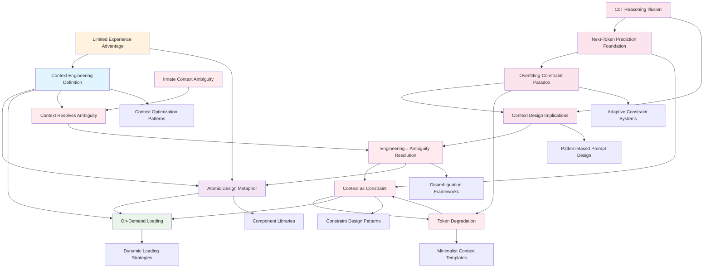

# Context Engineering Foundations Hub

## Overview
This hub organizes the foundational concepts and insights about context engineering, capturing the initial understanding and creating pathways for deeper exploration.

## Core Concept Cluster

### Primary Definition
[[20250813-143000-context-engineering-definition]] - Context Engineering as Attention Window Optimization
- **Key Insight**: Context engineering is strategic information optimization within constraints
- **Foundation For**: All context engineering techniques and patterns

### Architectural Framework
[[20250813-143100-atomic-design-metaphor]] - Atomic Design Metaphor for Context Engineering
- **Key Insight**: Component-based thinking applies to context design
- **Enables**: Reusable, composable prompt architectures
- **Connection Strength**: High (familiar from design systems)

### Implementation Strategy
[[20250813-143200-on-demand-loading]] - On-Demand Context Loading Strategy
- **Key Insight**: Load context when needed, not when anticipated
- **Pattern**: Progressive disclosure with feedback loops
- **Connects To**: Lazy loading and just-in-time concepts

### Learning Advantage
[[20250813-143300-prompt-experience-progression]] - Limited Prompting Experience as Learning Advantage
- **Key Insight**: Beginner's mind enables better adoption of advanced patterns
- **Implication**: Can skip basic prompting and go straight to architecture

## BREAKTHROUGH: Paradigm Shift (2025-08-13)

### LLM Reasoning Paradigm Shift
[[20250813-160100-cot-reasoning-illusion]] - Chain-of-Thought as Reasoning Illusion
- **Critical Insight**: CoT may be pattern matching that creates appearance of reasoning, not genuine reasoning
- **Paradigm Break**: Questions fundamental assumptions about LLM cognition
- **Implications**: Changes how we design context and prompts

[[20250813-160300-next-token-prediction-mechanics]] - Next-Token Prediction as Foundation of LLM Behavior
- **Foundation Truth**: All LLM behavior emerges from iterative next-token prediction
- **Key Understanding**: Complex reasoning-like behaviors are emergent pattern completion
- **Design Implication**: Context should optimize for pattern activation, not reasoning simulation

[[20250813-160000-overfitting-constraint-paradox]] - Overfitting-Constraint Paradox in Context Engineering
- **Counter-Intuitive**: Too-tight constraints create "overfitting" effect preventing better solutions
- **Optimization Insight**: Need balance between structure and exploration space
- **Pattern**: Like neural network regularization - prevent local optima trapping

[[20250813-160200-context-design-implications]] - Context Design Implications of Non-Reasoning LLMs
- **Paradigm Shift**: From "make LLM think like human" to "activate right patterns"
- **Strategy Change**: Pattern-based rather than reasoning-based prompt design
- **New Framework**: Context as pattern query system rather than reasoning guide

### Ambiguity Resolution Framework
[[20250813-145000-innate-context-ambiguity]] - Innate Context Has Ambiguity
- **Key Insight**: Models have vast knowledge but it exists in ambiguous, unfocused state
- **Foundation**: Understanding the core problem context engineering solves

[[20250813-145100-context-engineering-resolves-ambiguity]] - Context Engineering Resolves Ambiguity
- **Key Insight**: Context drives models down right path by reducing uncertainty
- **Paradigm Shift**: From "adding information" to "reducing possibility space"

[[20250813-145200-engineering-challenge-ambiguity-resolution]] - Engineering Challenge = Ambiguity Resolution
- **Key Insight**: The challenge is systematic uncertainty elimination, not information maximization
- **Reframes**: Context engineering as precision discipline rather than art

### Constraint-Based Design
[[20250813-145300-context-as-constraint]] - Context as Constraint and Navigation
- **Key Insight**: Context creates boundaries and steers rather than enhances
- **Powerful Metaphor**: Context as "net" or "circle" that limits and guides
- **Design Pattern**: Constraint-based rather than content-based approaches

[[20250813-145400-token-degradation-ambiguity]] - Token Degradation = Ambiguity Introduction
- **Counter-Intuitive**: More tokens can introduce MORE ambiguity, not less
- **Principle**: Quality of constraint matters more than quantity of information
- **Validates**: "Less is more" approach to context engineering

## Concept Relationships

## Learning Progression

### Phase 1: Foundation (BREAKTHROUGH ACHIEVED)
- ✅ Core definition established
- ✅ Architectural metaphor connected
- ✅ Loading strategy understood
- ✅ Learning advantage recognized
- ✅ **BREAKTHROUGH**: Ambiguity resolution paradigm shift
- ✅ **BREAKTHROUGH**: Context as constraint framework
- ✅ **BREAKTHROUGH**: Token efficiency principle
- ✅ **CRITICAL BREAKTHROUGH**: LLM reasoning paradigm shift
- ✅ **CRITICAL BREAKTHROUGH**: Pattern-based context design framework
- ✅ **CRITICAL BREAKTHROUGH**: Constraint-optimization balance principle

### Phase 2: Pattern-Based Development (Next)
- 🔄 Pattern activation frameworks
- 🔄 Constraint optimization techniques
- 🔄 Non-reasoning prompt architectures
- 🔄 Disambiguation technique taxonomy
- 🔄 Adaptive constraint systems
- 🔄 Pattern quality assessment methods

### Phase 3: Implementation (Future)
- ⏳ Dynamic loading mechanisms
- ⏳ Context caching strategies
- ⏳ Performance optimization
- ⏳ Testing methodologies

## Key Questions to Explore

### Immediate (Next Session)
1. How do we identify high-quality patterns in LLM training data?
2. What constraint levels optimize for different task types?
3. How do we design context that activates optimal patterns without over-constraining?
4. What are pattern-based alternatives to reasoning-style prompts?
5. How do we measure pattern activation effectiveness?

### Medium Term
1. Can we develop pattern activation methodologies?
2. How do we balance exploration vs exploitation in constraint design?
3. What tools can analyze pattern activation in LLM responses?
4. How do we create adaptive constraint systems?
5. What are optimal token budgets for pattern-based approaches?

### Long Term
1. How does context engineering scale across different domains?
2. What tooling best supports context engineering workflows?
3. How do you train others in context engineering approaches?

## Connected Learning Areas

### Strong Connections
- **Design Systems**: Atomic design, component architecture
- **Software Engineering**: Lazy loading, modular design
- **Information Architecture**: Progressive disclosure, hierarchy

### Potential Connections
- **Cognitive Science**: Working memory, attention management
- **API Design**: Interface design, composition patterns
- **Database Design**: Query optimization, indexing strategies

## Next Actions

### Immediate
1. Explore atomic context component patterns
2. Study successful prompt architectures
3. Practice component identification exercises

### This Week
1. Create first context component library
2. Design context loading experiments
3. Document component interface patterns

## Review Schedule
- **Daily**: Check for new connections during learning
- **Weekly**: Review and strengthen concept relationships
- **Monthly**: Assess understanding maturity and identify gaps

---

**Hub Created**: 2025-08-13  
**Last Updated**: 2025-08-13 16:05  
**Connected Notes**: 13  
**Maturity**: Foundation established, ready for expansion