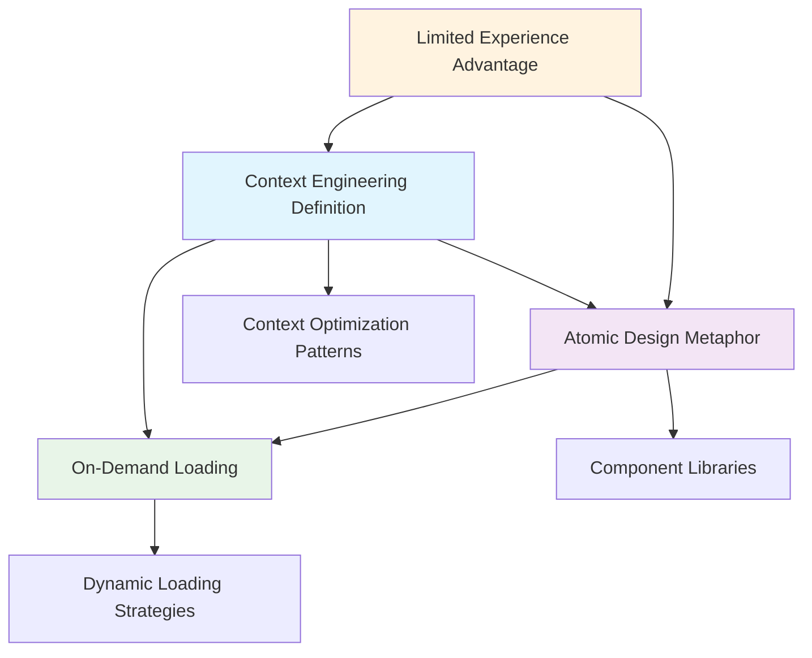

# Context Engineering Foundations Hub

## Overview
This hub organizes the foundational concepts and insights about context engineering, capturing the initial understanding and creating pathways for deeper exploration.

## Core Concept Cluster

### Primary Definition
[[20250813-143000-context-engineering-definition]] - Context Engineering as Attention Window Optimization
- **Key Insight**: Context engineering is strategic information optimization within constraints
- **Foundation For**: All context engineering techniques and patterns

### Architectural Framework
[[20250813-143100-atomic-design-metaphor]] - Atomic Design Metaphor for Context Engineering
- **Key Insight**: Component-based thinking applies to context design
- **Enables**: Reusable, composable prompt architectures
- **Connection Strength**: High (familiar from design systems)

### Implementation Strategy
[[20250813-143200-on-demand-loading]] - On-Demand Context Loading Strategy
- **Key Insight**: Load context when needed, not when anticipated
- **Pattern**: Progressive disclosure with feedback loops
- **Connects To**: Lazy loading and just-in-time concepts

### Learning Advantage
[[20250813-143300-prompt-experience-progression]] - Limited Prompting Experience as Learning Advantage
- **Key Insight**: Beginner's mind enables better adoption of advanced patterns
- **Implication**: Can skip basic prompting and go straight to architecture

## Concept Relationships

## Learning Progression

### Phase 1: Foundation (Current)
- ✅ Core definition established
- ✅ Architectural metaphor connected
- ✅ Loading strategy understood
- ✅ Learning advantage recognized

### Phase 2: Component Development (Next)
- 🔄 Context component taxonomy
- 🔄 Interface design patterns
- 🔄 Composition strategies
- 🔄 Reusability guidelines

### Phase 3: Implementation (Future)
- ⏳ Dynamic loading mechanisms
- ⏳ Context caching strategies
- ⏳ Performance optimization
- ⏳ Testing methodologies

## Key Questions to Explore

### Immediate (Next Session)
1. What are the most effective atomic context components?
2. How do you define clean interfaces between components?
3. What triggers indicate need for additional context?

### Medium Term
1. How do you measure context engineering effectiveness?
2. What are the common anti-patterns to avoid?
3. How do you balance component reusability with specificity?

### Long Term
1. How does context engineering scale across different domains?
2. What tooling best supports context engineering workflows?
3. How do you train others in context engineering approaches?

## Connected Learning Areas

### Strong Connections
- **Design Systems**: Atomic design, component architecture
- **Software Engineering**: Lazy loading, modular design
- **Information Architecture**: Progressive disclosure, hierarchy

### Potential Connections
- **Cognitive Science**: Working memory, attention management
- **API Design**: Interface design, composition patterns
- **Database Design**: Query optimization, indexing strategies

## Next Actions

### Immediate
1. Explore atomic context component patterns
2. Study successful prompt architectures
3. Practice component identification exercises

### This Week
1. Create first context component library
2. Design context loading experiments
3. Document component interface patterns

## Review Schedule
- **Daily**: Check for new connections during learning
- **Weekly**: Review and strengthen concept relationships
- **Monthly**: Assess understanding maturity and identify gaps

---

**Hub Created**: 2025-08-13  
**Last Updated**: 2025-08-13  
**Connected Notes**: 4  
**Maturity**: Foundation established, ready for expansion