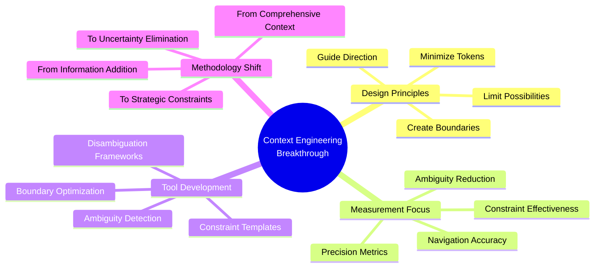
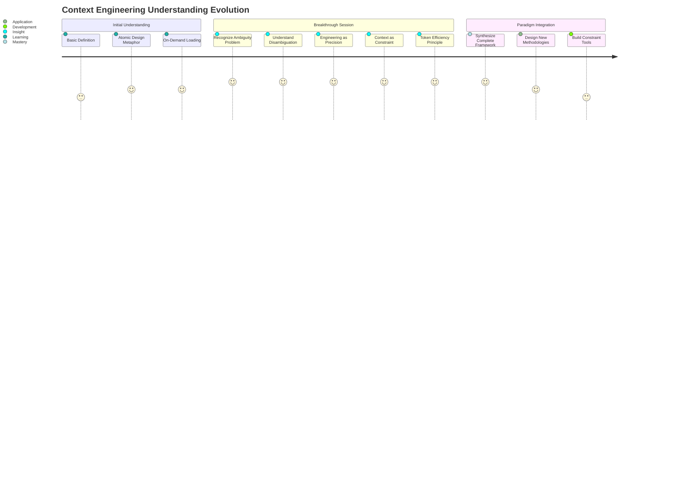

# Context Engineering Breakthrough - Concept Map

**Created**: 2025-08-13  
**Type**: Breakthrough Synthesis Visualization  
**Domain**: Context Engineering  

## Overview
This concept map visualizes the major breakthrough in understanding context engineering as constraint-based ambiguity resolution rather than content enhancement.

## Central Breakthrough Visualization

```mermaid
flowchart TD
    %% Core Problem
    A["🧠 Large Language Models<br/>Have Vast Knowledge<br/>But Ambiguous Focus"] --> B["❓ Innate Context<br/>Has Ambiguity<br/>[145000]"]
    
    %% The Solution Discovery
    B --> C["🎯 Context Engineering<br/>Resolves Ambiguity<br/>[145100]"]
    
    %% The Engineering Insight
    C --> D["⚙️ Engineering Challenge =<br/>Ambiguity Resolution<br/>[145200]"]
    
    %% The Operational Framework
    D --> E["🚧 Context as Constraint<br/>& Navigation<br/>[145300]"]
    
    %% The Efficiency Principle
    E --> F["📉 Token Degradation =<br/>Ambiguity Introduction<br/>[145400]"]
    
    %% The Complete Paradigm
    C --> G["🔄 PARADIGM SHIFT<br/>Constraint Over Content<br/>[145500]"]
    D --> G
    E --> G
    F --> G
    
    %% Contrast with Old Thinking
    H["❌ OLD: Add Information<br/>More Context = Better Results"] -.-> G
    G --> I["✅ NEW: Reduce Ambiguity<br/>Better Constraints = Better Results"]
    
    %% Applications
    G --> J["🛠️ Disambiguation<br/>Frameworks"]
    G --> K["📐 Constraint Design<br/>Patterns"]
    G --> L["🎯 Minimalist Context<br/>Templates"]
    G --> M["📊 Ambiguity Measurement<br/>Tools"]
    
    %% Styling
    classDef problem fill:#ffebee,stroke:#c62828,stroke-width:2px
    classDef solution fill:#e8f5e8,stroke:#2e7d32,stroke-width:2px
    classDef breakthrough fill:#fff3e0,stroke:#ef6c00,stroke-width:3px
    classDef old fill:#fafafa,stroke:#757575,stroke-width:1px,stroke-dasharray: 5 5
    classDef application fill:#e3f2fd,stroke:#1565c0,stroke-width:2px
    
    class A,B problem
    class C,D,E,F solution
    class G breakthrough
    class H old
    class I,J,K,L,M application
```

## Key Insight Connections

### Sequential Discovery Path
1. **Problem Recognition**: Models have inherent ambiguity despite vast knowledge
2. **Function Clarification**: Context engineering's true purpose is disambiguation
3. **Engineering Precision**: This becomes a systematic uncertainty elimination challenge
4. **Operational Mechanism**: Context works through constraint and navigation, not enhancement
5. **Efficiency Principle**: More tokens often introduce more ambiguity
6. **Paradigm Integration**: Complete shift from content-based to constraint-based thinking

### Cross-Connections
- **Ambiguity Problem** (145000) ↔ **Token Degradation** (145400): Both show how addition can worsen outcomes
- **Engineering Challenge** (145200) ↔ **Constraint Mechanism** (145300): Precision discipline meets operational framework
- **All Components** → **Paradigm Shift** (145500): Every insight contributes to the complete transformation

## Practical Implications Map

## Learning Journey Visualization

## Network Strength Analysis

### High-Strength Connections (5/5)
- All breakthrough notes are maximally connected
- Paradigm shift synthesizes all components
- Each insight validates and reinforces others

### Cross-Domain Bridges
- **Engineering Disciplines**: Precision, constraint optimization, systematic problem-solving
- **Cognitive Science**: Working memory, attention management, decision paralysis
- **Information Architecture**: Progressive disclosure, hierarchy, navigation design
- **Systems Thinking**: Constraint theory, boundary conditions, emergence

## Future Exploration Paths

### Immediate Development
1. **Disambiguation Taxonomy**: Categorize types of ambiguity in common prompt scenarios
2. **Constraint Pattern Library**: Develop reusable constraint templates for different domains
3. **Measurement Framework**: Create metrics for ambiguity reduction effectiveness

### Research Questions
1. **Optimal Constraint Density**: What's the ideal ratio of constraint to creative space?
2. **Domain Specificity**: How do constraint patterns vary across different fields?
3. **Automation Potential**: Can constraint optimization be systematically automated?

## Integration with Existing Knowledge

### Builds Upon
- [[20250813-143000-context-engineering-definition]]: Original foundation
- Design systems thinking and atomic design principles
- Software engineering constraint and optimization patterns

### Transforms
- Traditional prompt engineering approaches
- Information architecture methodologies
- Context design frameworks

### Enables
- Precision context engineering disciplines
- Systematic disambiguation methodologies
- Constraint-based design patterns
- Minimalist effectiveness approaches

---

**Note References**:
- [145000]: [[20250813-145000-innate-context-ambiguity]]
- [145100]: [[20250813-145100-context-engineering-resolves-ambiguity]]
- [145200]: [[20250813-145200-engineering-challenge-ambiguity-resolution]]
- [145300]: [[20250813-145300-context-as-constraint]]
- [145400]: [[20250813-145400-token-degradation-ambiguity]]
- [145500]: [[20250813-145500-paradigm-shift-constraint-over-content]]