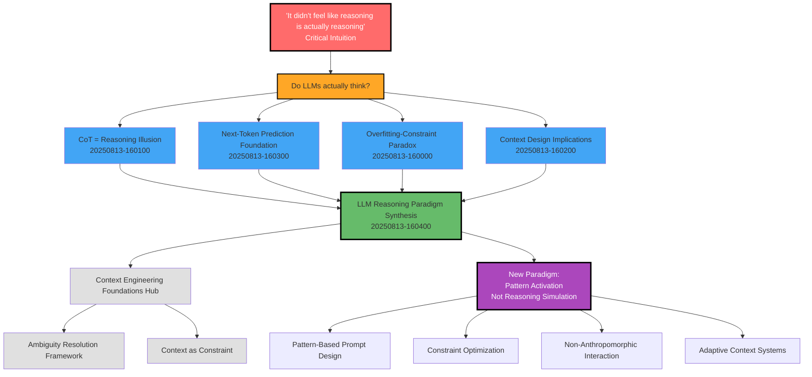
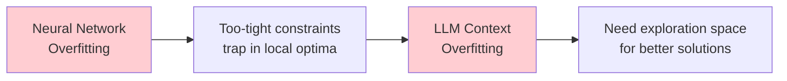
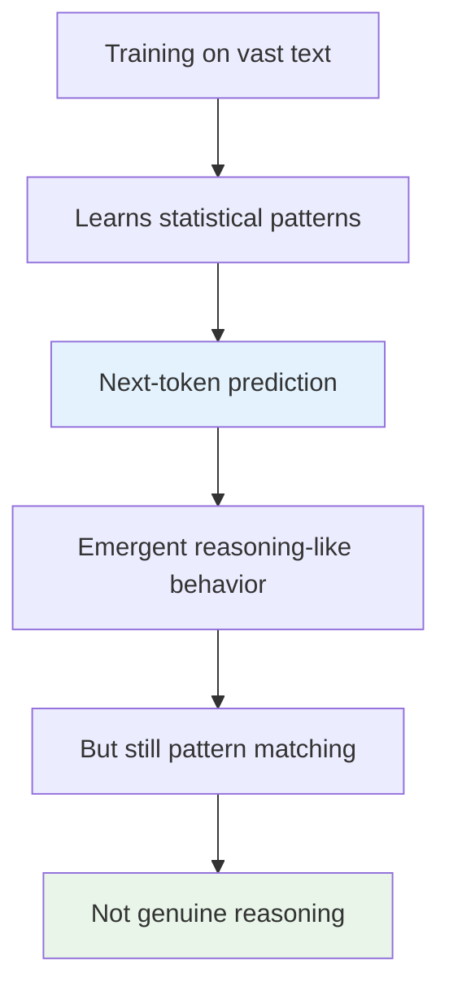

# LLM Reasoning Paradigm Breakthrough - Concept Map

**Created**: 2025-08-13 16:06  
**Session**: Critical insights about LLM reasoning nature  
**Breakthrough Level**: Paradigm-shifting  

## The Revelation Sequence

This map captures the moment of paradigm shift from "LLMs think like humans" to "LLMs perform sophisticated pattern matching."

## The Paradigm Shift Matrix

| Aspect | Old Paradigm | → | New Paradigm |
|--------|-------------|---|-------------|
| **LLM Nature** | Reasoning engine | → | Pattern completion system |
| **CoT Role** | Genuine thinking | → | Learned performance patterns |
| **Context Purpose** | Guide reasoning | → | Activate optimal patterns |
| **Constraint Strategy** | More detail = better | → | Balance structure vs exploration |
| **Design Philosophy** | Anthropomorphic | → | Pattern-optimization-based |
| **Success Metric** | Logical coherence | → | Pattern activation quality |

## Key Breakthrough Connections

### The Overfitting Analogy

### The Token Prediction Chain

## Critical Questions Emerged

1. **Pattern Quality**: How do we identify and activate high-quality patterns?
2. **Constraint Optimization**: What's the optimal balance for different tasks?
3. **Pattern Debugging**: Can we visualize what patterns are being activated?
4. **Measurement**: How do we assess pattern activation effectiveness?
5. **Transfer**: Do optimal patterns transfer across domains?

## Connected Learning Areas

### Newly Relevant
- **Machine Learning**: Pattern recognition, overfitting, regularization
- **Information Theory**: Pattern compression, entropy
- **Cognitive Science**: Pattern matching vs reasoning in humans
- **Philosophy of Mind**: What constitutes genuine reasoning?

### Design Implications
- **Prompt Engineering**: Shift from reasoning templates to pattern activation
- **Context Architecture**: Optimize for pattern quality not reasoning simulation
- **Evaluation Methods**: Measure pattern activation not logical coherence
- **User Experience**: Design interactions around pattern strengths

## Future Exploration Paths

### Immediate (This Week)
1. Experiment with pattern-based prompts vs reasoning-based prompts
2. Develop constraint optimization experiments
3. Research pattern activation measurement techniques

### Medium Term (This Month)
1. Build pattern activation frameworks
2. Create adaptive constraint systems
3. Develop non-anthropomorphic interaction patterns

### Long Term (Next Quarter)
1. Research cross-domain pattern transfer
2. Build pattern quality assessment tools
3. Develop training materials for new paradigm

## Significance Assessment

**Breakthrough Level**: ⭐⭐⭐⭐⭐ (Paradigm-shifting)

**Why This Matters**:
- Challenges fundamental assumptions about LLM cognition
- Provides new framework for context engineering
- Explains observed phenomena better than previous models
- Opens new research and development directions
- Changes best practices for LLM interaction

**Connection Strength**: Very High - integrates with existing knowledge while fundamentally reframing it

**Confidence**: High - grounded in technical understanding of LLM architecture

---

## Connections

### Related Permanent Notes
- [[20250813-160100-cot-reasoning-illusion]]: Chain-of-thought as reasoning illusion insight
- [[20250813-160300-next-token-prediction-mechanics]]: Technical foundation of pattern matching
- [[20250813-160000-overfitting-constraint-paradox]]: Constraint optimization principles
- [[20250813-160200-context-design-implications]]: How this changes context design
- [[20250813-160400-llm-reasoning-paradigm-synthesis]]: Synthesized understanding

### Hub Connections
- [[20250813-145700-HUB-context-engineering-foundations]]: Main knowledge hub

**Last Updated**: 2025-08-13 16:06  
**Review Schedule**: Daily for one week, then weekly  
**Next Actions**: Begin pattern-based prompt experiments