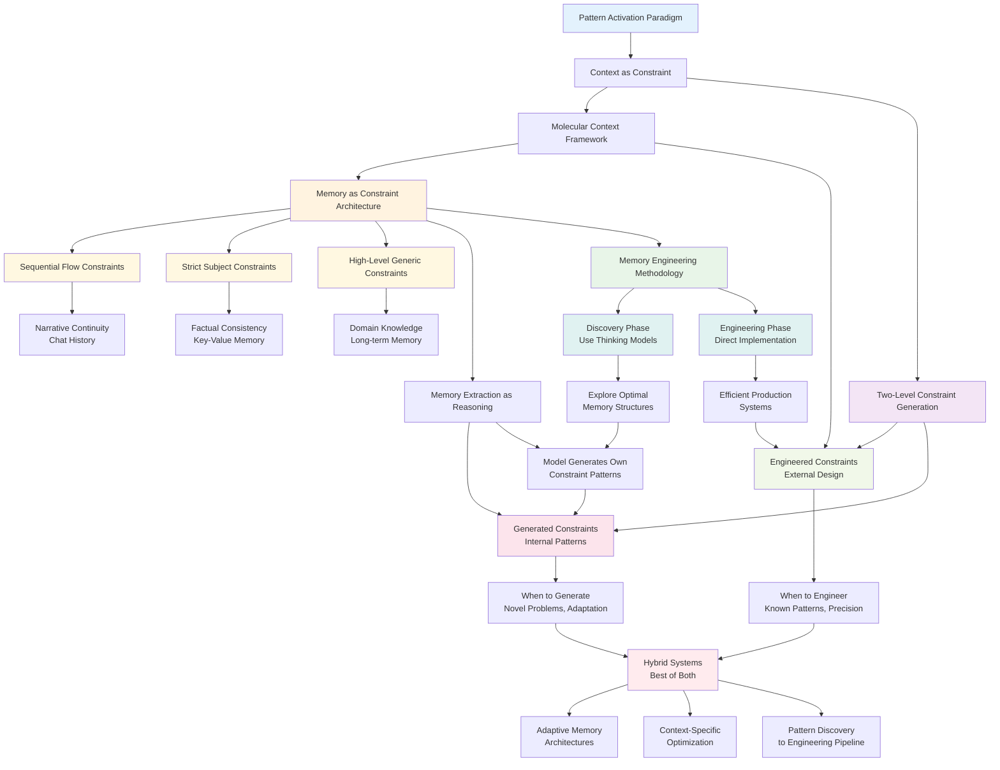

# Memory as Constraint Architecture - Concept Map

Generated: 2025-08-13 19:04

## Core Breakthrough Synthesis
This map shows the evolution from pattern-activation paradigm through molecular context to memory as constraint architecture.

## Key Insights Captured

### 1. Memory Architecture Evolution
- From storage metaphor to constraint metaphor
- Different memory types = different constraint patterns
- Behavioral shaping through pattern activation

### 2. Constraint Generation Levels
- Engineered: External design and optimization
- Generated: Internal model pattern creation
- Memory extraction exemplifies generated constraints

### 3. Methodology Framework
- Discovery through thinking model exploration
- Engineering through direct implementation
- Parallel to molecular context development approach

### 4. Strategic Design Space
- When to use engineered vs. generated constraints
- Hybrid approaches for complex scenarios  
- Context-specific optimization strategies

## Connection Strengths

### Strong Connections (Weight: 5)
- Memory Architecture ↔ Constraint Types
- Two-Level Generation ↔ Memory Extraction
- Discovery Phase ↔ Generated Constraints

### Medium Connections (Weight: 3-4)
- Memory Types ↔ Behavioral Constraints
- Engineering Phase ↔ Engineered Constraints
- Hybrid Systems ↔ Strategic Framework

### Emerging Connections (Weight: 2-3)
- Memory Engineering ↔ Molecular Context
- Pattern Discovery ↔ Constraint Optimization
- Adaptive Systems ↔ Context-Specific Design

## Research Implications

### Immediate Exploration
1. Memory constraint interaction patterns
2. Constraint effectiveness measurement
3. Discovery-to-engineering optimization
4. Hybrid system design principles

### Medium-term Development
1. Memory architecture design patterns
2. Constraint generation optimization
3. Cross-domain pattern transfer
4. Adaptive constraint systems

### Long-term Vision
1. Automated memory engineering tools
2. Universal constraint frameworks
3. Self-optimizing memory systems
4. Meta-constraint architectures

## Pattern Activation Connections
This breakthrough extends the core pattern-activation paradigm:
- Memory systems activate different behavioral patterns
- Constraints shape which patterns emerge
- Engineering vs. generation provides different activation mechanisms
- Discovery methodology leverages activation for optimization

---
**Map Type**: Synthesis Overview  
**Scope**: Major breakthrough integration  
**Next Review**: 2025-08-20  
**Connection Hub**: [[context-engineering-foundations]]