# Constraint Orchestration Breakthrough - Concept Map

## Overview
This concept map visualizes the breakthrough insights about multi-agent systems as constraint orchestration architectures, showing how different concepts connect and build upon each other.

## Creation Context
- **Date**: 2025-08-15
- **Session**: Multi-agent systems and constraint-based orchestration
- **Trigger**: Recognition of Teacher/Zelda architecture as perfect constraint orchestration example

## Concept Network

```mermaid
graph TD
    A[Multi-Agent Systems as Constraint Orchestration] --> B[Specialized Constraint Applicators]
    A --> C[Shared Constraint Space]
    A --> D[Single Orchestrator]
    
    B --> E[Teacher: Learning Constraints]
    B --> F[Zelda: Format Constraints]
    B --> G[Agent Specialization Boundaries]
    
    C --> H[Knowledge Base as Constraint Space]
    C --> I[Memory Types as Constraint Patterns]
    C --> J[Hybrid State Architecture]
    
    I --> K[Working Memory: Sequential Constraints]
    I --> L[Knowledge Base: Factual Constraints]
    I --> M[Process Log: Historical Constraints]
    I --> N[Output Buffer: Format Constraints]
    
    J --> O[Constraints - Rules]
    J --> P[Facts - Verified Info]
    J --> Q[Decisions - Irreversible Choices]
    J --> R[Proposals - Candidates]
    
    D --> S[ReAct as Constraint Loop]
    S --> T[Thought: Constraint Generation]
    S --> U[Action: Constraint Application]
    S --> V[Observation: Constraint Validation]
    
    A --> W[Real-World Example]
    W --> X[Teacher/Zelda Architecture]
    X --> Y[Clear Domain Separation]
    X --> Z[No Coordination Overhead]
    
    style A fill:#e1f5fe
    style B fill:#f3e5f5
    style C fill:#e8f5e8
    style D fill:#fff3e0
    style I fill:#ffebee
    style S fill:#f1f8e9
    style X fill:#fce4ec
```

## Key Relationships

### Foundation → Application
- **Constraint Orchestration Principle** enables **Specialized Agent Design**
- **Shared Constraint Space** enables **No Coordination Overhead**
- **Memory as Constraints** enables **Hybrid State Architecture**

### Pattern → Implementation
- **ReAct Constraint Loop** implements **Iterative Constraint Refinement**
- **Teacher/Zelda** implements **Constraint Domain Separation**
- **Knowledge Base** implements **Shared Constraint Validation**

### Theory → Practice
- **Multi-Agent Constraint Theory** validated by **Working Teacher/Zelda System**
- **Constraint Patterns** demonstrated in **Memory Type Specialization**
- **Orchestration Architecture** proven in **Real-World Implementation**

## Insight Hierarchy

### Primary Breakthrough
**Multi-Agent Systems as Constraint Orchestration**: Fundamental reframe from coordination to constraint application

### Supporting Insights
1. **Memory Types as Constraint Patterns**: Memory enforces behavioral rules rather than storing information
2. **ReAct as Constraint Loop**: Reasoning becomes iterative constraint refinement
3. **Teacher/Zelda as Validation**: Working example proves the pattern

### Implementation Patterns
1. **Shared Constraint Space Architecture**: Technical implementation approach
2. **Domain Separation Principles**: How to divide constraint responsibilities
3. **Hybrid State Management**: Separating constraints, facts, decisions, proposals

## Cross-Domain Connections

### Links to Context Engineering
- Builds on [[20250813-145300-context-as-constraint]]: Context as constraint system
- Extends [[20250813-145500-paradigm-shift-constraint-over-content]]: Constraint over content paradigm

### Links to System Design
- Connects to microservices: Specialized services as constraint applicators
- Relates to database design: Constraint validation systems
- Maps to workflow orchestration: Sequential constraint application

### Links to AI/ML
- Relates to ensemble methods: Multiple specialized models contributing constraints
- Connects to reinforcement learning: Constraint validation as reward signal
- Maps to prompt engineering: Context as constraint application

## Future Exploration Paths

### Technical Implementation
- How to build efficient shared constraint spaces
- Constraint conflict resolution algorithms
- Performance optimization for constraint validation

### Design Patterns
- Other domains where constraint orchestration applies
- Scaling to many specialized agents
- Automatic constraint learning and optimization

### Theoretical Development
- Formal constraint orchestration theory
- Mathematical models for constraint satisfaction in multi-agent systems
- Complexity analysis of constraint vs. coordination approaches

## Application Domains

### Software Architecture
- Microservices as constraint applicators
- API gateway as orchestrator
- Database as shared constraint space

### Business Process Management
- Departments as specialized constraint applicators
- Management as orchestrator
- Company policies as shared constraint space

### Quality Assurance
- Different QA stages as constraint types
- Quality manager as orchestrator
- Standards database as constraint space

## Tags
#concept-map #constraint-orchestration #multi-agent #breakthrough #architecture #teacher-zelda

## Connection Strength: 5
This represents a major breakthrough in understanding multi-agent systems and has immediate practical applications in system design.